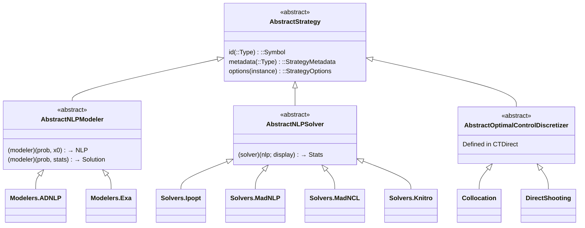
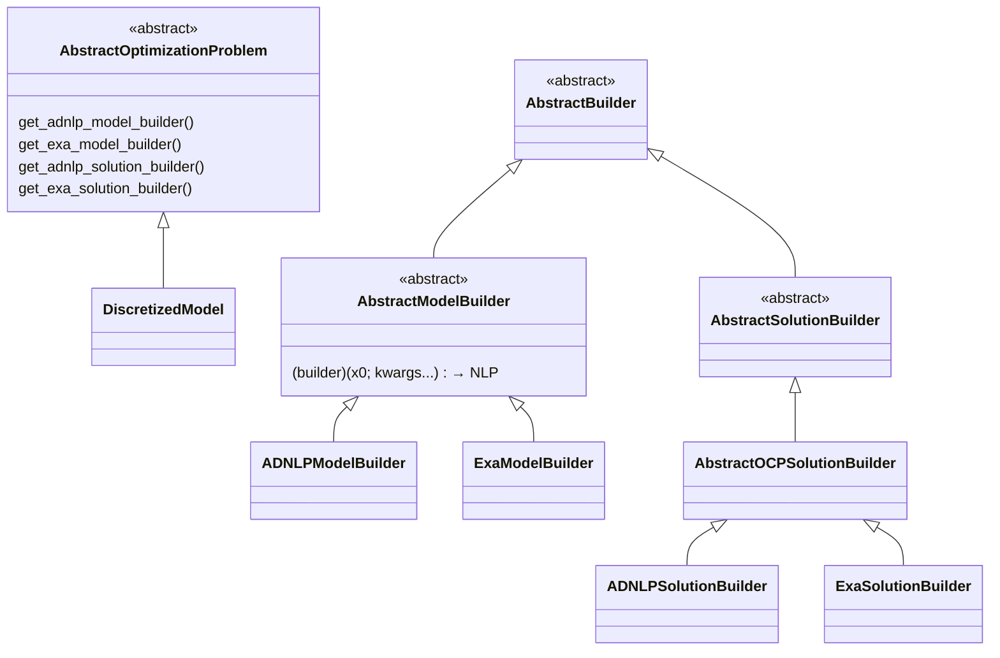
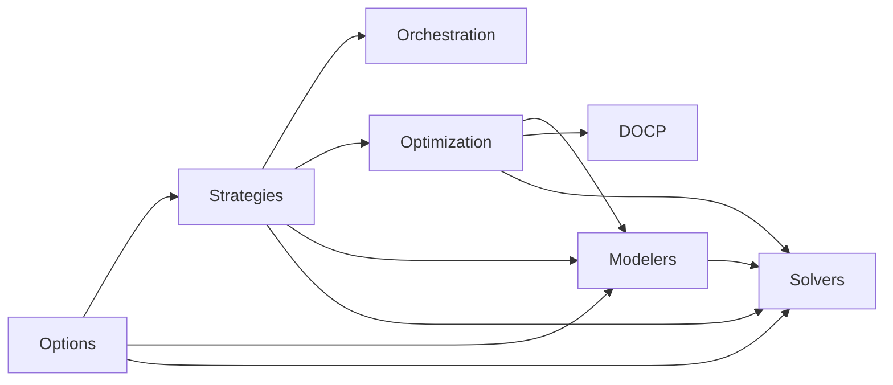
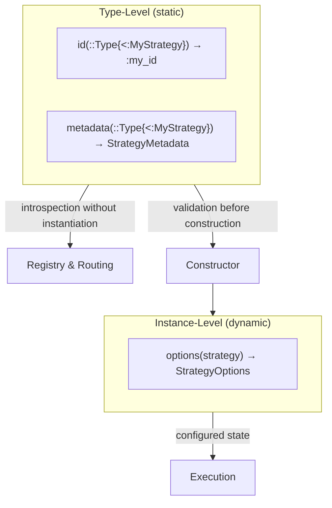
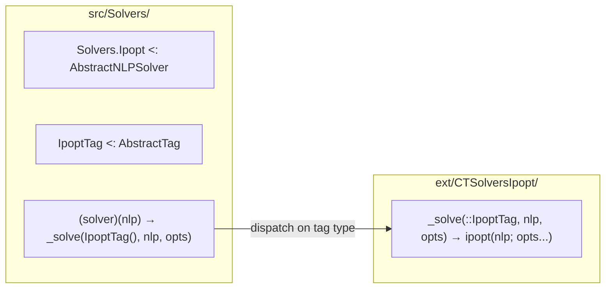

# Architecture

```@meta
CurrentModule = CTSolvers
```

CTSolvers is the **resolution layer** of the [control-toolbox](https://github.com/control-toolbox) ecosystem. It transforms optimal control problems (defined in [CTModels.jl](https://github.com/control-toolbox/CTModels.jl)) into NLP models, solves them, and converts the results back into optimal control solutions.

This page provides the complete architectural overview. Read it before diving into any specific guide.

## Module Overview

CTSolvers is organized into 7 modules, loaded in strict dependency order:

| # | Module | Responsibility |
|---|--------|---------------|
| 1 | **Options** | Configuration primitives: `OptionDefinition`, `OptionValue`, extraction, validation |
| 2 | **Strategies** | Strategy contract (`AbstractStrategy`), registry, metadata, options building |
| 3 | **Orchestration** | Multi-strategy option routing and disambiguation |
| 4 | **Optimization** | Abstract optimization types (`AbstractOptimizationProblem`), builders, `build_model`/`build_solution` |
| 5 | **Modelers** | NLP model backends: `Modelers.ADNLP`, `Modelers.Exa` |
| 6 | **DOCP** | `DiscretizedModel` — bridges CTModels and CTSolvers |
| 7 | **Solvers** | Solver integration: `Solvers.Ipopt`, `Solvers.MadNLP`, `Solvers.MadNCL`, `Solvers.Knitro`, CommonSolve API |

All access is **qualified** — CTSolvers does not export symbols at the top level:

```julia
using CTSolvers

# Correct: qualified access
CTSolvers.Strategies.id(MyStrategy)
CTSolvers.Options.OptionDefinition(name=:x, type=Int, default=1, description="...")

# Wrong: not exported
id(MyStrategy)  # ERROR: UndefVarError
```

## Type Hierarchies

### Strategy Branch

All configurable components (modelers, solvers, discretizers) are **strategies**. They share a common contract defined by `AbstractStrategy`.



- **`AbstractNLPModeler`** (in `Modelers`): converts problems into NLP models and back into solutions.
- **`AbstractNLPSolver`** (in `Solvers`): solves NLP models via backend libraries.
- **`AbstractOptimalControlDiscretizer`** (in CTDirect, external): discretizes continuous-time OCP into finite-dimensional problems. See [Implementing a Strategy](@ref) for a complete tutorial.

### Optimization / Builder Branch

The optimization module defines the **problem–builder** pattern: problems provide builders, modelers use them.



- **`AbstractOptimizationProblem`**: any problem that can provide builders for NLP model construction and solution conversion.
- **`AbstractModelBuilder`**: callable that constructs an NLP model (ADNLPModel or ExaModel).
- **`AbstractSolutionBuilder`**: callable that converts NLP solver results into problem-specific solutions.
- **`DiscretizedModel`** (in `DOCP`): the concrete implementation that bridges CTModels OCP with CTSolvers builders.

## Module Dependencies



The loading order in `CTSolvers.jl` is:

```
Options → Strategies → Orchestration → Optimization → Modelers → DOCP → Solvers
```

Each module only depends on modules loaded before it. This strict ordering ensures:
- No circular dependencies
- Types are available when needed
- Extensions can target specific modules

## Data Flow

The complete resolution pipeline transforms an optimal control problem into a solution through a sequence of well-defined steps:

```mermaid
sequenceDiagram
    participant User
    participant Solve as CommonSolve.solve
    participant Modeler as AbstractNLPModeler
    participant Problem as AbstractOptimizationProblem
    participant Builder as AbstractModelBuilder
    participant Solver as AbstractNLPSolver
    participant SolBuilder as AbstractSolutionBuilder

    User->>Solve: solve(problem, x0, modeler, solver)
    Solve->>Modeler: build_model(problem, x0, modeler)
    Modeler->>Problem: get_adnlp_model_builder(problem)
    Problem-->>Modeler: ADNLPModelBuilder
    Modeler->>Builder: builder(x0; options...)
    Builder-->>Modeler: NLP model
    Modeler-->>Solve: NLP model
    Solve->>Solver: solve(nlp, solver)
    Solver->>Solver: solver(nlp; display)
    Solver-->>Solve: ExecutionStats
    Solve->>Modeler: build_solution(problem, stats, modeler)
    Modeler->>Problem: get_adnlp_solution_builder(problem)
    Problem-->>Modeler: ADNLPSolutionBuilder
    Modeler->>SolBuilder: builder(stats)
    SolBuilder-->>Modeler: OCP Solution
    Modeler-->>Solve: OCP Solution
    Solve-->>User: OCP Solution
```

The three levels of `CommonSolve.solve`:

| Level | Signature | Purpose |
|-------|-----------|---------|
| **High** | `solve(problem, x0, modeler, solver)` | Full pipeline: build NLP → solve → build solution |
| **Mid** | `solve(nlp, solver)` | Solve an NLP model directly |
| **Low** | `solve(any, solver)` | Flexible dispatch for custom types |

## Architectural Patterns

### Two-Level Contract

Every strategy implements a **two-level contract** separating static metadata from dynamic configuration:



- **Type-level methods** (`id`, `metadata`) are called on the **type** — they enable introspection, routing, and validation without creating objects.
- **Instance-level methods** (`options`) are called on **instances** — they provide the actual configuration with provenance tracking.

See [Implementing a Strategy](@ref) for a step-by-step tutorial.

### NotImplemented Pattern

All contract methods have default implementations that throw `NotImplemented` with helpful error messages:

```julia
# If you forget to implement `id` for your strategy:
julia> Strategies.id(IncompleteStrategy)
# ERROR: NotImplemented
#   Strategy ID method not implemented
#   Required method: id(::Type{<:IncompleteStrategy})
#   Suggestion: Implement id(::Type{<:IncompleteStrategy}) to return a unique Symbol identifier
```

This pattern ensures that:
- Missing implementations are detected immediately with clear guidance
- Error messages tell the developer exactly what to implement
- No silent failures or incorrect defaults

### Tag Dispatch

Solvers use **Tag Dispatch** to separate type definitions (in `src/Solvers/`) from backend implementations (in `ext/`):



- **`src/Solvers/`**: defines the solver type, its options, and a callable that dispatches on a tag.
- **`ext/CTSolversXxx/`**: implements the actual backend call, loaded only when the backend package is available.
- This keeps CTSolvers lightweight — backend dependencies are optional.

### Qualified Access

CTSolvers does **not** export symbols at the top level. All access goes through qualified module paths:

```julia
CTSolvers.Strategies.id(MyStrategy)
CTSolvers.Options.OptionDefinition(...)
CTSolvers.Optimization.build_model(problem, x0, modeler)
```

This ensures namespace clarity, avoids conflicts with other packages, and makes dependencies explicit.

## Conventions

### Naming

- **Types**: `PascalCase` — `StrategyOptions`, `ADNLPModelBuilder`
- **Modules**: `PascalCase` — `Options`, `Strategies`, `Orchestration`
- **Functions**: `snake_case` — `build_strategy_options`, `option_value`
- **Strategy IDs**: `snake_case` symbols — `:collocation`, `:adnlp`, `:ipopt`
- **Private defaults**: `__name()` pattern — `__grid_size()`, `__scheme()`

### Constructor Pattern

Every strategy constructor follows the same pattern:

```julia
function MyStrategy(; mode::Symbol = :strict, kwargs...)
    opts = Strategies.build_strategy_options(MyStrategy; mode = mode, kwargs...)
    return MyStrategy(opts)
end
```

- `mode = :strict` (default): rejects unknown options with Levenshtein suggestions.
- `mode = :permissive`: accepts unknown options with a warning.

### OptionDefinition Pattern

Options are declared via `OptionDefinition` in the `metadata` method:

```julia
Strategies.metadata(::Type{<:MyStrategy}) = Strategies.StrategyMetadata(
    Options.OptionDefinition(
        name = :max_iter,
        type = Int,
        default = 1000,
        description = "Maximum number of iterations",
    ),
    Options.OptionDefinition(
        name = :tol,
        type = Float64,
        default = 1e-8,
        description = "Convergence tolerance",
        aliases = [:tolerance],
    ),
)
```

Each definition specifies: `name`, `type`, `default`, `description`, and optionally `aliases` and `validator`.
