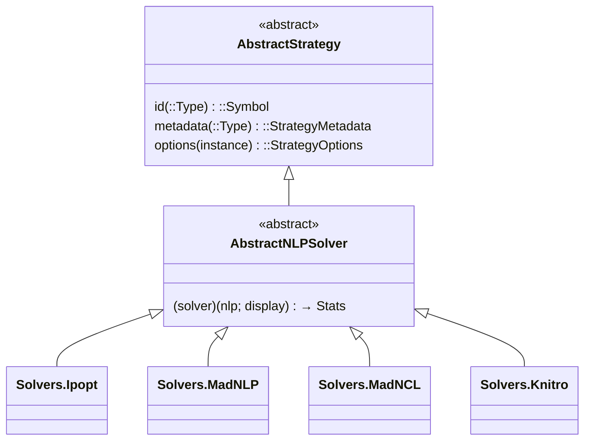
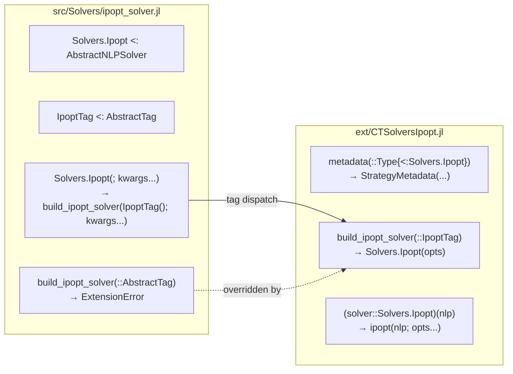
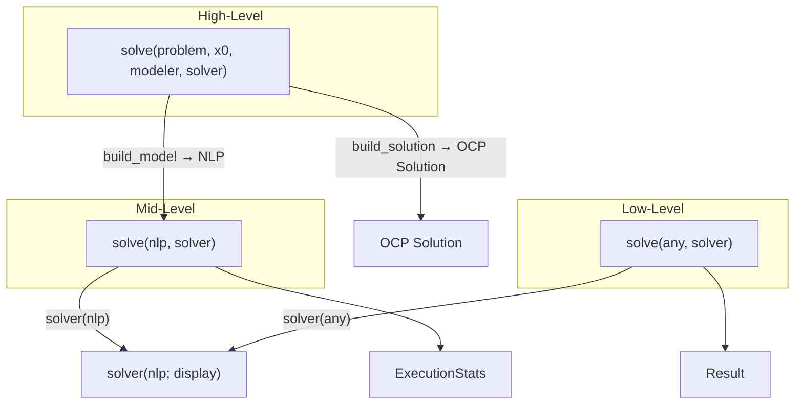

# Implementing a Solver

```@meta
CurrentModule = CTSolvers
```

This guide explains how to implement an optimization solver in CTSolvers. Solvers are strategies that wrap NLP backend libraries (Ipopt, MadNLP, Knitro, etc.) behind a unified interface. We use **Solvers.Ipopt** as the reference example throughout.

!!! tip "Prerequisites"
    Read [Architecture](@ref) and [Implementing a Strategy](@ref) first. A solver is a strategy with two additional requirements: a **callable interface** and a **Tag Dispatch** extension.

## The AbstractNLPSolver Contract

A solver must satisfy **three contracts**:

1. **Strategy contract** — `id`, `metadata`, `options` (inherited from `AbstractStrategy`)
2. **Callable contract** — `(solver)(nlp; display) → ExecutionStats`
3. **Tag Dispatch** — separates type definition from backend implementation



The default callable throws `NotImplemented` with guidance.

```@example solver
using CTSolvers
nothing # hide
```

Without the extension loaded, constructing a solver throws `ExtensionError`:

```@repl solver
CTSolvers.Solvers.Ipopt()
```

## Implementing the Solver Type

### Step 1 — Define the Tag

A **tag type** is a lightweight struct used for dispatch. It routes the constructor call to the right extension:

```julia
# In src/Solvers/ipopt_solver.jl
struct IpoptTag <: AbstractTag end
```

### Step 2 — Define the struct

Like any strategy, the solver has a single `options` field:

```julia
struct Solvers.Ipopt <: AbstractNLPSolver
    options::Strategies.StrategyOptions
end
```

### Step 3 — Implement `id`

The `id` is available even without the extension:

```@example solver
CTSolvers.Strategies.id(CTSolvers.Solvers.Ipopt)
```

### Step 4 — Constructor with Tag Dispatch

The constructor delegates to a `build_*` function that dispatches on the tag. The stub in `src/` throws an `ExtensionError` if the extension is not loaded:

```julia
function Solvers.Ipopt(; mode::Symbol = :strict, kwargs...)
    return build_ipopt_solver(IpoptTag(); mode = mode, kwargs...)
end

# Stub — real implementation in ext/CTSolversIpopt.jl
function build_ipopt_solver(::AbstractTag; kwargs...)
    throw(Exceptions.ExtensionError(
        :NLPModelsIpopt;
        message = "to create Solvers.Ipopt, access options, and solve problems",
        feature = "Solvers.Ipopt functionality",
        context = "Load NLPModelsIpopt extension first: using NLPModelsIpopt",
    ))
end
```

Live demonstration of the `ExtensionError` for all solvers:

```@repl solver
CTSolvers.Solvers.MadNLP()
```

!!! note "Why Tag Dispatch?"
    The `metadata` (option definitions) and the callable (backend call) both live in the extension. The tag type allows the constructor in `src/` to dispatch to the extension without a direct dependency on the backend package.

## The Tag Dispatch Pattern



The split is:

| Location | Contains |
|----------|----------|
| `src/Solvers/ipopt_solver.jl` | Struct, `id`, tag, constructor stub, `ExtensionError` fallback |
| `ext/CTSolversIpopt.jl` | `metadata` (option definitions), `build_ipopt_solver` (real constructor), callable `(solver)(nlp)` |

This keeps CTSolvers lightweight — `NLPModelsIpopt` is only loaded when the user does `using NLPModelsIpopt`.

## Creating the Extension

### File structure

```
ext/
└── CTSolversIpopt.jl    # Single-file extension module
```

### Project.toml declaration

```toml
[weakdeps]
NLPModelsIpopt = "f4238b75-b362-5c4c-b852-0801c9a21d71"

[extensions]
CTSolversIpopt = "NLPModelsIpopt"
```

### Extension implementation

The extension module provides three things:

**1. Metadata** — option definitions with types, defaults, validators:

```julia
module CTSolversIpopt

using CTSolvers, CTSolvers.Solvers, CTSolvers.Strategies, CTSolvers.Options
using CTBase.Exceptions
using NLPModelsIpopt, NLPModels, SolverCore

function Strategies.metadata(::Type{<:Solvers.Ipopt})
    return Strategies.StrategyMetadata(
        Options.OptionDefinition(
            name = :tol,
            type = Real,
            default = 1e-8,
            description = "Desired convergence tolerance (relative)",
            validator = x -> x > 0 || throw(Exceptions.IncorrectArgument(...)),
        ),
        Options.OptionDefinition(
            name = :max_iter,
            type = Integer,
            default = 1000,
            description = "Maximum number of iterations",
            aliases = (:maxiter,),
            validator = x -> x >= 0 || throw(Exceptions.IncorrectArgument(...)),
        ),
        # ... more options (print_level, linear_solver, mu_strategy, etc.)
    )
end
```

**2. Constructor** — builds validated options and returns the solver:

```julia
function Solvers.build_ipopt_solver(::Solvers.IpoptTag; mode::Symbol = :strict, kwargs...)
    opts = Strategies.build_strategy_options(Solvers.Ipopt; mode = mode, kwargs...)
    return Solvers.Ipopt(opts)
end
```

**3. Callable** — solves the NLP problem using the backend:

```julia
function (solver::Solvers.Ipopt)(
    nlp::NLPModels.AbstractNLPModel;
    display::Bool = true,
)::SolverCore.GenericExecutionStats
    options = Strategies.options_dict(solver)
    options[:print_level] = display ? options[:print_level] : 0
    return solve_with_ipopt(nlp; options...)
end

function solve_with_ipopt(nlp::NLPModels.AbstractNLPModel; kwargs...)
    solver = NLPModelsIpopt.Solvers.Ipopt(nlp)
    return NLPModelsIpopt.solve!(solver, nlp; kwargs...)
end

end # module CTSolversIpopt
```

!!! info "Display handling"
    The `display` parameter controls solver output. When `display = false`, the solver sets `print_level = 0` to suppress all output. This is a convention shared by all CTSolvers solvers.

## CommonSolve Integration

CTSolvers provides a unified `CommonSolve.solve` interface at three levels:



### High-level: full pipeline

```julia
using CommonSolve

solution = solve(problem, x0, modeler, solver)
# Internally:
#   1. nlp = build_model(problem, x0, modeler)
#   2. stats = solve(nlp, solver)
#   3. solution = build_solution(problem, stats, modeler)
```

### Mid-level: NLP → Stats

```julia
using ADNLPModels

nlp = ADNLPModel(x -> sum(x.^2), zeros(10))
solver = Solvers.Ipopt(max_iter = 1000)
stats = solve(nlp, solver; display = false)
```

### Low-level: flexible dispatch

```julia
stats = solve(any_compatible_object, solver; display = false)
# Calls solver(any_compatible_object; display = false)
```

## Summary: Adding a New Solver

To add a new solver (e.g., `MySolver` backed by `MyBackend`):

### In `src/Solvers/`

1. Define `MyTag <: AbstractTag`
2. Define `MySolver <: AbstractNLPSolver` with `options::StrategyOptions`
3. Implement `Strategies.id(::Type{<:MySolver}) = :my_solver`
4. Write constructor: `MySolver(; mode, kwargs...) = build_my_solver(MyTag(); mode, kwargs...)`
5. Write stub: `build_my_solver(::AbstractTag; kwargs...) = throw(ExtensionError(...))`

### In `ext/CTSolversMyBackend.jl`

6. Implement `Strategies.metadata(::Type{<:MySolver})` with all option definitions
7. Implement `Solvers.build_my_solver(::Solvers.MyTag; kwargs...)` — real constructor
8. Implement `(solver::Solvers.MySolver)(nlp; display)` — callable that invokes the backend

### In `Project.toml`

9. Add `MyBackend` to `[weakdeps]` and `CTSolversMyBackend = "MyBackend"` to `[extensions]`

### Tests

10. **Contract test**: `Strategies.validate_strategy_contract(MySolver)` (requires extension loaded)
11. **Callable test**: `solver(nlp; display = false)` returns `AbstractExecutionStats`
12. **CommonSolve test**: `solve(nlp, solver)` works at mid-level
13. **Extension error test**: without `using MyBackend`, `MySolver()` throws `ExtensionError`
