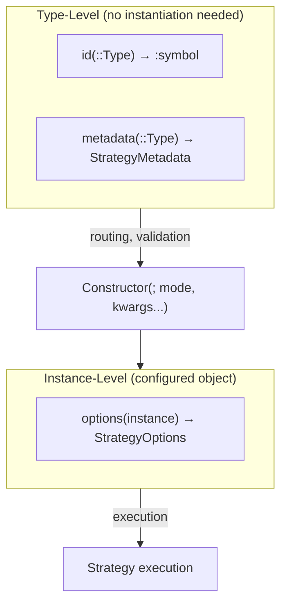

# Implementing a Strategy

```@meta
CurrentModule = CTSolvers
```

This guide walks you through implementing a complete strategy family using the `AbstractStrategy` contract. We use **Collocation** and **DirectShooting** discretizers as concrete examples — real strategies from the [CTDirect.jl](https://github.com/control-toolbox/CTDirect.jl) package.

!!! tip "Prerequisites"
    Read the [Architecture](@ref) page first to understand the type hierarchies and module structure.

```@setup strategy
using CTSolvers
using CTSolvers.Strategies
using CTSolvers.Options
```

## The Two-Level Contract

Every strategy implements a **two-level contract** that separates static metadata from dynamic configuration:



- **Type-level** methods (`id`, `metadata`) can be called on the **type itself** — no object needed. This enables registry lookup, option routing, and validation before any resource allocation.
- **Instance-level** methods (`options`) are called on **instances** — they carry the actual configuration with provenance tracking (user vs default).

## Defining a Strategy Family

A strategy family is an intermediate abstract type that groups related strategies. Here we define a family for optimal control discretizers:

```@example strategy
abstract type AbstractOptimalControlDiscretizer <: Strategies.AbstractStrategy end
nothing # hide
```

This type enables:
- Grouping discretizers in a `StrategyRegistry` by family
- Dispatching on the family in option routing
- Adding methods common to all discretizers

## Implementing a Concrete Strategy: Collocation

### Step 1 — Define the struct

A strategy struct needs exactly one field: `options::Strategies.StrategyOptions`.

```@example strategy
struct Collocation <: AbstractOptimalControlDiscretizer
    options::Strategies.StrategyOptions
end
nothing # hide
```

### Step 2 — Implement `id`

The `id` method returns a unique `Symbol` identifier for the strategy. It is a **type-level** method.

```@example strategy
Strategies.id(::Type{<:Collocation}) = :collocation
nothing # hide
```

### Step 3 — Define default values

Use the `__name()` convention for private default functions:

```@example strategy
__collocation_grid_size()::Int = 250
__collocation_scheme()::Symbol = :midpoint
nothing # hide
```

### Step 4 — Implement `metadata`

The `metadata` method returns a `StrategyMetadata` containing `OptionDefinition` objects. It is a **type-level** method.

```@example strategy
function Strategies.metadata(::Type{<:Collocation})
    return Strategies.StrategyMetadata(
        Options.OptionDefinition(
            name = :grid_size,
            type = Int,
            default = __collocation_grid_size(),
            description = "Number of time steps for the collocation grid",
        ),
        Options.OptionDefinition(
            name = :scheme,
            type = Symbol,
            default = __collocation_scheme(),
            description = "Time integration scheme (e.g., :midpoint, :trapeze)",
        ),
    )
end
nothing # hide
```

Let's verify the metadata:

```@repl strategy
Strategies.metadata(Collocation)
```

### Step 5 — Implement the constructor

The constructor uses `build_strategy_options` to validate and merge user-provided options with defaults:

```@example strategy
function Collocation(; mode::Symbol = :strict, kwargs...)
    opts = Strategies.build_strategy_options(Collocation; mode = mode, kwargs...)
    return Collocation(opts)
end
nothing # hide
```

### Step 6 — Implement `options`

The `options` method provides instance-level access to the configured options:

```@example strategy
Strategies.options(c::Collocation) = c.options
nothing # hide
```

Now let's create instances and inspect them:

```@repl strategy
c = Collocation()
```

```@repl strategy
c = Collocation(grid_size = 500, scheme = :trapeze)
```

### Step 7 — Verify the contract

Use `validate_strategy_contract` to check that all contract methods are correctly implemented:

```@repl strategy
Strategies.validate_strategy_contract(Collocation)
```

### Step 8 — Access options

The `StrategyOptions` object tracks both values and their provenance:

```@repl strategy
c = Collocation(grid_size = 100)
Strategies.options(c)
```

```@repl strategy
Strategies.options(c)[:grid_size]
```

```@repl strategy
Strategies.source(Strategies.options(c), :grid_size)
```

```@repl strategy
Strategies.is_user(Strategies.options(c), :grid_size)
```

```@repl strategy
Strategies.is_default(Strategies.options(c), :scheme)
```

### Error handling

A typo in an option name triggers a helpful error with Levenshtein suggestion:

```@repl strategy
Collocation(grdi_size = 500)
```

## Adding a Second Strategy: DirectShooting

The same pattern applies to any strategy in the family. Here is `DirectShooting` with different options:

```@example strategy
struct DirectShooting <: AbstractOptimalControlDiscretizer
    options::Strategies.StrategyOptions
end

Strategies.id(::Type{<:DirectShooting}) = :direct_shooting

__shooting_grid_size()::Int = 100

function Strategies.metadata(::Type{<:DirectShooting})
    return Strategies.StrategyMetadata(
        Options.OptionDefinition(
            name = :grid_size,
            type = Int,
            default = __shooting_grid_size(),
            description = "Number of shooting intervals",
        ),
    )
end

function DirectShooting(; mode::Symbol = :strict, kwargs...)
    opts = Strategies.build_strategy_options(DirectShooting; mode = mode, kwargs...)
    return DirectShooting(opts)
end

Strategies.options(ds::DirectShooting) = ds.options
nothing # hide
```

!!! note "Same option name, different definitions"
    Both `Collocation` and `DirectShooting` define a `:grid_size` option, but with different defaults (250 vs 100) and descriptions. Each strategy has its own independent `OptionDefinition` set.

```@repl strategy
Strategies.validate_strategy_contract(DirectShooting)
```

```@repl strategy
DirectShooting()
```

```@repl strategy
DirectShooting(grid_size = 50)
```

## Registering the Family

A `StrategyRegistry` maps abstract family types to their concrete strategies. This enables lookup by symbol and automated construction.

```@repl strategy
registry = Strategies.create_registry(
    AbstractOptimalControlDiscretizer => (Collocation, DirectShooting),
)
```

Query the registry:

```@repl strategy
Strategies.strategy_ids(AbstractOptimalControlDiscretizer, registry)
```

```@repl strategy
Strategies.type_from_id(:collocation, AbstractOptimalControlDiscretizer, registry)
```

Build a strategy from the registry:

```@repl strategy
Strategies.build_strategy(:collocation, AbstractOptimalControlDiscretizer, registry; grid_size = 300)
```

```@repl strategy
Strategies.build_strategy(:direct_shooting, AbstractOptimalControlDiscretizer, registry; grid_size = 50)
```

## Integration with Method Tuples

In the full CTSolvers pipeline, a **method tuple** like `(:collocation, :adnlp, :ipopt)` identifies one strategy per family. The orchestration layer extracts the right ID for each family:

```@repl strategy
method = (:collocation, :adnlp, :ipopt)
Strategies.extract_id_from_method(method, AbstractOptimalControlDiscretizer, registry)
```

Build a strategy directly from a method tuple:

```@repl strategy
Strategies.build_strategy_from_method(
    method, AbstractOptimalControlDiscretizer, registry;
    grid_size = 500, scheme = :trapeze,
)
```

See [Orchestration & Routing](@ref) for the full multi-strategy routing system.

## Introspection

The Strategies API provides type-level introspection without instantiation:

```@repl strategy
Strategies.option_names(Collocation)
```

```@repl strategy
Strategies.option_names(DirectShooting)
```

```@repl strategy
Strategies.option_defaults(Collocation)
```

```@repl strategy
Strategies.option_defaults(DirectShooting)
```

```@repl strategy
Strategies.option_type(Collocation, :scheme)
```

```@repl strategy
Strategies.option_description(Collocation, :grid_size)
```

## Advanced Patterns

### Permissive Mode

Use `mode = :permissive` to accept backend-specific options that are not declared in the metadata:

```@repl strategy
Collocation(grid_size = 500, custom_backend_param = 42; mode = :permissive)
```

Unknown options are stored with `:user` source but bypass type validation. Known options are still fully validated.

### Option Aliases

An `OptionDefinition` can declare aliases — alternative names that resolve to the primary name:

```julia
Options.OptionDefinition(
    name = :grid_size,
    type = Int,
    default = 250,
    description = "Number of time steps",
    aliases = [:N, :num_steps],
)
```

With this definition, `Collocation(N = 100)` would be equivalent to `Collocation(grid_size = 100)`.

### Custom Validators

Add a `validator` function to enforce constraints beyond type checking:

```julia
Options.OptionDefinition(
    name = :grid_size,
    type = Int,
    default = 250,
    description = "Number of time steps",
    validator = x -> x > 0 || throw(ArgumentError("grid_size must be positive")),
)
```

The validator is called during construction in both strict and permissive modes.
