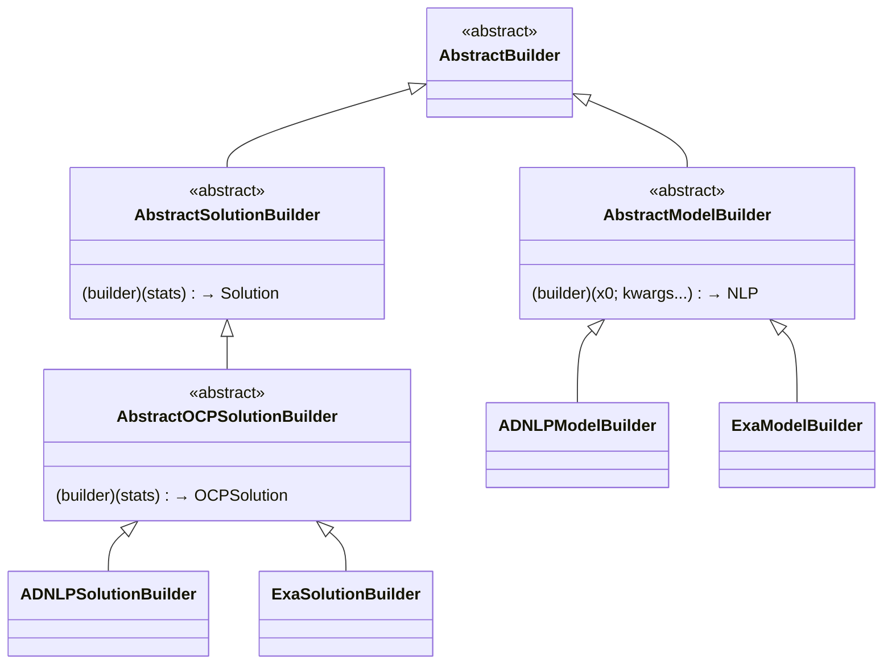

# Implementing an Optimization Problem

```@meta
CurrentModule = CTSolvers
```

This guide explains how to implement an optimization problem in CTSolvers. An optimization problem is a concrete type that carries all the data needed to build NLP models and extract solutions. We use **DiscretizedModel** (DOCP) as the reference example.

!!! tip "Prerequisites"
    Read [Architecture](@ref) and [Implementing a Modeler](@ref) first. The optimization problem provides the **builders** that modelers call.

## The AbstractOptimizationProblem Contract

Every concrete optimization problem must implement **four builder getters** — one model builder and one solution builder per NLP backend:

| Method | Returns | Used by |
|--------|---------|---------|
| `get_adnlp_model_builder(prob)` | `AbstractModelBuilder` | `Modelers.ADNLP` |
| `get_exa_model_builder(prob)` | `AbstractModelBuilder` | `Modelers.Exa` |
| `get_adnlp_solution_builder(prob)` | `AbstractSolutionBuilder` | `Modelers.ADNLP` |
| `get_exa_solution_builder(prob)` | `AbstractSolutionBuilder` | `Modelers.Exa` |

All four have default implementations that throw `NotImplemented`:

```@example optprob
using CTSolvers
struct EmptyProblem <: CTSolvers.Optimization.AbstractOptimizationProblem end
nothing # hide
```

```@repl optprob
CTSolvers.Optimization.get_adnlp_model_builder(EmptyProblem())
```

```@repl optprob
CTSolvers.Optimization.get_exa_solution_builder(EmptyProblem())
```

You only need to implement the getters for the backends you support. If your problem only supports ADNLPModels, leave the ExaModels getters unimplemented — they will throw a clear error if called.

## The Builder Pattern

Builders are **callable objects** that encapsulate the logic for constructing NLP models or solutions. They are defined in the `Optimization` module.



### ADNLPModelBuilder

Wraps a function that builds an `ADNLPModel` from an initial guess:

```@example optprob
using CTSolvers.Optimization: ADNLPModelBuilder

builder = ADNLPModelBuilder(x0 -> "NLP from x0=$x0")
```

```@example optprob
builder([1.0, 2.0])  # call the builder
```

### ExaModelBuilder

Wraps a function that builds an `ExaModel` from a base type and initial guess:

```@example optprob
using CTSolvers.Optimization: ExaModelBuilder

exa_builder = ExaModelBuilder((T, x0) -> "ExaModel{$T} from x0=$x0")
```

```@example optprob
exa_builder(Float64, [1.0, 2.0])  # call the builder
```

### Solution Builders

Same pattern for solution builders:

```@example optprob
using CTSolvers.Optimization: ADNLPSolutionBuilder

sol_builder = ADNLPSolutionBuilder(stats -> "Solution from stats=$stats")
```

```@example optprob
sol_builder(:converged)  # call the builder
```

!!! note "Why callable objects?"
    Builders capture problem-specific data (closures) while presenting a uniform interface to modelers. The modeler doesn't need to know what data the builder needs — it just calls it with the standard arguments.

## Implementing DiscretizedModel

### Step 1 — Define the struct

The DOCP stores the original OCP plus one builder per backend:

```julia
struct DiscretizedModel{
    TO <: AbstractModel,
    TAMB <: AbstractModelBuilder,
    TEMB <: AbstractModelBuilder,
    TASB <: AbstractSolutionBuilder,
    TESB <: AbstractSolutionBuilder,
} <: AbstractOptimizationProblem
    optimal_control_problem::TO
    adnlp_model_builder::TAMB
    exa_model_builder::TEMB
    adnlp_solution_builder::TASB
    exa_solution_builder::TESB
end
```

### Step 2 — Implement the contract

Each getter simply returns the corresponding field:

```julia
import CTSolvers.Optimization: get_adnlp_model_builder, get_exa_model_builder
import CTSolvers.Optimization: get_adnlp_solution_builder, get_exa_solution_builder

get_adnlp_model_builder(prob::DiscretizedModel) = prob.adnlp_model_builder
get_exa_model_builder(prob::DiscretizedModel) = prob.exa_model_builder
get_adnlp_solution_builder(prob::DiscretizedModel) = prob.adnlp_solution_builder
get_exa_solution_builder(prob::DiscretizedModel) = prob.exa_solution_builder
```

### Step 3 — Construct with builders

The DOCP is typically constructed by a discretization strategy (e.g., Collocation) that creates the builders from the OCP:

```julia
# In CTDirect.jl (external package)
function discretize(ocp, discretizer::Collocation)
    # Build the closures that know how to create NLP models from this OCP
    adnlp_builder = ADNLPModelBuilder(x0 -> build_adnlp(ocp, discretizer, x0))
    exa_builder = ExaModelBuilder((T, x0) -> build_exa(ocp, discretizer, T, x0))

    # Build the closures that know how to extract solutions
    adnlp_sol_builder = ADNLPSolutionBuilder(stats -> extract_solution(ocp, discretizer, stats))
    exa_sol_builder = ExaSolutionBuilder(stats -> extract_solution(ocp, discretizer, stats))

    return DiscretizedModel(
        ocp, adnlp_builder, exa_builder, adnlp_sol_builder, exa_sol_builder,
    )
end
```

## Integration with the Pipeline

The complete data flow from user call to solution:

```mermaid
sequenceDiagram
    participant User
    participant Solve as CommonSolve.solve
    participant Modeler as Modelers.ADNLP
    participant Problem as DOCP
    participant ModelBuilder as ADNLPModelBuilder
    participant Solver as Solvers.Ipopt
    participant SolBuilder as ADNLPSolutionBuilder

    User->>Solve: solve(docp, x0, modeler, solver)
    Solve->>Modeler: build_model(docp, x0, modeler)
    Modeler->>Problem: get_adnlp_model_builder(docp)
    Problem-->>Modeler: ADNLPModelBuilder
    Modeler->>ModelBuilder: builder(x0; backend=:optimized, ...)
    ModelBuilder-->>Modeler: ADNLPModel
    Modeler-->>Solve: nlp

    Solve->>Solver: solve(nlp, solver)
    Solver-->>Solve: stats

    Solve->>Modeler: build_solution(docp, stats, modeler)
    Modeler->>Problem: get_adnlp_solution_builder(docp)
    Problem-->>Modeler: ADNLPSolutionBuilder
    Modeler->>SolBuilder: builder(stats)
    SolBuilder-->>Modeler: OCPSolution
    Modeler-->>Solve: solution
    Solve-->>User: solution
```

The key insight is that the **problem provides the builders** and the **modeler orchestrates the calls**. This separation allows:

- Different problem types to provide different builders
- The same modeler to work with any problem that implements the contract
- Builders to capture problem-specific data without exposing it to the modeler

## Summary: Adding a New Optimization Problem

To add a new optimization problem type:

1. Define `MyProblem <: AbstractOptimizationProblem` with fields for your problem data and builders
2. Implement `get_adnlp_model_builder(prob::MyProblem)` — return an `ADNLPModelBuilder`
3. Implement `get_adnlp_solution_builder(prob::MyProblem)` — return an `ADNLPSolutionBuilder`
4. Optionally implement `get_exa_model_builder` and `get_exa_solution_builder` for ExaModels support
5. Create a construction function that builds the builders from your problem data

The builders should be callable objects that:

- **Model builders**: take `(initial_guess; kwargs...)` and return an NLP model
- **Solution builders**: take `(nlp_stats)` and return a problem-specific solution
