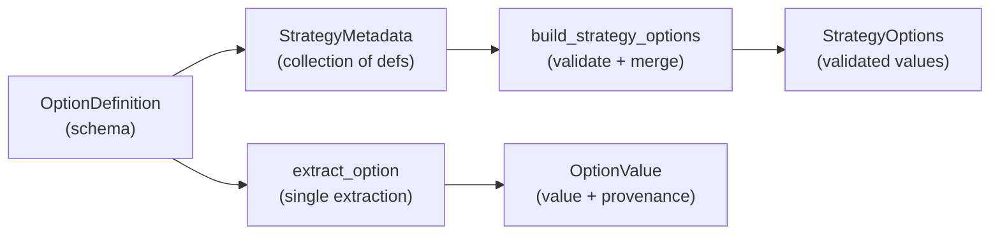
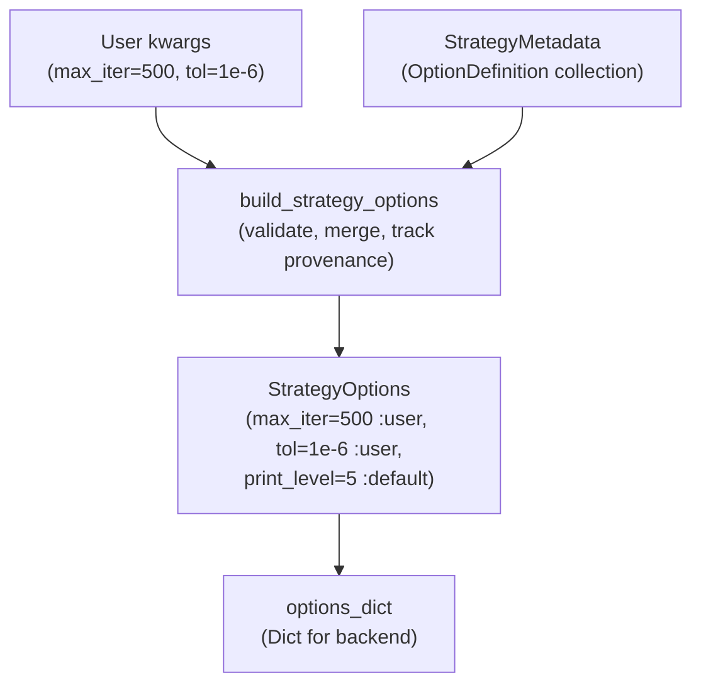

# Options System

```@meta
CurrentModule = CTSolvers
```

This guide explains the Options module — the foundational layer for defining, validating, extracting, and tracking configuration values throughout CTSolvers. The Options module is generic and has no dependencies on other CTSolvers modules.

```@example options
using CTSolvers
using CTBase: CTBase
const Exceptions = CTBase.Exceptions
nothing # hide
```

## Overview

The options system has four core types and a set of extraction functions:



## OptionDefinition

An `OptionDefinition` is the schema for a single option. It specifies the name, type, default, description, aliases, and an optional validator.

```@example options
using CTSolvers.Options: OptionDefinition, OptionValue, NotProvided # hide
using CTSolvers.Options: all_names, extract_option, extract_options, extract_raw_options # hide
def = OptionDefinition(
    name        = :max_iter,
    type        = Integer,
    default     = 1000,
    description = "Maximum number of iterations",
    aliases     = (:maxiter,),
    validator   = x -> x >= 0 || throw(Exceptions.IncorrectArgument(
        "Invalid max_iter", got = "$x", expected = ">= 0",
    )),
)
```

### Fields

| Field         | Type                      | Description                           |
|-------------- |---------------------------|---------------------------------------|
| `name`        | `Symbol`                  | Primary option name                   |
| `type`        | `Type`                    | Expected Julia type                   |
| `default`     | `Any`                     | Default value (or `NotProvided`)      |
| `description` | `String`                  | Human-readable description            |
| `aliases`     | `Tuple{Vararg{Symbol}}`   | Alternative names                     |
| `validator`   | `Function` or `nothing`   | Validation function                   |

### Constructor validation

The constructor automatically:

1. Checks that `default` matches the declared `type`
2. Runs the `validator` on the `default` value (if both are provided)
3. Skips validation when `default` is `NotProvided`

Type mismatch in the constructor:

```@repl options
OptionDefinition(name = :count, type = Integer, default = "hello", description = "A count")
```

### Aliases

Aliases allow users to use alternative names for the same option:

```@example options
def_alias = OptionDefinition(
    name = :max_iter, type = Int, default = 100,
    description = "Max iterations", aliases = (:maxiter, :max),
)
all_names(def_alias)
```

The extraction system searches all names when looking for a match in kwargs.

### Validators

Validators follow the pattern `x -> condition || throw(...)`. They should return a truthy value on success or throw on failure:

```@example options
validated_def = OptionDefinition(
    name = :tol, type = Real, default = 1e-8,
    description = "Tolerance",
    validator = x -> x > 0 || throw(Exceptions.IncorrectArgument(
        "Invalid tolerance",
        got = "tol=$x", expected = "positive real number (> 0)",
        suggestion = "Use 1e-6 or 1e-8",
    )),
)
nothing # hide
```

Validator failure:

```@repl options
extract_option((tol = -1.0,), validated_def)
```

## NotProvided

`NotProvided` is a sentinel value that distinguishes "no default" from "default is `nothing`":

```@example options
NotProvided
```

```@example options
# Option with NotProvided default — omitted if user doesn't provide it
opt_np = OptionDefinition(
    name = :mu_init, type = Real, default = NotProvided,
    description = "Initial barrier parameter",
)
```

When `extract_option` encounters a `NotProvided` default and the user hasn't provided the option, the option is excluded from the result:

```@example options
result, remaining = extract_option((other = 42,), opt_np)
println("Result: ", result)
println("Remaining: ", remaining)
```

## OptionValue and Provenance

`OptionValue` wraps a value with its **provenance** — where it came from:

```@example options
OptionValue(1000, :user)
```

```@example options
OptionValue(1e-8, :default)
```

```@example options
OptionValue(42, :computed)
```

### Three sources

| Source     | Meaning                                   |
|----------- |-------------------------------------------|
| `:user`    | Explicitly provided by the user           |
| `:default` | Came from the `OptionDefinition` default  |
| `:computed`| Derived or computed from other options    |

Invalid source:

```@repl options
OptionValue(42, :invalid_source)
```

Provenance tracking enables introspection — you can tell whether a value was explicitly chosen or inherited from defaults:

```@example options
opt = OptionValue(1000, :user)
println("Value: ", opt.value)
println("Source: ", opt.source)
```

## Accessing Option Properties (Getters)

Use the getters in `Options` to access `OptionDefinition` and `OptionValue` fields instead of reading struct fields directly. This keeps encapsulation intact and aligns with Strategies overrides.

```@example options
using CTSolvers.Options

def = OptionDefinition(
    name = :max_iter,
    type = Int,
    default = 100,
    description = "Maximum iterations",
    aliases = (:maxiter,),
)

@show Options.name(def)
@show Options.type(def)
@show Options.default(def)
@show Options.description(def)
@show Options.aliases(def)
@show Options.is_required(def)

opt = OptionValue(200, :user)
@show Options.value(opt)
@show Options.source(opt)
@show Options.is_user(opt)
@show Options.is_default(opt)
@show Options.is_computed(opt)
```

### Encapsulation Best Practices (Strategies)

- To retrieve an `OptionValue` from a strategy: `opt = Strategies.option(opts, :max_iter)`
- To read value/provenance: `Options.value(opt)`, `Options.source(opt)` or directly `Options.value(opts, :max_iter)`
- For predicates on a strategy: `Strategies.option_is_user(strategy, key)` (or `Options.is_user(options(strategy), key)`).
- Avoid direct field access (`.value`, `.source`, `.options`), which is reserved for the owning module.

**Example usage** (using `DemoStrategy` defined below):

```julia
using CTSolvers.Strategies

# Build strategy options with user-provided values
opts = Strategies.build_strategy_options(DemoStrategy; max_iter=250, tol=1e-7)

# Encapsulated access to option values
opt = Strategies.option(opts, :max_iter)
Options.value(opt)    # Returns: 250
Options.source(opt)   # Returns: :user

# Check provenance
Options.is_user(opts, :max_iter)    # Returns: true
Options.is_default(opts, :tol)      # Returns: false (user provided)
```

## StrategyMetadata Overview (Strategies)

`StrategyMetadata` is a collection of `OptionDefinition` objects that describes all configurable options for a strategy. It is returned by `Strategies.metadata(::Type)`.

```@example options
meta = CTSolvers.Strategies.StrategyMetadata(
    OptionDefinition(name = :tol, type = Real, default = 1e-8, description = "Tolerance"),
    OptionDefinition(name = :max_iter, type = Integer, default = 1000, description = "Max iterations"),
    OptionDefinition(name = :verbose, type = Bool, default = false, description = "Verbose output"),
)
```

### Collection interface

`StrategyMetadata` implements the standard Julia collection interface:

```@example options
println("keys:   ", keys(meta))
println("length: ", length(meta))
println("haskey: ", haskey(meta, :tol))
```

```@example options
meta[:tol]
```

### Uniqueness

The constructor validates that all option names (including aliases) are unique across the entire metadata collection.

## StrategyOptions

`StrategyOptions` stores the **validated option values** for a strategy instance. It is created by `build_strategy_options`.

```@example options
abstract type DemoStrategy <: CTSolvers.Strategies.AbstractStrategy end
CTSolvers.Strategies.id(::Type{DemoStrategy}) = :demo
CTSolvers.Strategies.metadata(::Type{DemoStrategy}) = meta
nothing # hide
```

```@example options
opts = CTSolvers.Strategies.build_strategy_options(DemoStrategy;
    max_iter = 500, tol = 1e-6,
)
```

### Access patterns

```@example options
println("opts[:max_iter] = ", opts[:max_iter])
println("opts[:tol]      = ", opts[:tol])
println("opts[:verbose]  = ", opts[:verbose])
```

### Collection interface

```@example options
println("keys:   ", keys(opts))
println("length: ", length(opts))
println("haskey: ", haskey(opts, :tol))
```

```@example options
for (k, v) in pairs(opts)
    println("  ", k, " => ", v)
end
```

## Validation Modes

`build_strategy_options` supports two validation modes.

### Strict mode (default)

Rejects unknown options with a helpful error message:

```@repl options
CTSolvers.Strategies.build_strategy_options(DemoStrategy; max_itr = 500)
```

### Permissive mode

Accepts unknown options with a warning and stores them with `:user` source:

```@example options
opts_perm = CTSolvers.Strategies.build_strategy_options(DemoStrategy;
    mode = :permissive, max_iter = 500, custom_flag = true,
)
println("keys: ", keys(opts_perm))
```

## Extraction Functions

### `extract_option`

Extracts a single option from a `NamedTuple`:

```@example options
def_grid = OptionDefinition(
    name = :grid_size, type = Int, default = 100,
    description = "Grid size", aliases = (:n,),
)
opt_value, remaining = extract_option((n = 200, tol = 1e-6), def_grid)
println("Extracted: ", opt_value)
println("Remaining: ", remaining)
```

The function:

1. Searches all names (primary + aliases)
2. Validates the type
3. Runs the validator
4. Returns `OptionValue` with `:user` source
5. Removes the matched key from remaining kwargs

Type mismatch in extraction:

```@repl options
extract_option((grid_size = "hello",), def_grid)
```

### `extract_options`

Extracts multiple options at once:

```@example options
defs = [
    OptionDefinition(name = :grid_size, type = Int, default = 100, description = "Grid"),
    OptionDefinition(name = :tol, type = Float64, default = 1e-6, description = "Tol"),
]
extracted, remaining = extract_options((grid_size = 200, max_iter = 1000), defs)
println("Extracted: ", extracted)
println("Remaining: ", remaining)
```

### `extract_raw_options`

Unwraps `OptionValue` wrappers and filters out `NotProvided` values:

```@example options
raw_input = (
    backend   = OptionValue(:optimized, :user),
    show_time = OptionValue(false, :default),
    optional  = OptionValue(NotProvided, :default),
)
extract_raw_options(raw_input)
```

## Data Flow Summary


