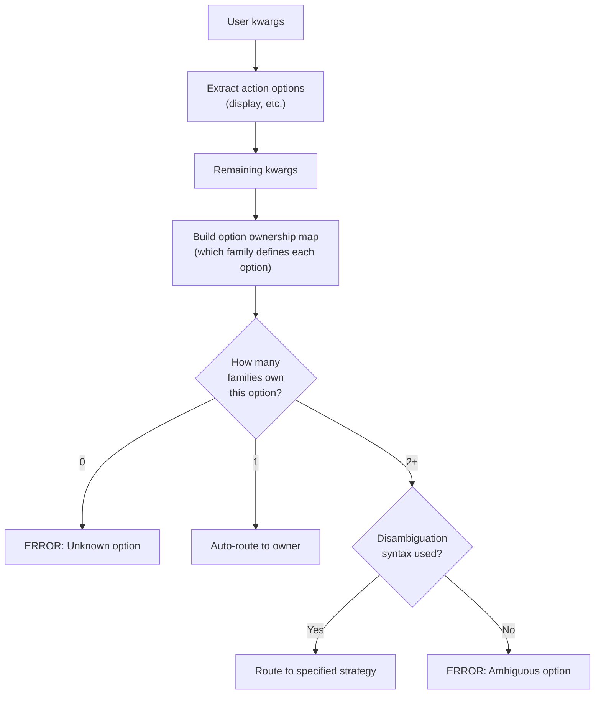

# Orchestration and Routing

```@meta
CurrentModule = CTSolvers
```

This guide explains how the Orchestration module routes user-provided keyword arguments to the correct strategy in a multi-strategy pipeline. It covers the method tuple concept, automatic routing, disambiguation syntax, and the helper functions that power the system.

!!! tip "Prerequisites"
    Read [Architecture](@ref) and [Implementing a Strategy](@ref) first. Orchestration builds on top of the strategy metadata system.

We first set up three fake strategies (discretizer, modeler, solver) with a shared `backend` option to demonstrate routing and disambiguation:

```@example routing
using CTSolvers
using CTSolvers.Options: OptionDefinition

# --- Fake discretizer family ---
abstract type AbstractFakeDiscretizer <: CTSolvers.Strategies.AbstractStrategy end
struct FakeCollocation <: AbstractFakeDiscretizer; options::CTSolvers.Strategies.StrategyOptions; end
CTSolvers.Strategies.id(::Type{<:FakeCollocation}) = :collocation
CTSolvers.Strategies.metadata(::Type{<:FakeCollocation}) = CTSolvers.Strategies.StrategyMetadata(
    OptionDefinition(name = :grid_size, type = Int, default = 100, description = "Grid size"),
)
FakeCollocation(; kwargs...) = FakeCollocation(CTSolvers.Strategies.build_strategy_options(FakeCollocation; kwargs...))

# --- Fake modeler family ---
abstract type AbstractFakeModeler <: CTSolvers.Strategies.AbstractStrategy end
struct FakeADNLP <: AbstractFakeModeler; options::CTSolvers.Strategies.StrategyOptions; end
CTSolvers.Strategies.id(::Type{<:FakeADNLP}) = :adnlp
CTSolvers.Strategies.metadata(::Type{<:FakeADNLP}) = CTSolvers.Strategies.StrategyMetadata(
    OptionDefinition(name = :backend, type = Symbol, default = :default, description = "AD backend"),
)
FakeADNLP(; kwargs...) = FakeADNLP(CTSolvers.Strategies.build_strategy_options(FakeADNLP; kwargs...))

# --- Fake solver family ---
abstract type AbstractFakeSolver <: CTSolvers.Strategies.AbstractStrategy end
struct FakeIpopt <: AbstractFakeSolver; options::CTSolvers.Strategies.StrategyOptions; end
CTSolvers.Strategies.id(::Type{<:FakeIpopt}) = :ipopt
CTSolvers.Strategies.metadata(::Type{<:FakeIpopt}) = CTSolvers.Strategies.StrategyMetadata(
    OptionDefinition(name = :max_iter, type = Integer, default = 1000, description = "Max iterations"),
    OptionDefinition(name = :backend, type = Symbol, default = :cpu, description = "Compute backend"),
)
FakeIpopt(; kwargs...) = FakeIpopt(CTSolvers.Strategies.build_strategy_options(FakeIpopt; kwargs...))

# --- Registry ---
registry = CTSolvers.Strategies.create_registry(
    AbstractFakeDiscretizer => (FakeCollocation,),
    AbstractFakeModeler     => (FakeADNLP,),
    AbstractFakeSolver      => (FakeIpopt,),
)
```

## The Method Tuple Concept

A **method tuple** identifies which concrete strategy to use for each role in the pipeline:

```@example routing
method = (:collocation, :adnlp, :ipopt)
```

Each symbol is a strategy `id` (returned by `Strategies.id(::Type)`). The **families** mapping associates each role with its abstract type:

```@example routing
families = (
    discretizer = AbstractFakeDiscretizer,
    modeler     = AbstractFakeModeler,
    solver      = AbstractFakeSolver,
)
nothing # hide
```

The orchestration system uses the `StrategyRegistry` to resolve each symbol to its concrete type and access its metadata.

## Automatic Routing

When a user passes keyword arguments, `route_all_options` automatically routes each option to the strategy that owns it:

```julia
solve(ocp, :collocation, :adnlp, :ipopt;
    grid_size = 100,    # only discretizer defines this → auto-route
    max_iter  = 1000,   # only solver defines this → auto-route
    display   = true,   # action option → extracted separately
)
```

The routing algorithm:



### How it works internally

1. **Extract action options** — options like `display` are matched against `action_defs` and removed from the pool
2. **Build strategy-to-family map** — maps each strategy ID to its family name (e.g., `:ipopt → :solver`)
3. **Build option ownership map** — scans all strategy metadata to determine which family defines each option name
4. **Route each remaining option** — auto-route if unambiguous, require disambiguation if ambiguous, error if unknown

## Disambiguation

When an option name appears in multiple strategies (e.g., `backend` is defined by both the modeler and the solver), the user must disambiguate using `route_to`:

### Single strategy

```julia
solve(ocp, :collocation, :adnlp, :ipopt;
    backend = route_to(adnlp = :sparse),  # route to modeler only
)
```

### Multiple strategies

```julia
solve(ocp, :collocation, :adnlp, :ipopt;
    backend = route_to(adnlp = :sparse, ipopt = :cpu),  # route to both
)
```

### How `route_to` works

`route_to` creates a `RoutedOption` object that carries `(strategy_id => value)` pairs. The `extract_strategy_ids` function detects this type and returns the routing information:

```@example routing
using CTSolvers.Strategies: route_to
using CTSolvers.Orchestration: extract_strategy_ids

opt = route_to(ipopt = 100, adnlp = 50)
```

```@example routing
extract_strategy_ids(opt, (:collocation, :adnlp, :ipopt))
```

No disambiguation detected for plain values:

```@example routing
extract_strategy_ids(:plain_value, (:collocation, :adnlp, :ipopt))
```

Invalid strategy ID in `route_to`:

```@repl routing
extract_strategy_ids(route_to(unknown = 42), (:collocation, :adnlp, :ipopt))
```

## Strict and Permissive Modes

The routing system supports two validation modes, consistent with strategy-level validation:

| Mode | Unknown option | Ambiguous option |
|------|---------------|-----------------|
| `:strict` (default) | Error with available options listed | Error with disambiguation syntax |
| `:permissive` | Warning, passed through if disambiguated | Error (always requires disambiguation) |

## Helper Functions

### `build_strategy_to_family_map`

Maps each strategy ID in the method to its family name:

```@example routing
using CTSolvers.Orchestration: build_strategy_to_family_map
build_strategy_to_family_map(method, families, registry)
```

### `build_option_ownership_map`

Scans all strategy metadata and maps each option name to the set of families that define it:

```@example routing
using CTSolvers.Orchestration: build_option_ownership_map
build_option_ownership_map(method, families, registry)
```

Note that `:backend` is owned by both `:modeler` and `:solver` — it is ambiguous and requires disambiguation.

### `extract_strategy_ids`

Detects disambiguation syntax and extracts `(value, strategy_id)` pairs:

```@example routing
extract_strategy_ids(route_to(ipopt = 1000), method)
```

```@example routing
extract_strategy_ids(42, method)
```

## Complete Example

Auto-routing with disambiguation and action option extraction:

```@example routing
using CTSolvers.Orchestration: route_all_options

action_defs = [
    OptionDefinition(name = :display, type = Bool, default = true,
                     description = "Display solver progress"),
]

kwargs = (
    grid_size = 100,                          # auto-routed to discretizer
    max_iter  = 500,                          # auto-routed to solver
    backend   = route_to(adnlp = :optimized), # disambiguated to modeler
    display   = false,                        # action option
)

routed = route_all_options(method, families, action_defs, kwargs, registry)
```

Action options:

```@example routing
routed.action
```

Strategy options per family:

```@example routing
routed.strategies
```

### Error: unknown option

```@repl routing
route_all_options(method, families, action_defs, (foo = 42,), registry)
```

### Error: ambiguous option without disambiguation

```@repl routing
route_all_options(method, families, action_defs, (backend = :sparse,), registry)
```
