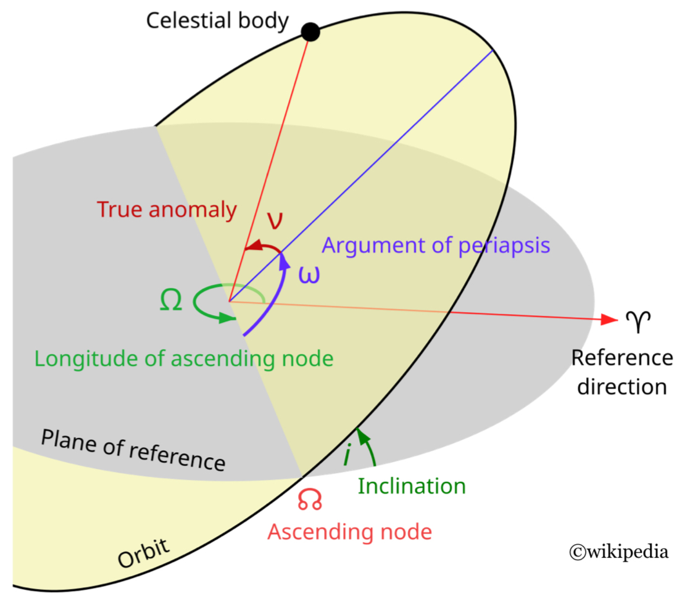

# [Minimum time orbit transfer](@id orbit)

## Introduction

```@raw html

```

For the controlled Kepler equation, check [^1] and [^2].

```@example main
using OptimalControl
using NLPModelsIpopt
using OrdinaryDiffEq
using Plots
using MINPACK
using ForwardDiff
using LinearAlgebra
```

## Problem definition

```@example main
Tmax = 60                                  # Maximum thrust (Newtons)
cTmax = 3600^2 / 1e6; T = Tmax * cTmax     # Conversion from Newtons to kg x Mm / h²
mass0 = 1500                               # Initial mass of the spacecraft
β = 1.42e-02                               # Engine specific impulsion
μ = 5165.8620912                           # Earth gravitation constant
P0 = 11.625                                # Initial semilatus rectum
ex0, ey0 = 0.75, 0                         # Initial eccentricity
hx0, hy0 = 6.12e-2, 0                      # Initial ascending node and inclination
L0 = π                                     # Initial longitude
Pf = 42.165                                # Final semilatus rectum
exf, eyf = 0, 0                            # Final eccentricity
hxf, hyf = 0, 0                            # Final ascending node and inclination

asqrt(x; ε=1e-9) = sqrt(sqrt(x^2+ε^2))     # Avoid issues with AD

function F0(x)
    P, ex, ey, hx, hy, L = x
    pdm = asqrt(P / μ)
    cl = cos(L)
    sl = sin(L)
    w = 1 + ex * cl + ey * sl
    F = zeros(eltype(x), 6) # Use eltype to allow overloading for AD
    F[6] = w^2 / (P * pdm)
    return F
end

function F1(x)
    P, ex, ey, hx, hy, L = x
    pdm = asqrt(P / μ)
    cl = cos(L)
    sl = sin(L)
    F = zeros(eltype(x), 6)
    F[2] = pdm *   sl
    F[3] = pdm * (-cl)
    return F
end

function F2(x)
    P, ex, ey, hx, hy, L = x
    pdm = asqrt(P / μ)
    cl = cos(L)
    sl = sin(L)
    w = 1 + ex * cl + ey * sl
    F = zeros(eltype(x), 6)
    F[1] = pdm * 2 * P / w
    F[2] = pdm * (cl + (ex + cl) / w)
    F[3] = pdm * (sl + (ey + sl) / w)
    return F
end

function F3(x)
    P, ex, ey, hx, hy, L = x
    pdm = asqrt(P / μ)
    cl = cos(L)
    sl = sin(L)
    w = 1 + ex * cl + ey * sl
    pdmw = pdm / w
    zz = hx * sl - hy * cl
    uh = (1 + hx^2 + hy^2) / 2
    F = zeros(eltype(x), 6)
    F[2] = pdmw * (-zz * ey)
    F[3] = pdmw *   zz * ex
    F[4] = pdmw *   uh * cl
    F[5] = pdmw *   uh * sl
    F[6] = pdmw *   zz
    return F
end

nothing # hide
```

## Direct solve

```@example main
tf = 15                                      # Estimation of final time
Lf = 3π                                      # Estimation of final longitude
x0 = [P0, ex0, ey0, hx0, hy0, L0]            # Initial state
xf = [Pf, exf, eyf, hxf, hyf, Lf]            # Final state
x(t) = x0 + (xf - x0) * t / tf               # Linear interpolation
u(t) = [0.1, 0.5, 0.]                        # Initial guess for the control
nlp_init = (state=x, control=u, variable=tf) # Initial guess for the NLP

@def ocp begin
    tf ∈ R, variable
    t ∈ [0, tf], time
    x = (P, ex, ey, hx, hy, L) ∈ R⁶, state
    u ∈ R³, control
    x(0) == x0 
    x[1:5](tf) == xf[1:5]
    mass = mass0 - β * T * t
    ẋ(t) == F0(x(t)) + T / mass * (u₁(t) * F1(x(t)) + u₂(t) * F2(x(t)) + u₃(t) * F3(x(t)))
    u₁(t)^2 + u₂(t)^2 + u₃(t)^2 ≤ 1
    .8P0 ≤ P(t) ≤ 1.2Pf
    -1 ≤ ex(t) ≤ 1
    -1 ≤ ey(t) ≤ 1
    -1 ≤ hx(t) ≤ 1
    -1 ≤ hy(t) ≤ 1
    L0 ≤ L(t) ≤ 1.2Lf
    tf → min
end
```

```@example main
nlp_sol = OptimalControl.solve(ocp; init=nlp_init, grid_size=100)
nothing # hide
```

```@example main
tf = nlp_sol.variable
p0 = nlp_sol.costate(0)
plot(nlp_sol)
```

## Shooting (1/2), Tmax = 60 Newtons

```@example main
function ur(t, x, p, tf) # Regular maximising control 
    H1 = p' * F1(x)
    H2 = p' * F2(x)
    H3 = p' * F3(x)
    u = [H1, H2, H3]
    u = u / sqrt(u[1]^2 + u[2]^2 + u[3]^2)
    return u
end

fr = Flow(ocp, ur) # Regular flow (first version)

function shoot(ξ::Vector{T}) where T
    tf, p0 = ξ[1], ξ[2:end]
    xf_, pf = fr(0, x0, p0, tf)
    s = zeros(T, 7)
    s[1:5] = xf_[1:5] - xf[1:5]
    s[6] = pf[6]
    s[7] = p0[1]^2 + p0[2]^2 + p0[3]^2 + p0[4]^2 + p0[5]^2 + p0[6]^2 - 1
    return s
end

p0 = p0 / norm(p0) # Normalization |p0|=1 for free final time
ξ = [tf; p0]; # Initial guess
jshoot(ξ) = ForwardDiff.jacobian(shoot, ξ)
shoot!(s, ξ) = (s[:] = shoot(ξ); nothing)
jshoot!(js, ξ) = (js[:] = jshoot(ξ); nothing)
bvp_sol = fsolve(shoot!, jshoot!, ξ; show_trace=true); println(bvp_sol)
nothing # hide
```

## Shooting (2/2), Tmax = 6 Newtons


```@example main
hr = (t, x, p) -> begin # Regular maximised Hamiltonian (more efficient)
    H0 = p' * F0(x)
    H1 = p' * F1(x)
    H2 = p' * F2(x)
    H3 = p' * F3(x)
    mass = mass0 - β*T*t
    h = H0 + T / mass * sqrt(H1^2 + H2^2 + H3^2) 
    return h
end

hr = Hamiltonian(hr; autonomous=false)
fr = Flow(hr) # Regular flow (again)

Tmax = 0.7                                 # Maximum thrust (Newtons)
cTmax = 3600^2 / 1e6; T = Tmax * cTmax     # Conversion from Newtons to kg x Mm / h²
tf = 6.080e3; p0 =-[-1.234155379067110e+02, -6.207170881591489e+02, 5.742554220129187e-01, 1.629324243017332e+03, -2.373935935351530e+00, -2.854066853269850e-01] # hide
tf = 1.320e2; p0 =-[-4.743728539366440e+00, -7.171314869854240e+01, -2.750468309804530e+00, 4.505679923365745e+01, -3.026794475592510e+00, 2.248091067047670e+00] # hide
tf = 1.210e3; p0 =-[-2.215319700438820e+01, -4.347109477345140e+01, 9.613188807286992e-01, 3.181800985503019e+02, -2.307236094862410e+00, -5.797863110671591e-01] # Tmax = 0.7 Newtons 
p0 = p0 / norm(p0) # Normalization |p0|=1 for free final time
ξ = [tf; p0]; # Initial guess

bvp_sol = fsolve(shoot!, jshoot!, ξ; show_trace=true); println(bvp_sol)
nothing # hide
```

## Plots

```@example main
tf = bvp_sol.x[1]
p0 = bvp_sol.x[2:end]
ode_sol = fr((0, tf), x0, p0)
t  = ode_sol.t; N = size(t, 1)
P  = ode_sol[1, :]
ex = ode_sol[2, :]
ey = ode_sol[3, :]
hx = ode_sol[4, :]
hy = ode_sol[5, :]
L  = ode_sol[6, :]
cL = cos.(L)
sL = sin.(L)
w  = @. 1 + ex * cL + ey * sL
Z  = @. hx * sL - hy * cL
C  = @. 1 + hx^2 + hy^2
q1 = @. P *((1 + hx^2 - hy^2) * cL + 2 * hx * hy * sL) / (C * w)
q2 = @. P *((1 - hx^2 + hy^2) * sL + 2 * hx * hy * cL) / (C * w)
q3 = @. 2 * P * Z / (C * w)

plt1 = plot3d(1; xlim = (-60, 60), ylim = (-60, 60), zlim = (-5, 5), title = "Orbit transfer", legend=false)
@gif for i = 1:N
    push!(plt1, q1[i], q2[i], q3[i])
end every N ÷ min(N, 100) 
```

## References

[^1]: Bonnard, B.; Caillau, J.-B.; Trélat, E. Geometric optimal control of elliptic Keplerian orbits.  *Discrete Contin. Dyn. Syst. Ser. B* **5** (2005), no. 4, 929-956.

[^2]: Caillau, J.-B.; Gergaud, J.; Noailles, J. 3D Geosynchronous Transfer of a Satellite: continuation on the Thrust. *J. Optim. Theory Appl.* **118** (2003), no. 3, 541-565.