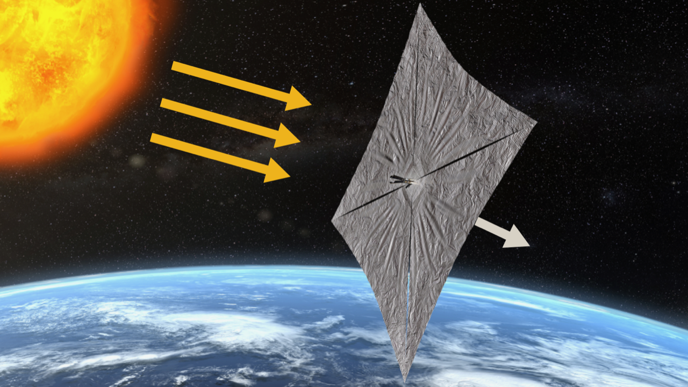

# [Solar sail](@id sail)

```@raw html

```

```@example main
using OptimalControl
using NLPModelsIpopt
using Plots
using Interpolations
using JLD2

include("kepl2cart.jl")
include("control_ideal2D.jl")

function rnorm(x; ε=1e-9)
    return sqrt(sum(x.^2) + ε^2)
end

# Definition of the optical parameters 
rho = 0.88 # Specular reflection coefficient
eps_f = 0.05 # Emissivity front coeff 
eps_b = 0.55 # Emissivity back coeff 

# Solar and space constants
LU = 1.495978707e11  # (m) Astronautical unit 
mu = 1  # m^3/s^2
TU = sqrt(LU^3/132712440042e9) # Time Unit
Cs = 1367 * TU^3  # W m^-2 solar flux at 1AU
Tds = 3  # K temperature of the Deep Space
sigma = 5.67051e-8 * TU^3  # Stefan-Boltzmann's constant [W / m^2 /K^4]
light_speed = 299792458 / LU * TU # Speed of light

# Sail parameters
Am = 45 / LU^2  # Area-to-mass ratio
Area = 20 * 6 / LU^2 # Vane area * quantity of vanes
mass = Area / Am  # Mass of the satellite
temp0 = 293.15  # Initial temperature of the satellite
Csrp = Cs / light_speed
epsilon = Am * Csrp

# Initial orbit data
rpsail = 0.15                     # Periapsis distance elliptic orbit
a0 = (1 + rpsail) /2
e0 = 1 - rpsail/a0
r0, v0 = kepl2cart(a0, e0, 1e-6, 0, 0, 0, mu)
x0 = [r0[1:2]; v0[1:2]]                 # Initial state

# Heat parameters for Kapton material
spec_heat = 989 / LU^2 * TU^2                     # J/kg/K
heat_cap = spec_heat * mass / LU^2 * TU^2        # J/K
Tlim = 800                                   # K
temp_constr = Tds^4 - Tlim^4 #Tlim^4 - Tds^4 

opt_constr = (1 - rho)/(eps_f + eps_b)
heat_constr = Cs/sigma

# Integration 
t0 = 0
tf = 3600 * 24 * 30 * 12 * 3.5 / TU 

# Read of the initial guess from Matlab
filename = "matrix.txt"
file = open(filename, "r")
file_content = read(file, String)
close(file)
lines = split(file_content, "\n")
matrix_data = []
for line in lines
    if !isempty(line)
        row = [parse(Float64, x) for x in split(line)]
        push!(matrix_data, row)
    end
end

# Integration from a random point x_init 
t_inter = matrix_data[1]
N = length(t_inter)
x_inter = [ [ matrix_data[i][j] for i ∈ 2:7 ] for j ∈ 1:N ]
u_inter = control_ideal.(x_inter)

N_init = 350
time_init = t_inter[N_init]
x0 = [x_inter[N_init][1:2]; x_inter[N_init][4:5]]

N_final = N

t0 = time_init
tf = t_inter[N_final] 

itp1 = linear_interpolation(t_inter[N_init:N_final], [ x_inter[i][1] for i ∈ N_init:N_final ], extrapolation_bc=Line())
itp2 = linear_interpolation(t_inter[N_init:N_final], [ x_inter[i][2] for i ∈ N_init:N_final ], extrapolation_bc=Line())
itp3 = linear_interpolation(t_inter[N_init:N_final], [ x_inter[i][4] for i ∈ N_init:N_final ], extrapolation_bc=Line())
itp4 = linear_interpolation(t_inter[N_init:N_final], [ x_inter[i][5] for i ∈ N_init:N_final ], extrapolation_bc=Line())
itp_u = linear_interpolation(t_inter[N_init:N_final], u_inter[N_init:N_final], extrapolation_bc=Line())

function F0(x)
    # Kepler equation
    normr = rnorm(x[1:2])
    r = x[1:2]
    v = x[3:4]
    dv = -mu / normr^3 * r
    dx = [v; dv]
    return dx
end

function F1(x, β)
    normr = rnorm(x[1:2])
    cf = x[1] / normr
    sf = x[2] / normr
    rot_matrix = [cf -sf; sf  cf]
    dvdt = rot_matrix * srpsail2D(x, β, epsilon)
    dxdt = [0; 0; dvdt]
    return dxdt
end

function temperature(x, β)
    normr = rnorm(x[1:2])
    temp = (Tds^4 + cos(β) / ( normr ) * opt_constr * heat_constr)^(1/4)
    return temp
end

@def ocp begin
    t ∈ [ t0, tf ], time
    x ∈ R⁴, state
    β ∈ R, control
    -30 ≤ x₁(t) ≤ 30
    -30 ≤ x₂(t) ≤ 30
    -30 ≤ x₃(t) ≤ 30
    -30 ≤ x₄(t) ≤ 30
    -π/2 * 0.8 ≤ β(t) ≤ π/2 * 0.8
    x(t0) == x0
    ẋ(t) == F0(x(t)) + F1(x(t), β(t)) 
    cos(β(t)) / ( rnorm(x[1:2](t))) * opt_constr * heat_constr + temp_constr ≤ 0
    -mu / sqrt( rnorm(x[1:2](tf))) + 1/2 * ( x₃(tf)^2 + x₄(tf)^2 ) → max
end

x(t) = [itp1(t), itp2(t), itp3(t), itp4(t)]
β(t)  = itp_u(t)

initial_guess = (state=x, control=β)
sol = solve(ocp, init=initial_guess, grid_size = 200)
```

```@example main
plot_sol = Plots.plot(sol, size=(900, 1200))
```

```@example main
x_sol = sol.state.(sol.times)
Nsol = length(x_sol)
plot_traj2D = Plots.plot([ x_sol[i][1] for i ∈ 1:Nsol ], [ x_sol[i][2] for i ∈ 1:Nsol ], size=(600, 600), label="direct without initial guess")
plot_traj_matlab = Plots.plot!(matrix_data[2], matrix_data[3], size=(600, 600), label="local-optimal")
scatter!([x_sol[1][1]], [x_sol[1][2]], label="beginning of the optimised arc" )
scatter!([x_sol[end][1]], [x_sol[end][2]], label="end of the optimised arc" )
scatter!([0], [0], label="Sun", color="yellow" )
```

```@example main
β_sol = sol.control.(sol.times)
plot_temperature = Plots.plot(sol.times, temperature.(x_sol, β_sol), size=(600, 600), label="sail temperature")
plot!([sol.times[1], sol.times[end]], [Tlim, Tlim], label="temperature limit")
```

```@example main
energy_sol = -mu./sqrt.([x_sol[i][1] for i ∈ 1:Nsol].^2 + [x_sol[i][2] for i ∈ 1:Nsol].^2 ) + 1/2 * ([x_sol[i][3] for i ∈ 1:Nsol].^2 + [x_sol[i][4] for i ∈ 1:Nsol].^2)
energy_local_optimal = -mu./sqrt.(matrix_data[2].^2 + matrix_data[3].^2 + matrix_data[4].^2) + 1/2 * (matrix_data[5].^2 + matrix_data[6].^2 + matrix_data[7].^2)

plot_energy = Plots.plot(sol.times, energy_sol, size=(600, 600), label="orbital energy")
plot!(matrix_data[1][N_init:N], energy_local_optimal[N_init:N], label="orbital energy, local-optimal")
```

```@example main
###########################################################################################################################################
#                           CONTINUATION ON T0
###########################################################################################################################################

function ocp_t0(N_0, N_f)
    global t0 = t_inter[N_0]
    global tf = t_inter[N_f]
    global x0 = [x_inter[N_0][1:2]; x_inter[N_0][4:5]]
    @def ocp begin
        t ∈ [ t0, tf ], time
        x ∈ R⁴, state
        β ∈ R, control
        -30 ≤ x₁(t) ≤ 30
        -30 ≤ x₂(t) ≤ 30
        -30 ≤ x₃(t) ≤ 30
        -30 ≤ x₄(t) ≤ 30
        -π/2 * 0.8 ≤ β(t) ≤ π/2 * 0.8
        x(t0) == x0
        ẋ(t) == F0(x(t)) + F1(x(t), β(t)) 
        cos(β(t)) / ( x₁(t)^2 + x₂(t)^2 + 1e-3^2) * opt_constr * heat_constr + temp_constr ≤ 0
        -mu / sqrt( x₁(tf)^2 + x₂(tf)^2 + 1e-3^2) + 1/2 * ( x₃(tf)^2 + x₄(tf)^2 ) → max
    end
    return ocp
end

function fun_plot_sol(sol)
    x_sol = sol.state.(sol.times)
    Nsol = length(x_sol)
    plot_traj2D = Plots.plot([ x_sol[i][1] for i ∈ 1:Nsol ], [ x_sol[i][2] for i ∈ 1:Nsol ], size=(600, 600), label="direct without initial guess")
    Plots.plot!(matrix_data[2], matrix_data[3], size=(600, 600), label="local-optimal")
    scatter!([x_sol[1][1]], [x_sol[1][2]], label="beginning of the optimised arc" )
    scatter!([x_sol[end][1]], [x_sol[end][2]], label="end of the optimised arc" )
    scatter!([0], [0], label="Sun", color="yellow" )
    return plot_traj2D
end

init_loop = sol
sol_list = []
for Nt0_local = N_init:-10:N_init-50 
    ocp_loop = ocp_t0(Nt0_local, N)
    global sol_loop = solve(ocp_loop, init=init_loop, grid_size = 150, print_level=0)
    global init_loop = sol_loop
    println("Time: $(Nt0_local), Objective: $(sol_loop.objective), Iteration: $(sol_loop.iterations)")
    p = fun_plot_sol(sol_loop)
    display(p)
    push!(sol_list, sol_loop)
end
```

```@example main
sol = sol_list[end]
fun_plot_sol(sol)
x_sol = sol.state.(sol.times)
Nsol = length(x_sol)
energy_sol = -mu./sqrt.([x_sol[i][1] for i ∈ 1:Nsol].^2 + [x_sol[i][2] for i ∈ 1:Nsol].^2 ) + 1/2 * ([x_sol[i][3] for i ∈ 1:Nsol].^2 + [x_sol[i][4] for i ∈ 1:Nsol].^2)
plot_energy = Plots.plot(sol.times, energy_sol, size=(600, 600), label="orbital energy")
plot!(matrix_data[1][N_init-50:N], energy_local_optimal[N_init-50:N], label="orbital energy, local-optimal")
```