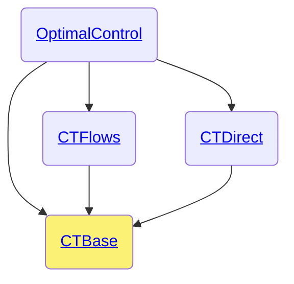

# CTBase.jl

```@meta
CollapsedDocStrings = true
```

The [CTBase.jl](control-toolbox.org/CTBase.jl/) package is part of the [control-toolbox ecosystem](https://github.com/control-toolbox).



You may find in this package:

- [Types](@ref api-ctbase-types): the common types and associated methods if any.
- [Description](@ref api-ctbase-description): tools to manipulate tuples.
- [Differential geometry](@ref api-ctbase-diffgeometry): tools to compute [Lie brackets](https://en.wikipedia.org/w/index.php?title=Lie_bracket_of_vector_fields&oldid=1163591634), [Poisson brackets](https://en.wikipedia.org/w/index.php?title=Poisson_manifold&oldid=1163991099#Formal_definition)...
- [Exceptions](@ref api-ctbase-exceptions).
- [Model](@ref api-ctbase-model): tools to modelise an optimal control problem in a functional manner.
- [Parser](@ref api-ctbase-parser): tools to modelise an optimal control problem in an abstract manner.
- [Plot](@ref api-ctbase-plot): the `plot` function extended from Plots.jl and utils.
- [Print](@ref api-ctbase-print): check how an optimal control problem is displayed.
- [Repl](@ref api-ctbase-repl): control-toolbox repl.
- [Utils](@ref api-ctbase-utils): auxiliary methods.

Here is the list of imported packages and exported functions.

```@autodocs
Modules = [CTBase, Base]
Order = [:module]
Pages = ["CTBase.jl"]
Private = false
```

For the developers, here are the [private methods](@ref dev-ctbase).