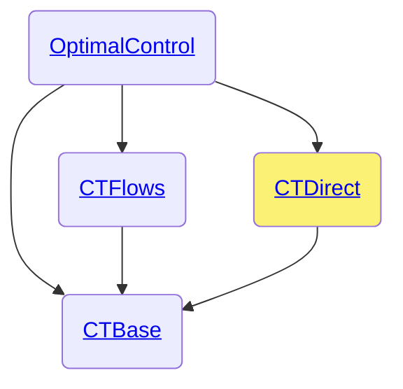

# CTDirect.jl

```@meta
CollapsedDocStrings = true
```

The `CTDirect.jl` package is part of the [control-toolbox ecosystem](https://github.com/control-toolbox).



For the developers, here are the [private methods](@ref dev-ctdirect).

## Index

```@index
Pages   = ["api-ctdirect.md"]
Modules = [CTDirect]
Order   = [:module, :constant, :type, :function, :macro]
```

## Documentation

```@autodocs
Modules = [CTDirect]
Order   = [:module, :constant, :type, :function, :macro]
Private = false
```
