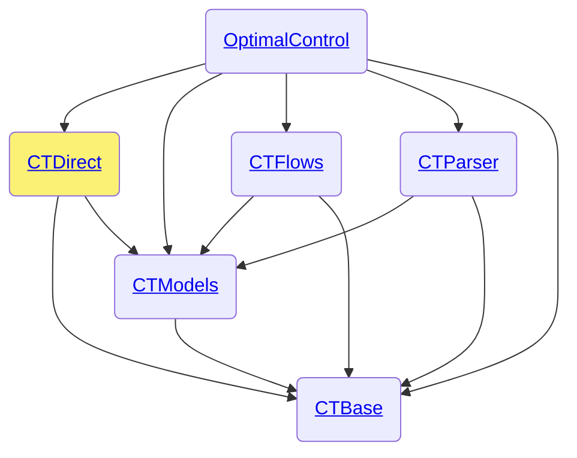

# CTDirect.jl

```@meta
CollapsedDocStrings = false
```

The [CTDirect.jl](https://github.com/control-toolbox/CTDirect.jl) package is part of the [control-toolbox ecosystem](https://github.com/control-toolbox).



OptimalControl heavily relies on CTDirect. Refer to the [CTDirect API documentation](https://control-toolbox.org/CTBase.jl) for more details.