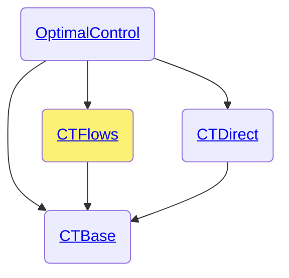

# CTFlows.jl

```@meta
CollapsedDocStrings = true
```

The `CTFlows.jl` package is part of the [control-toolbox ecosystem](https://github.com/control-toolbox).



For the developers, here are the [private methods](@ref dev-ctflows).

## Index

```@index
Pages   = ["api-ctflows.md"]
Modules = [CTFlows]
Order   = [:module, :constant, :type, :function, :macro]
```

## Documentation

```@autodocs
Modules = [CTFlows]
Order   = [:module, :constant, :type, :function, :macro]
Private = false
```
