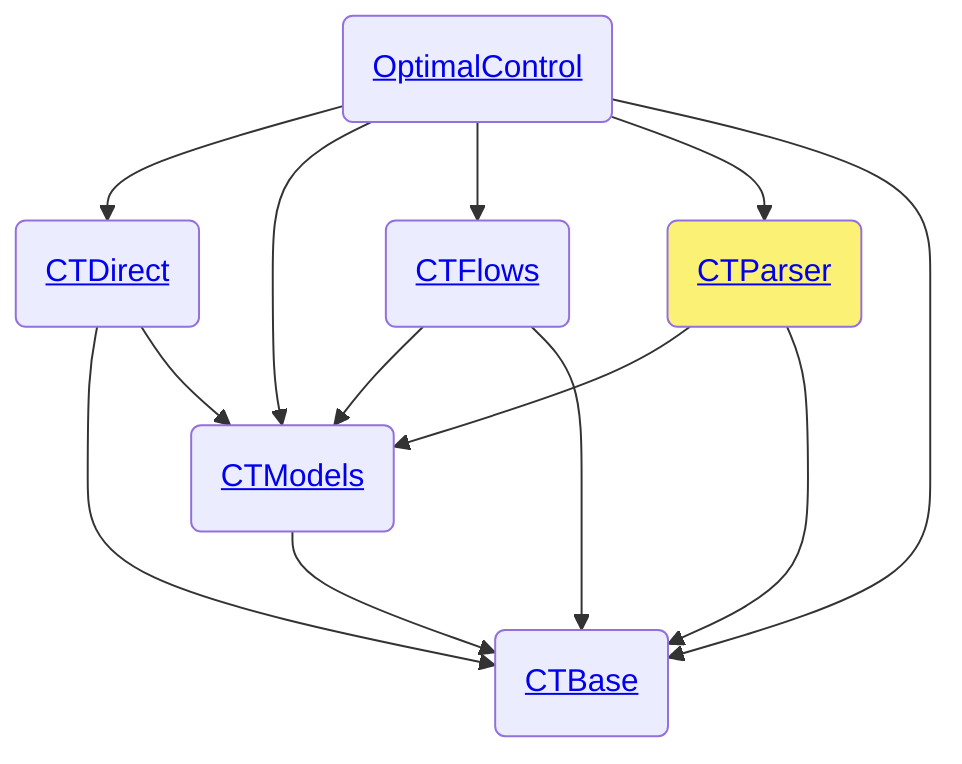

# CTParser.jl

```@meta
CollapsedDocStrings = false
```

The [CTParser.jl](https://github.com/control-toolbox/CTParser.jl) package is part of the [control-toolbox ecosystem](https://github.com/control-toolbox).



OptimalControl heavily relies on CTParser. Refer to the [CTParser API documentation](@extref CTParser index) for more details.