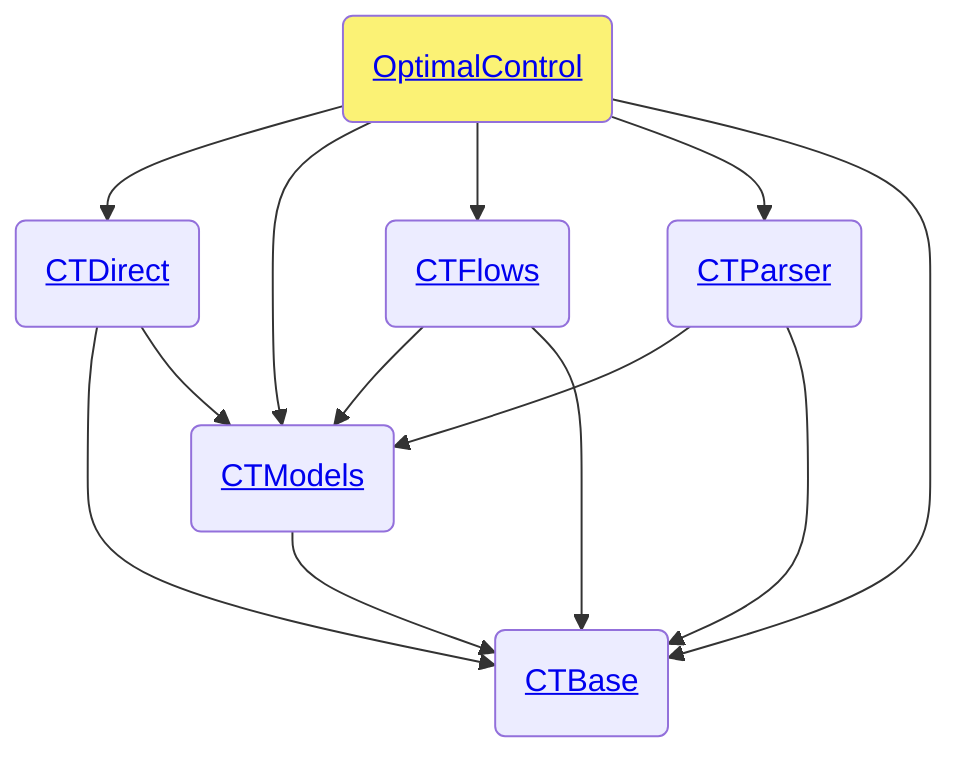

# OptimalControl.jl (Private)

```@meta
CollapsedDocStrings = false
```

[OptimalControl.jl](https://github.com/control-toolbox/OptimalControl.jl) is the root package of the [control-toolbox ecosystem](https://github.com/control-toolbox).



## Index

```@index
Pages   = ["api-optimalcontrol-dev.md"]
Modules = [OptimalControl]
Order   = [:module, :constant, :type, :function, :macro]
```

## Documentation

```@autodocs
Modules = [OptimalControl]
Order   = [:type, :module, :constant, :type, :function, :macro]
Public  = false
```
