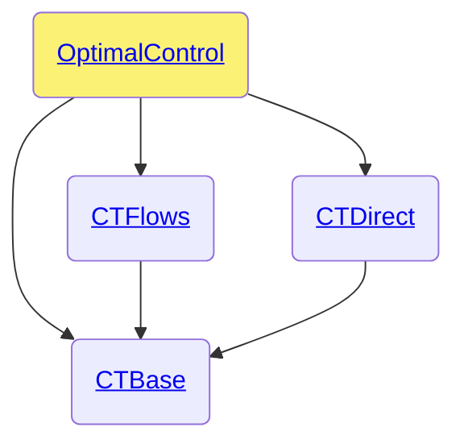

# OptimalControl.jl

```@meta
CollapsedDocStrings = true
```

The OptimalControl.jl package is part of the [control-toolbox ecosystem](https://github.com/control-toolbox).



## Index

```@index
Pages   = ["api-optimalcontrol.md"]
Modules = [OptimalControl]
Order   = [:module, :constant, :type, :function, :macro]
```

For the developers, here are the [private methods](@ref dev-optimalcontrol).

## Available methods

```@example
using OptimalControl
available_methods()
```

## Documentation

```@autodocs
Modules = [OptimalControl]
Order   = [:module, :constant, :type, :function, :macro]
Private = false
```
