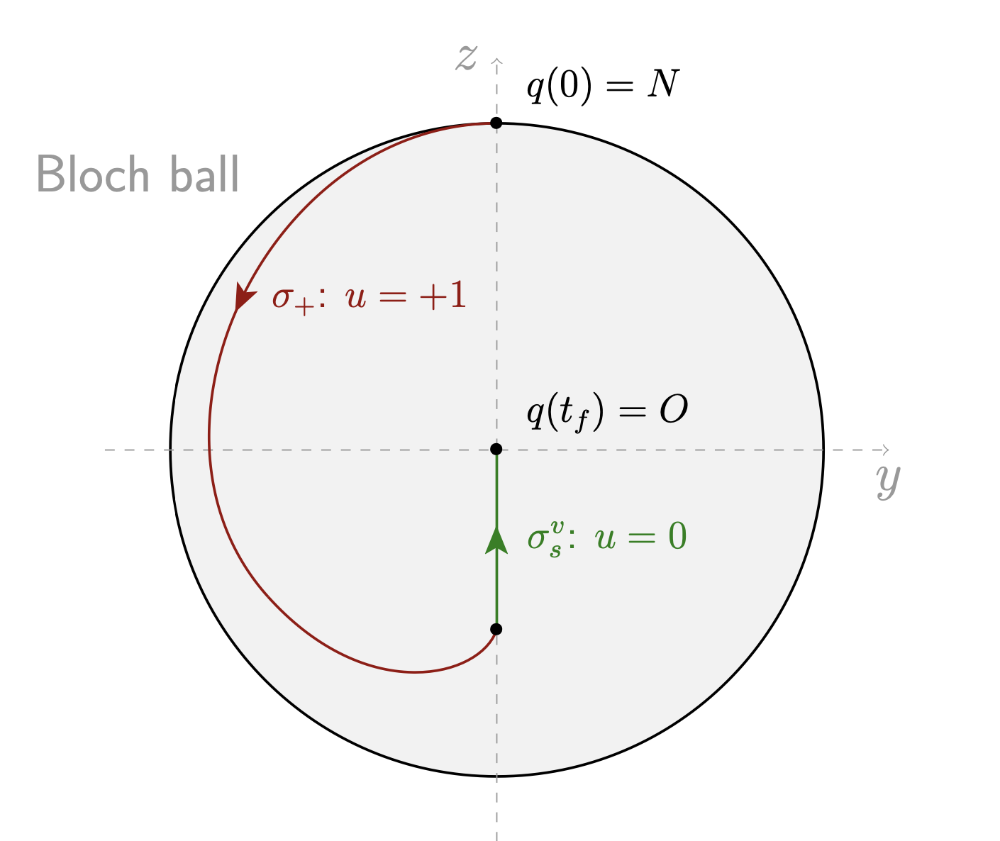

# [The saturation problem in Magnetic Resonance Imaging](@id mri-saturation)

## Background overview

From the 2010 survey[^1], one of the earliest examples of coherent control of quantum dynamics 
is manipulation of nuclear spin ensembles using radiofrequency (RF) fields[^2]. 
This manipulation is possible due to the Nuclear Magnetic Resonance (NMR) phenomenon[^3] [^4]
which has become a very powerful tool to study matter in a variety of domains from biology 
and chemistry to solid physics and quantum mechanics. Two of the main applications of NMR 
control techniques are maybe high-resolution spectroscopy and Magnetic Resonance Imaging (MRI).

MRI is a medical imaging technique used to produce pictures of the anatomy and investigate 
physiological processes of the body. The general principles involve the interaction of matter 
with electromagnetic fields and are the following. When a sample of matter, in liquid phase, 
is inside a strong and uniform longitudinal magnetic field ($B_0$), the magnetic moments
of the spin-$1/2$ particles align with the direction of this field. When a transverse
radio-frequency magnetic pulse ($B_1$) is then applied, the sample alter its magnetization 
alignment relative to the field and its characteristics (the relaxation times $T_1$ and
$T_2$). These changes in magnetization alignment produce a changing magnetic flux, which 
yields to the emission of an electric signal which is detected and amplified. Then, the image 
is obtained by the analysis of the Fourier transform of this signal. One key point of this 
process is the control of the magnetization vector via the magnetic pulse.
To do that, many different control strategies already exists[^4], but the majority are based 
upon heuristic reasoning[^5] [^6].


Optimal control algorithms were introduced in NMR to improve control field sequences 
recently[^7] and at the end of the nineties, new methods appeared in optimal control of NMR 
systems both from the analytical and numerical points of view[^8] [^9]. More recently, the 
combination of geometric optimal control based on the Maximum Principle[^10] and related 
numerical algorithms (gradient methods[^11], shooting and continuation methods[^12]) leads 
to sophisticated results about the time-minimal saturation problem (which consists in bringing 
the magnetization vector to zero, ie. the state to the origin) of a single spin[^13]
with applications to the contrast problem in MRI, see[^14] [^15]. They are the basis to 
numerical computations of *robust optimal controls* which take into account inhomogeneities 
contained in the $B_0$ and $B_1$ magnetic fields and which have been validated very recently 
by *in vitro* and *in vivo* experiments, see[^16] [^17].

!!! note "Recent survey"

    This background overview is not up-to-date. We refer to [^18] for more details.

[^1]: C. Brif, R. Chakrabarti & H. Rabitz, *Control of Quantum Phenomena: Past, Present and Future*, New Journal for Physics, **12** (2010), pp.1--68.

[^2]: A. Abragam, *The Principles of Nucelar Magnetism*, Oxford University Press, London (1961).

[^3]: R. R. Ernst, *Principles of Nuclear Magnetic Resonance in one and two dimensions* International Series of Monographs on Chemistry, Oxford University Press, Oxford (1990).

[^4]: M. H. Levitt, *Spin dynamics: Basics of Nuclear Magnetic Resonance*, John Wiley & Sons, New York-London-Sydney (2008).

[^5]: M. A. Berstein, K. F. King & X. J. Zhou, *Handbook of MRI pulse sequences*, Elsevier, Amsterdam (2004).

[^6]: J. N. Rydberg, S. J. Riederer, C. H. Rydberg & C. R. Jack, *Contrast optimization of fluid-attenuated inversion recovery (flair) imaging*, Magn. Reson. Med., **34** (1995), no. 6, 868--877.

[^7]: S. Conolly, D. Nishimura & A. Macovski, *Optimal control solutions to the magnetic resonance selective excitation problem*, IEEE Trans. Med. Imaging, **5** (1986), no. 2, 106--115.

[^8]: N. Khaneja, S. J. Glaser & R. Brockett, *Sub-Riemannian geometry and time optimal control of three spin systems: quantum gates and coherence transfer*, Phys. Rev. A, **65** (2002), no. 3, 032301, pp.11. Errata Phys. Rev. A **68** (2003), 049903; Phys. Rev. A **71** (2005), 039906.

[^9]: T. E. Skinner, T. O. Reiss, B. Luy, N. Khaneja & S. J. Glaser, *Application of optimal control theory to the design of broadband excitation pulses for high-resolution NMR*, J. Magn. Reson., **163** (2003), no. 1, 8--15.

[^10]: L. S. Pontryagin, V. G. Boltyanskii, R. V. Gamkrelidze & E. F. Mishchenko, *The Mathematical Theory of Optimal Processes*, Translated from the Russian by K. N. Trirogoff, edited by L. W. Neustadt, Interscience Publishers John Wiley & Sons, Inc., New York-London, 1962.

[^11]: N. Khaneja, T. Reiss, C. Kehlet, T. Schulte-Herbriiggen & S. J. Glaser, *Optimal control of coupled spin dynamics: design of NMR pulse sequences by gradient ascent algorithms*, J. Magn. Reson., **172** (2005), no. 2, 296--305.

[^12]: O. Cots, *Contrôle optimal géométrique : méthodes homotopiques et applications*, Phd thesis, Institut Mathématiques de Bourgogne, Dijon, France, 2012.

[^13]: M. Lapert, Y. Zhang, M. Braun, S. J. Glaser & D. Sugny, *Singular extremals for the time-optimal control of dissipative spin 1/2 particles*, Phys. Rev. Lett., **104** (2010), 083001.

[^14]: B. Bonnard, M. Chyba & J. Marriott, *Singular Trajectories and the Contrast Imaging Problem in Nuclear Magnetic resonance*, SIAM J. Control Optim., **51** (2013), no. 2, 1325--1349.

[^15]: M. Lapert, Y. Zhang, M. A. Janich, S. J. Glaser & D. Sugny, *Exploring the physical limits of saturation contrast in magnetic resonance imaging*, Sci. Rep., **589** (2012), no. 2.

[^16]: B. Bonnard, O. Cots, S. Glaser, M. Lapert, D. Sugny & Y. Zhang, *Geometric optimal control of the contrast imaging problem in nuclear magnetic resonance, IEEE Trans. Automat. Control, **57** (2012), no. 8, 1957--1969.

[^17]: E. Van Reeth, H. Ratiney, M. Tesch, D. Grenier, O. Beuf, S. J. Glaser &  D. Sugny, *Optimal control design of preparation pulses for contrast optimization in MRI*, J. Magn. Reson., **279** (2017), 39--50.

[^18]: C. P. Koch, U. Boscain, T. Calarco, G. Dirr, S. Filipp, S. J. Glaser, R. Kosloff, S. Montangero, T. Schulte-Herbrüggen, D. Sugny & F. K. Wilhelm, *Quantum optimal control in quantum technologies. strategic report on current status, visions and goals for research in europe*, EPJ Quantum Technology, 9 (2022), p. 60.

[^19]: Bonnard, B.; Cots, O.; Rouot, J.; Verron, T. Time minimal saturation of a pair of spins and application in magnetic resonance imaging. Mathematical Control and Related Fields, 2020, 10 (1), pp.47-88. https://inria.hal.science/hal-01779377

## The Bloch equation

```@raw html

```

The mathematical model which is suitable for analyzing such problems is to consider an 
ensemble of spins, each spin being described by a magnetization vector $M = (M_X, M_Y, M_Z)$ 
in the *laboratory frame* $0XYZ$ whose evolution satisfies the so-called *Bloch equation*

```math
    \dot{M}(\tau) = \bar{\gamma}\, M(\tau) \wedge B(\tau) + R(M(\tau)),
```

where $\tau$ is the time, $\bar{\gamma}$ is the *gyromagnetic ratio* of the considered nucleus, 
$B(\tau) = (B_X(\tau), B_Y(\tau), B_Z(\tau))$ is the total magnetic field applied to the 
system which decomposes into

```math
    B(\tau) = B_0 + B_1(\tau),
```

where $B_0 = B_Z\, e_Z$ is a *constant and strong polarizing field* in the $Z$-direction,
while the *control RF-field* $B_1(\tau) = B_X(\tau)\, e_X + B_Y(\tau)\, e_Y$ is in the 
transverse plane $(X,Y)$. The vectors $e_X$, $e_Y$ and $e_Z$ form the standard basis of 
$\R^3$. The $R(M)$ term represents the dissipation and is of the form:

```math
    R(M) = \left( -\frac{M_X}{T_2}, -\frac{M_Y}{T_2}, -\frac{(M_Z-M_0)}{T_1} \right),
```

where $M_0$ is the equilibrium magnetization, and $T_1$, $T_2$ are the *relaxation times* 
which are the chemical signatures of the observed species and satisfy the physical constraints 
$0 < T_2 \le 2\, T_1$. The control is denoted $\omega(\tau) = (\omega_X(\tau),\omega_Y(\tau)) \coloneqq (-\bar{\gamma}  B_X(\tau), -\bar{\gamma} B_Y(\tau))$, and is bounded by 
$\omega_\mathrm{max}$, ie. $\Vert{\omega(\tau)}\Vert\le \omega_\mathrm{max}$,
where $\omega_\mathrm{max}$ is the maximal experimental intensity of the experiments and 
$\Vert{\cdot}\Vert$ is the Euclidean norm.

The Bloch equation can be written in a *rotating frame* $0xyz$ where the equilibrium is 
normalized introducing the state $q=(x,y,z)$, the matrices

```math
    \Omega_z =
    \begin{bmatrix}
        0 & -1 & 0 \\
        1 & 0 & 0 \\
        0 & 0 & 0
    \end{bmatrix}
```

and $S(\tau) = \exp(\tau \, \bar{\omega}\,  \Omega_z)$, and writting 
$M(\tau) = M_0 S(\tau) q(\tau)$. In the rotating frame the Bloch equation becomes:

```math
    \dot{q}(\tau) = 
    \begin{bmatrix}
        -{1}/{T_2}  &  -\Delta\omega   &   \omega_y \\
        \Delta\omega   &  -{1}/{T_2}  &  -\omega_x \\
        -\omega_y       &  \omega_x        &  -{1}/{T_1} \\
    \end{bmatrix}\, q(\tau) + 
    \begin{bmatrix}
        0 \\ 0 \\ {1}/{T_1}
    \end{bmatrix},
```

where $\Delta \omega = \omega_0 - \bar{\omega}$ is the *resonance offset*, 
$\omega_0 = -\bar{\gamma} B_Z$ is the *resonance frequency* and the new control is

```math
    \begin{aligned}
        \omega_x(\tau) \coloneqq \omega_X(\tau) \cos(\bar{\omega} \tau) + 
        \omega_Y(\tau) \sin(\bar{\omega} \tau), \\
        \omega_y(\tau) \coloneqq \omega_Y(\tau) \cos(\bar{\omega} \tau) - 
        \omega_X(\tau) \sin(\bar{\omega} \tau),
    \end{aligned}
```

which preserves the control bound $\omega_x^2(\tau) + \omega_y^2(\tau) \le \omega_\mathrm{max}$. 
Finally, we introduce the normalized control and time:

```math
    u \coloneqq \frac{u_\mathrm{max}}{\omega_\mathrm{max}}\, \omega, 
    \quad t \coloneqq \frac{\omega_\mathrm{max}}{u_\mathrm{max}}\, \tau,
```

such that the normalized control satisfies $\Vert{u(t)}\Vert\le u_\mathrm{max}$. 
In the sequel, we fix $\bar{\omega} = \omega_0$ which gives $\Delta \omega = 0$
(it is called the *resonant case*) and which leads to the final normalized Bloch equation:

```math
    \left\{ 
        \begin{aligned}
            \dot{x}(t)  &= \displaystyle -\Gamma\, x(t) + u_2(t)\, z(t), \\[0.2em]
            \dot{y}(t)  &= \displaystyle -\Gamma\, y(t) - u_1(t)\, z(t), \\[0.2em]
            \dot{z}(t)  &= \displaystyle \gamma\,(1-z(t)) + u_1(t)\, y(t) - u_2(t)\, x(t),
        \end{aligned}
    \right.
```

where

```math
    \gamma \coloneqq \frac{u_\mathrm{max}}{w_\mathrm{max}\, T_1}, \quad 
    \Gamma \coloneqq \frac{u_\mathrm{max}}{w_\mathrm{max}\, T_2},
    \quad 0 < \gamma \le 2\Gamma.
```

### Time parameterization

In this setting, the normalized Bloch equation has 3 positive parameters: $\gamma$, $\Gamma$ and 
$u_\mathrm{max}$. However, one may choose one parameter to fix since for any $\lambda > 0$ and 
any triplet $(\gamma, \Gamma, u_\mathrm{max})$, both systems in coordinates $(x, y, z)$
with parameters $(\gamma, \Gamma, u_\mathrm{max})$ or 
$(\lambda\gamma, \lambda\Gamma, \lambda u_\mathrm{max})$ are equivalent, up to a time 
reparameterization.

Note that for the constant control $u(\cdot) =(u_\mathrm{max},0)$, starting from $x=0$ and 
denoting $q = (y,z)$, the Bloch equation becomes to

```math
    \dot{x}(t) = -\Gamma\, x(t), \quad
    \dot{q}(t) = u_\mathrm{max} 
    \begin{pmatrix}
        0 & -1 \\
        1 & 0
    \end{pmatrix}\,
    q(t),
```

and the solution is given by $x(t) = 0$, $q(t) = R(u_\mathrm{max}\, t) \, q(0)$ where 
$R(\theta)$ is the rotation matrix of angle $\theta$. Thus, this trajectory is periodic of 
period $T$ given by:

```math
    T = \frac{2\, \pi}{u_\mathrm{max}}.
```

Classically, one may fix the period to $T=1$ and so $u_\mathrm{max} = 2 \pi$, or on the contrary 
one may fix $u_\mathrm{max} = 1$ and choose $T = 2 \pi$. From now, we choose to fix 
$u_\mathrm{max} = 1$.

### Spherical coordinates

The Bloch equation in the spherical coordinates

```math
    \begin{aligned}
        x = \rho\, \sin\phi \cos\theta, \quad %\\[0.1em]
        y = \rho\, \sin\phi \sin\theta, \quad %\\[0.1em]
        z = \rho\, \cos\phi,
    \end{aligned}
```

with the feedback $u = R(\theta)^{-1} v$ becomes:

```math
    \left\{ 
        \begin{aligned}
            \dot{\rho}(t)   &= \gamma \cos \phi(t)\, (1 - \rho(t) \cos \phi(t)) - \Gamma \rho(t) \sin^2 \phi(t), \\[0.0em]
            \dot{\phi}(t)   &= \delta \sin \phi(t) \cos \phi(t) - \frac{\gamma}{\rho(t)} \sin \phi(t) + v_2(t), \\[0.0em]
            \dot{\theta}(t) &= - \cot \phi(t)\, v_1(t),
        \end{aligned}
    \right.
```

where $\delta \coloneqq \gamma - \Gamma$ and with the control constraint 
$v_1^2 + v_2^2 = u_1^2 + u_2^2 \le 1$.

```@raw html
<article class="docstring">
<header>
    <a class="docstring-article-toggle-button fa-solid fa-chevron-right" href="javascript:;" title="Expand docstring"> </a>
    <span class="docstring-category">Details.</span>
</header>
<section style="display: none;">
    <div><p>Inverting the spherical change of coordinates, we get</p>

<p class="math-container"><span><span class="katex-display"><span class="katex"><span class="katex-mathml"><math xmlns="http://www.w3.org/1998/Math/MathML" display="block"><semantics><mrow><msup><mi>ρ</mi><mn>2</mn></msup><mo>=</mo><msup><mi>x</mi><mn>2</mn></msup><mo>+</mo><msup><mi>y</mi><mn>2</mn></msup><mo>+</mo><msup><mi>z</mi><mn>2</mn></msup><mo separator="true">,</mo><mspace width="1em"></mspace><mi>θ</mi><mo>=</mo><mi>arctan</mi><mo>⁡</mo><mo stretchy="false">(</mo><mi>y</mi><mi mathvariant="normal">/</mi><mi>x</mi><mo stretchy="false">)</mo><mo separator="true">,</mo><mspace width="1em"></mspace><mi>ϕ</mi><mo>=</mo><mi>arccos</mi><mo>⁡</mo><mo stretchy="false">(</mo><mi>z</mi><mi mathvariant="normal">/</mi><mi>ρ</mi><mo stretchy="false">)</mo><mi mathvariant="normal">.</mi></mrow><annotation encoding="application/x-tex">    \rho^2  = x^2 + y^2 + z^2,  \quad %\\[0.1em]
    \theta  = \arctan(y/x),     \quad %\\[0.1em]
    \phi    = \arccos(z/\rho).</annotation></semantics></math></span><span class="katex-html" aria-hidden="true"><span class="base"><span class="strut" style="height: 1.0585em; vertical-align: -0.1944em;"></span><span class="mord"><span class="mord mathnormal">ρ</span><span class="msupsub"><span class="vlist-t"><span class="vlist-r"><span class="vlist" style="height: 0.8641em;"><span class="" style="top: -3.113em; margin-right: 0.05em;"><span class="pstrut" style="height: 2.7em;"></span><span class="sizing reset-size6 size3 mtight"><span class="mord mtight">2</span></span></span></span></span></span></span></span><span class="mspace" style="margin-right: 0.2778em;"></span><span class="mrel">=</span><span class="mspace" style="margin-right: 0.2778em;"></span></span><span class="base"><span class="strut" style="height: 0.9474em; vertical-align: -0.0833em;"></span><span class="mord"><span class="mord mathnormal">x</span><span class="msupsub"><span class="vlist-t"><span class="vlist-r"><span class="vlist" style="height: 0.8641em;"><span class="" style="top: -3.113em; margin-right: 0.05em;"><span class="pstrut" style="height: 2.7em;"></span><span class="sizing reset-size6 size3 mtight"><span class="mord mtight">2</span></span></span></span></span></span></span></span><span class="mspace" style="margin-right: 0.2222em;"></span><span class="mbin">+</span><span class="mspace" style="margin-right: 0.2222em;"></span></span><span class="base"><span class="strut" style="height: 1.0585em; vertical-align: -0.1944em;"></span><span class="mord"><span class="mord mathnormal" style="margin-right: 0.0359em;">y</span><span class="msupsub"><span class="vlist-t"><span class="vlist-r"><span class="vlist" style="height: 0.8641em;"><span class="" style="top: -3.113em; margin-right: 0.05em;"><span class="pstrut" style="height: 2.7em;"></span><span class="sizing reset-size6 size3 mtight"><span class="mord mtight">2</span></span></span></span></span></span></span></span><span class="mspace" style="margin-right: 0.2222em;"></span><span class="mbin">+</span><span class="mspace" style="margin-right: 0.2222em;"></span></span><span class="base"><span class="strut" style="height: 1.0585em; vertical-align: -0.1944em;"></span><span class="mord"><span class="mord mathnormal" style="margin-right: 0.044em;">z</span><span class="msupsub"><span class="vlist-t"><span class="vlist-r"><span class="vlist" style="height: 0.8641em;"><span class="" style="top: -3.113em; margin-right: 0.05em;"><span class="pstrut" style="height: 2.7em;"></span><span class="sizing reset-size6 size3 mtight"><span class="mord mtight">2</span></span></span></span></span></span></span></span><span class="mpunct">,</span><span class="mspace" style="margin-right: 1em;"></span><span class="mspace" style="margin-right: 0.1667em;"></span><span class="mord mathnormal" style="margin-right: 0.0278em;">θ</span><span class="mspace" style="margin-right: 0.2778em;"></span><span class="mrel">=</span><span class="mspace" style="margin-right: 0.2778em;"></span></span><span class="base"><span class="strut" style="height: 1em; vertical-align: -0.25em;"></span><span class="mop">arctan</span><span class="mopen">(</span><span class="mord mathnormal" style="margin-right: 0.0359em;">y</span><span class="mord">/</span><span class="mord mathnormal">x</span><span class="mclose">)</span><span class="mpunct">,</span><span class="mspace" style="margin-right: 1em;"></span><span class="mspace" style="margin-right: 0.1667em;"></span><span class="mord mathnormal">ϕ</span><span class="mspace" style="margin-right: 0.2778em;"></span><span class="mrel">=</span><span class="mspace" style="margin-right: 0.2778em;"></span></span><span class="base"><span class="strut" style="height: 1em; vertical-align: -0.25em;"></span><span class="mop">arccos</span><span class="mopen">(</span><span class="mord mathnormal" style="margin-right: 0.044em;">z</span><span class="mord">/</span><span class="mord mathnormal">ρ</span><span class="mclose">)</span><span class="mord">.</span></span></span></span></span></span></p>

<p>To get the dynamics with the new coordinates, we use the following procedure: let us assume  that we have a multi-inputs affine control system of the form  <span><span><span class="katex"><span class="katex-mathml"><math xmlns="http://www.w3.org/1998/Math/MathML"><semantics><mrow><mover accent="true"><mi>q</mi><mo>˙</mo></mover><mo>=</mo><mi>X</mi><mo stretchy="false">(</mo><mi>q</mi><mo stretchy="false">)</mo><mo>+</mo><msubsup><mo>∑</mo><mrow><mi>i</mi><mo>=</mo><mn>1</mn></mrow><mi>m</mi></msubsup><msub><mi>u</mi><mi>i</mi></msub><msub><mi>Y</mi><mi>i</mi></msub><mo stretchy="false">(</mo><mi>q</mi><mo stretchy="false">)</mo></mrow><annotation encoding="application/x-tex">\dot{q} = X(q) + \sum_{i=1}^{m} u_i Y_i(q)</annotation></semantics></math></span><span class="katex-html" aria-hidden="true"><span class="base"><span class="strut" style="height: 0.8623em; vertical-align: -0.1944em;"></span><span class="mord accent"><span class="vlist-t vlist-t2"><span class="vlist-r"><span class="vlist" style="height: 0.6679em;"><span class="" style="top: -3em;"><span class="pstrut" style="height: 3em;"></span><span class="mord mathnormal" style="margin-right: 0.0359em;">q</span></span><span class="" style="top: -3em;"><span class="pstrut" style="height: 3em;"></span><span class="accent-body" style="left: -0.0556em;"><span class="mord">˙</span></span></span></span><span class="vlist-s">​</span></span><span class="vlist-r"><span class="vlist" style="height: 0.1944em;"><span class=""></span></span></span></span></span><span class="mspace" style="margin-right: 0.2778em;"></span><span class="mrel">=</span><span class="mspace" style="margin-right: 0.2778em;"></span></span><span class="base"><span class="strut" style="height: 1em; vertical-align: -0.25em;"></span><span class="mord mathnormal" style="margin-right: 0.0785em;">X</span><span class="mopen">(</span><span class="mord mathnormal" style="margin-right: 0.0359em;">q</span><span class="mclose">)</span><span class="mspace" style="margin-right: 0.2222em;"></span><span class="mbin">+</span><span class="mspace" style="margin-right: 0.2222em;"></span></span><span class="base"><span class="strut" style="height: 1.104em; vertical-align: -0.2997em;"></span><span class="mop"><span class="mop op-symbol small-op" style="position: relative; top: 0em;">∑</span><span class="msupsub"><span class="vlist-t vlist-t2"><span class="vlist-r"><span class="vlist" style="height: 0.8043em;"><span class="" style="top: -2.4003em; margin-left: 0em; margin-right: 0.05em;"><span class="pstrut" style="height: 2.7em;"></span><span class="sizing reset-size6 size3 mtight"><span class="mord mtight"><span class="mord mathnormal mtight">i</span><span class="mrel mtight">=</span><span class="mord mtight">1</span></span></span></span><span class="" style="top: -3.2029em; margin-right: 0.05em;"><span class="pstrut" style="height: 2.7em;"></span><span class="sizing reset-size6 size3 mtight"><span class="mord mtight"><span class="mord mathnormal mtight">m</span></span></span></span></span><span class="vlist-s">​</span></span><span class="vlist-r"><span class="vlist" style="height: 0.2997em;"><span class=""></span></span></span></span></span></span><span class="mspace" style="margin-right: 0.1667em;"></span><span class="mord"><span class="mord mathnormal">u</span><span class="msupsub"><span class="vlist-t vlist-t2"><span class="vlist-r"><span class="vlist" style="height: 0.3117em;"><span class="" style="top: -2.55em; margin-left: 0em; margin-right: 0.05em;"><span class="pstrut" style="height: 2.7em;"></span><span class="sizing reset-size6 size3 mtight"><span class="mord mathnormal mtight">i</span></span></span></span><span class="vlist-s">​</span></span><span class="vlist-r"><span class="vlist" style="height: 0.15em;"><span class=""></span></span></span></span></span></span><span class="mord"><span class="mord mathnormal" style="margin-right: 0.2222em;">Y</span><span class="msupsub"><span class="vlist-t vlist-t2"><span class="vlist-r"><span class="vlist" style="height: 0.3117em;"><span class="" style="top: -2.55em; margin-left: -0.2222em; margin-right: 0.05em;"><span class="pstrut" style="height: 2.7em;"></span><span class="sizing reset-size6 size3 mtight"><span class="mord mathnormal mtight">i</span></span></span></span><span class="vlist-s">​</span></span><span class="vlist-r"><span class="vlist" style="height: 0.15em;"><span class=""></span></span></span></span></span></span><span class="mopen">(</span><span class="mord mathnormal" style="margin-right: 0.0359em;">q</span><span class="mclose">)</span></span></span></span></span></span>, where <span><span><span class="katex"><span class="katex-mathml"><math xmlns="http://www.w3.org/1998/Math/MathML"><semantics><mrow><mi>X</mi></mrow><annotation encoding="application/x-tex">X</annotation></semantics></math></span><span class="katex-html" aria-hidden="true"><span class="base"><span class="strut" style="height: 0.6833em;"></span><span class="mord mathnormal" style="margin-right: 0.0785em;">X</span></span></span></span></span></span>, <span><span><span class="katex"><span class="katex-mathml"><math xmlns="http://www.w3.org/1998/Math/MathML"><semantics><mrow><msub><mi>Y</mi><mn>1</mn></msub></mrow><annotation encoding="application/x-tex">Y_1</annotation></semantics></math></span><span class="katex-html" aria-hidden="true"><span class="base"><span class="strut" style="height: 0.8333em; vertical-align: -0.15em;"></span><span class="mord"><span class="mord mathnormal" style="margin-right: 0.2222em;">Y</span><span class="msupsub"><span class="vlist-t vlist-t2"><span class="vlist-r"><span class="vlist" style="height: 0.3011em;"><span class="" style="top: -2.55em; margin-left: -0.2222em; margin-right: 0.05em;"><span class="pstrut" style="height: 2.7em;"></span><span class="sizing reset-size6 size3 mtight"><span class="mord mtight">1</span></span></span></span><span class="vlist-s">​</span></span><span class="vlist-r"><span class="vlist" style="height: 0.15em;"><span class=""></span></span></span></span></span></span></span></span></span></span></span>, ..., <span><span><span class="katex"><span class="katex-mathml"><math xmlns="http://www.w3.org/1998/Math/MathML"><semantics><mrow><msub><mi>Y</mi><mi>m</mi></msub></mrow><annotation encoding="application/x-tex">Y_m</annotation></semantics></math></span><span class="katex-html" aria-hidden="true"><span class="base"><span class="strut" style="height: 0.8333em; vertical-align: -0.15em;"></span><span class="mord"><span class="mord mathnormal" style="margin-right: 0.2222em;">Y</span><span class="msupsub"><span class="vlist-t vlist-t2"><span class="vlist-r"><span class="vlist" style="height: 0.1514em;"><span class="" style="top: -2.55em; margin-left: -0.2222em; margin-right: 0.05em;"><span class="pstrut" style="height: 2.7em;"></span><span class="sizing reset-size6 size3 mtight"><span class="mord mathnormal mtight">m</span></span></span></span><span class="vlist-s">​</span></span><span class="vlist-r"><span class="vlist" style="height: 0.15em;"><span class=""></span></span></span></span></span></span></span></span></span></span></span> are vector fields. Considering that we are working in local coordinates, we can define the matrix  <span><span><span class="katex"><span class="katex-mathml"><math xmlns="http://www.w3.org/1998/Math/MathML"><semantics><mrow><mi>Y</mi><mo stretchy="false">(</mo><mi>q</mi><mo stretchy="false">)</mo><mo>=</mo><mo stretchy="false">[</mo><msub><mi>Y</mi><mn>1</mn></msub><mo stretchy="false">(</mo><mi>q</mi><mo stretchy="false">)</mo><mo>⋯</mo><msub><mi>Y</mi><mi>m</mi></msub><mo stretchy="false">(</mo><mi>q</mi><mo stretchy="false">)</mo><mo stretchy="false">]</mo><mo>∈</mo><msup><mi mathvariant="double-struck">R</mi><mrow><mi>n</mi><mo>×</mo><mi>m</mi></mrow></msup></mrow><annotation encoding="application/x-tex">Y(q) = [Y_1(q) \cdots Y_m(q)] \in \R^{n\times m}</annotation></semantics></math></span><span class="katex-html" aria-hidden="true"><span class="base"><span class="strut" style="height: 1em; vertical-align: -0.25em;"></span><span class="mord mathnormal" style="margin-right: 0.2222em;">Y</span><span class="mopen">(</span><span class="mord mathnormal" style="margin-right: 0.0359em;">q</span><span class="mclose">)</span><span class="mspace" style="margin-right: 0.2778em;"></span><span class="mrel">=</span><span class="mspace" style="margin-right: 0.2778em;"></span></span><span class="base"><span class="strut" style="height: 1em; vertical-align: -0.25em;"></span><span class="mopen">[</span><span class="mord"><span class="mord mathnormal" style="margin-right: 0.2222em;">Y</span><span class="msupsub"><span class="vlist-t vlist-t2"><span class="vlist-r"><span class="vlist" style="height: 0.3011em;"><span class="" style="top: -2.55em; margin-left: -0.2222em; margin-right: 0.05em;"><span class="pstrut" style="height: 2.7em;"></span><span class="sizing reset-size6 size3 mtight"><span class="mord mtight">1</span></span></span></span><span class="vlist-s">​</span></span><span class="vlist-r"><span class="vlist" style="height: 0.15em;"><span class=""></span></span></span></span></span></span><span class="mopen">(</span><span class="mord mathnormal" style="margin-right: 0.0359em;">q</span><span class="mclose">)</span><span class="mspace" style="margin-right: 0.1667em;"></span><span class="minner">⋯</span><span class="mspace" style="margin-right: 0.1667em;"></span><span class="mord"><span class="mord mathnormal" style="margin-right: 0.2222em;">Y</span><span class="msupsub"><span class="vlist-t vlist-t2"><span class="vlist-r"><span class="vlist" style="height: 0.1514em;"><span class="" style="top: -2.55em; margin-left: -0.2222em; margin-right: 0.05em;"><span class="pstrut" style="height: 2.7em;"></span><span class="sizing reset-size6 size3 mtight"><span class="mord mathnormal mtight">m</span></span></span></span><span class="vlist-s">​</span></span><span class="vlist-r"><span class="vlist" style="height: 0.15em;"><span class=""></span></span></span></span></span></span><span class="mopen">(</span><span class="mord mathnormal" style="margin-right: 0.0359em;">q</span><span class="mclose">)]</span><span class="mspace" style="margin-right: 0.2778em;"></span><span class="mrel">∈</span><span class="mspace" style="margin-right: 0.2778em;"></span></span><span class="base"><span class="strut" style="height: 0.7713em;"></span><span class="mord"><span class="mord mathbb">R</span><span class="msupsub"><span class="vlist-t"><span class="vlist-r"><span class="vlist" style="height: 0.7713em;"><span class="" style="top: -3.063em; margin-right: 0.05em;"><span class="pstrut" style="height: 2.7em;"></span><span class="sizing reset-size6 size3 mtight"><span class="mord mtight"><span class="mord mathnormal mtight">n</span><span class="mbin mtight">×</span><span class="mord mathnormal mtight">m</span></span></span></span></span></span></span></span></span></span></span></span></span></span>, where <span><span><span class="katex"><span class="katex-mathml"><math xmlns="http://www.w3.org/1998/Math/MathML"><semantics><mrow><mi>n</mi></mrow><annotation encoding="application/x-tex">n</annotation></semantics></math></span><span class="katex-html" aria-hidden="true"><span class="base"><span class="strut" style="height: 0.4306em;"></span><span class="mord mathnormal">n</span></span></span></span></span></span> is the dimension of the state  space and <span><span><span class="katex"><span class="katex-mathml"><math xmlns="http://www.w3.org/1998/Math/MathML"><semantics><mrow><mi>m</mi></mrow><annotation encoding="application/x-tex">m</annotation></semantics></math></span><span class="katex-html" aria-hidden="true"><span class="base"><span class="strut" style="height: 0.4306em;"></span><span class="mord mathnormal">m</span></span></span></span></span></span> the dimension of the control space. Let <span><span><span class="katex"><span class="katex-mathml"><math xmlns="http://www.w3.org/1998/Math/MathML"><semantics><mrow><mi>φ</mi><mspace></mspace><mspace width="0.1111em"></mspace><mo lspace="0em" rspace="0.17em"></mo> ⁣<mo lspace="0em" rspace="0em">:</mo><mspace width="0.3333em"></mspace><msup><mi mathvariant="double-struck">R</mi><mi>n</mi></msup><mo>→</mo><msup><mi mathvariant="double-struck">R</mi><mi>n</mi></msup></mrow><annotation encoding="application/x-tex">\varphi\colon \R^n \to \R^n</annotation></semantics></math></span><span class="katex-html" aria-hidden="true"><span class="base"><span class="strut" style="height: 0.8833em; vertical-align: -0.1944em;"></span><span class="mord mathnormal">φ</span><span class="mspace nobreak"></span><span class="mspace" style="margin-right: 0.1111em;"></span><span class="mpunct"></span><span class="mspace" style="margin-right: -0.1667em;"></span><span class="mspace" style="margin-right: 0.1667em;"></span><span class="mord"><span class="mrel">:</span></span><span class="mspace" style="margin-right: 0.3333em;"></span><span class="mord"><span class="mord mathbb">R</span><span class="msupsub"><span class="vlist-t"><span class="vlist-r"><span class="vlist" style="height: 0.6644em;"><span class="" style="top: -3.063em; margin-right: 0.05em;"><span class="pstrut" style="height: 2.7em;"></span><span class="sizing reset-size6 size3 mtight"><span class="mord mathnormal mtight">n</span></span></span></span></span></span></span></span><span class="mspace" style="margin-right: 0.2778em;"></span><span class="mrel">→</span><span class="mspace" style="margin-right: 0.2778em;"></span></span><span class="base"><span class="strut" style="height: 0.6889em;"></span><span class="mord"><span class="mord mathbb">R</span><span class="msupsub"><span class="vlist-t"><span class="vlist-r"><span class="vlist" style="height: 0.6644em;"><span class="" style="top: -3.063em; margin-right: 0.05em;"><span class="pstrut" style="height: 2.7em;"></span><span class="sizing reset-size6 size3 mtight"><span class="mord mathnormal mtight">n</span></span></span></span></span></span></span></span></span></span></span></span></span> be a  diffeomorphism and <span><span><span class="katex"><span class="katex-mathml"><math xmlns="http://www.w3.org/1998/Math/MathML"><semantics><mrow><msup><mi>q</mi><mo mathvariant="normal" lspace="0em" rspace="0em">′</mo></msup></mrow><annotation encoding="application/x-tex">q'</annotation></semantics></math></span><span class="katex-html" aria-hidden="true"><span class="base"><span class="strut" style="height: 0.9463em; vertical-align: -0.1944em;"></span><span class="mord"><span class="mord mathnormal" style="margin-right: 0.0359em;">q</span><span class="msupsub"><span class="vlist-t"><span class="vlist-r"><span class="vlist" style="height: 0.7519em;"><span class="" style="top: -3.063em; margin-right: 0.05em;"><span class="pstrut" style="height: 2.7em;"></span><span class="sizing reset-size6 size3 mtight"><span class="mord mtight"><span class="mord mtight">′</span></span></span></span></span></span></span></span></span></span></span></span></span></span> the new coordinates given by <span><span><span class="katex"><span class="katex-mathml"><math xmlns="http://www.w3.org/1998/Math/MathML"><semantics><mrow><msup><mi>q</mi><mo mathvariant="normal" lspace="0em" rspace="0em">′</mo></msup><mo>=</mo><mi>φ</mi><mo stretchy="false">(</mo><mi>q</mi><mo stretchy="false">)</mo></mrow><annotation encoding="application/x-tex">q' = \varphi(q)</annotation></semantics></math></span><span class="katex-html" aria-hidden="true"><span class="base"><span class="strut" style="height: 0.9463em; vertical-align: -0.1944em;"></span><span class="mord"><span class="mord mathnormal" style="margin-right: 0.0359em;">q</span><span class="msupsub"><span class="vlist-t"><span class="vlist-r"><span class="vlist" style="height: 0.7519em;"><span class="" style="top: -3.063em; margin-right: 0.05em;"><span class="pstrut" style="height: 2.7em;"></span><span class="sizing reset-size6 size3 mtight"><span class="mord mtight"><span class="mord mtight">′</span></span></span></span></span></span></span></span></span><span class="mspace" style="margin-right: 0.2778em;"></span><span class="mrel">=</span><span class="mspace" style="margin-right: 0.2778em;"></span></span><span class="base"><span class="strut" style="height: 1em; vertical-align: -0.25em;"></span><span class="mord mathnormal">φ</span><span class="mopen">(</span><span class="mord mathnormal" style="margin-right: 0.0359em;">q</span><span class="mclose">)</span></span></span></span></span></span>. The dynamics in the new  coordinates with the affine feedback <span><span><span class="katex"><span class="katex-mathml"><math xmlns="http://www.w3.org/1998/Math/MathML"><semantics><mrow><mi>u</mi><mo>=</mo><mi>A</mi><mo stretchy="false">(</mo><mi>q</mi><mo stretchy="false">)</mo> <mi>v</mi><mo>+</mo><mi>b</mi><mo stretchy="false">(</mo><mi>q</mi><mo stretchy="false">)</mo></mrow><annotation encoding="application/x-tex">u = A(q)\, v + b(q)</annotation></semantics></math></span><span class="katex-html" aria-hidden="true"><span class="base"><span class="strut" style="height: 0.4306em;"></span><span class="mord mathnormal">u</span><span class="mspace" style="margin-right: 0.2778em;"></span><span class="mrel">=</span><span class="mspace" style="margin-right: 0.2778em;"></span></span><span class="base"><span class="strut" style="height: 1em; vertical-align: -0.25em;"></span><span class="mord mathnormal">A</span><span class="mopen">(</span><span class="mord mathnormal" style="margin-right: 0.0359em;">q</span><span class="mclose">)</span><span class="mspace" style="margin-right: 0.1667em;"></span><span class="mord mathnormal" style="margin-right: 0.0359em;">v</span><span class="mspace" style="margin-right: 0.2222em;"></span><span class="mbin">+</span><span class="mspace" style="margin-right: 0.2222em;"></span></span><span class="base"><span class="strut" style="height: 1em; vertical-align: -0.25em;"></span><span class="mord mathnormal">b</span><span class="mopen">(</span><span class="mord mathnormal" style="margin-right: 0.0359em;">q</span><span class="mclose">)</span></span></span></span></span></span>, <span><span><span class="katex"><span class="katex-mathml"><math xmlns="http://www.w3.org/1998/Math/MathML"><semantics><mrow><mi>A</mi><mo stretchy="false">(</mo><mi>q</mi><mo stretchy="false">)</mo><mo>∈</mo><msup><mi mathvariant="double-struck">R</mi><mrow><mi>m</mi><mtext>&nbsp;</mtext><mo>×</mo><mi>m</mi></mrow></msup></mrow><annotation encoding="application/x-tex">A(q) \in \R^{m&nbsp;\times m}</annotation></semantics></math></span><span class="katex-html" aria-hidden="true"><span class="base"><span class="strut" style="height: 1em; vertical-align: -0.25em;"></span><span class="mord mathnormal">A</span><span class="mopen">(</span><span class="mord mathnormal" style="margin-right: 0.0359em;">q</span><span class="mclose">)</span><span class="mspace" style="margin-right: 0.2778em;"></span><span class="mrel">∈</span><span class="mspace" style="margin-right: 0.2778em;"></span></span><span class="base"><span class="strut" style="height: 0.7713em;"></span><span class="mord"><span class="mord mathbb">R</span><span class="msupsub"><span class="vlist-t"><span class="vlist-r"><span class="vlist" style="height: 0.7713em;"><span class="" style="top: -3.063em; margin-right: 0.05em;"><span class="pstrut" style="height: 2.7em;"></span><span class="sizing reset-size6 size3 mtight"><span class="mord mtight"><span class="mord mathnormal mtight">m</span><span class="mord mtight">&nbsp;</span><span class="mbin mtight">×</span><span class="mord mathnormal mtight">m</span></span></span></span></span></span></span></span></span></span></span></span></span></span>  invertible, <span><span><span class="katex"><span class="katex-mathml"><math xmlns="http://www.w3.org/1998/Math/MathML"><semantics><mrow><mi>b</mi><mo stretchy="false">(</mo><mi>q</mi><mo stretchy="false">)</mo><mo>∈</mo><mtext>&nbsp;</mtext><msup><mi mathvariant="double-struck">R</mi><mi>m</mi></msup></mrow><annotation encoding="application/x-tex">b(q) \in&nbsp;\R^m</annotation></semantics></math></span><span class="katex-html" aria-hidden="true"><span class="base"><span class="strut" style="height: 1em; vertical-align: -0.25em;"></span><span class="mord mathnormal">b</span><span class="mopen">(</span><span class="mord mathnormal" style="margin-right: 0.0359em;">q</span><span class="mclose">)</span><span class="mspace" style="margin-right: 0.2778em;"></span><span class="mrel">∈</span><span class="mspace" style="margin-right: 0.2778em;"></span></span><span class="base"><span class="strut" style="height: 0.6889em;"></span><span class="mord">&nbsp;</span><span class="mord"><span class="mord mathbb">R</span><span class="msupsub"><span class="vlist-t"><span class="vlist-r"><span class="vlist" style="height: 0.6644em;"><span class="" style="top: -3.063em; margin-right: 0.05em;"><span class="pstrut" style="height: 2.7em;"></span><span class="sizing reset-size6 size3 mtight"><span class="mord mathnormal mtight">m</span></span></span></span></span></span></span></span></span></span></span></span></span>, is given by the new vector fields</p>

<p class="math-container"><span><span class="katex-display"><span class="katex"><span class="katex-mathml"><math xmlns="http://www.w3.org/1998/Math/MathML" display="block"><semantics><mrow><mo fence="true">{</mo><mtable rowspacing="0.25em" columnalign="right left" columnspacing="0em"><mtr><mtd><mstyle scriptlevel="0" displaystyle="true"><msup><mi>X</mi><mo mathvariant="normal" lspace="0em" rspace="0em">′</mo></msup></mstyle></mtd><mtd><mstyle scriptlevel="0" displaystyle="true"><mrow><mrow></mrow><mo>=</mo><msub><mi>φ</mi><mo>∗</mo></msub><mi>X</mi><mo>+</mo><mo stretchy="false">(</mo><msub><mi>φ</mi><mo>∗</mo></msub><mi>Y</mi><mo stretchy="false">)</mo><mo>⋅</mo><mo stretchy="false">(</mo><mi>b</mi><mo>∘</mo><msup><mi>φ</mi><mrow><mo>−</mo><mn>1</mn></mrow></msup><mo stretchy="false">)</mo><mo separator="true">,</mo></mrow></mstyle></mtd></mtr><mtr><mtd><mstyle scriptlevel="0" displaystyle="true"><msup><mi>Y</mi><mo mathvariant="normal" lspace="0em" rspace="0em">′</mo></msup></mstyle></mtd><mtd><mstyle scriptlevel="0" displaystyle="true"><mrow><mrow></mrow><mo>=</mo><mo stretchy="false">(</mo><msub><mi>φ</mi><mo>∗</mo></msub><mi>Y</mi><mo stretchy="false">)</mo><mo>⋅</mo><mo stretchy="false">(</mo><mi>A</mi><mo>∘</mo><msup><mi>φ</mi><mrow><mo>−</mo><mn>1</mn></mrow></msup><mo stretchy="false">)</mo><mo separator="true">,</mo></mrow></mstyle></mtd></mtr></mtable></mrow><annotation encoding="application/x-tex">    \left\{
    \begin{aligned}
        X' &amp;= \varphi_* X + (\varphi_* Y) \cdot (b \circ \varphi^{-1}), \\[0.2em]
        Y' &amp;= (\varphi_* Y)\cdot (A\circ \varphi^{-1}),
    \end{aligned}
    \right.</annotation></semantics></math></span><span class="katex-html" aria-hidden="true"><span class="base"><span class="strut" style="height: 3.2482em; vertical-align: -1.3741em;"></span><span class="minner"><span class="mopen delimcenter" style="top: 0em;"><span class="delimsizing size4">{</span></span><span class="mord"><span class="mtable"><span class="col-align-r"><span class="vlist-t vlist-t2"><span class="vlist-r"><span class="vlist" style="height: 1.8741em;"><span class="" style="top: -4.01em;"><span class="pstrut" style="height: 3em;"></span><span class="mord"><span class="mord"><span class="mord mathnormal" style="margin-right: 0.0785em;">X</span><span class="msupsub"><span class="vlist-t"><span class="vlist-r"><span class="vlist" style="height: 0.8019em;"><span class="" style="top: -3.113em; margin-right: 0.05em;"><span class="pstrut" style="height: 2.7em;"></span><span class="sizing reset-size6 size3 mtight"><span class="mord mtight"><span class="mord mtight">′</span></span></span></span></span></span></span></span></span></span></span><span class="" style="top: -2.2859em;"><span class="pstrut" style="height: 3em;"></span><span class="mord"><span class="mord"><span class="mord mathnormal" style="margin-right: 0.2222em;">Y</span><span class="msupsub"><span class="vlist-t"><span class="vlist-r"><span class="vlist" style="height: 0.8019em;"><span class="" style="top: -3.113em; margin-right: 0.05em;"><span class="pstrut" style="height: 2.7em;"></span><span class="sizing reset-size6 size3 mtight"><span class="mord mtight"><span class="mord mtight">′</span></span></span></span></span></span></span></span></span></span></span></span><span class="vlist-s">​</span></span><span class="vlist-r"><span class="vlist" style="height: 1.3741em;"><span class=""></span></span></span></span></span><span class="col-align-l"><span class="vlist-t vlist-t2"><span class="vlist-r"><span class="vlist" style="height: 1.8741em;"><span class="" style="top: -4.01em;"><span class="pstrut" style="height: 3em;"></span><span class="mord"><span class="mord"></span><span class="mspace" style="margin-right: 0.2778em;"></span><span class="mrel">=</span><span class="mspace" style="margin-right: 0.2778em;"></span><span class="mord"><span class="mord mathnormal">φ</span><span class="msupsub"><span class="vlist-t vlist-t2"><span class="vlist-r"><span class="vlist" style="height: 0.1757em;"><span class="" style="top: -2.55em; margin-left: 0em; margin-right: 0.05em;"><span class="pstrut" style="height: 2.7em;"></span><span class="sizing reset-size6 size3 mtight"><span class="mbin mtight">∗</span></span></span></span><span class="vlist-s">​</span></span><span class="vlist-r"><span class="vlist" style="height: 0.15em;"><span class=""></span></span></span></span></span></span><span class="mord mathnormal" style="margin-right: 0.0785em;">X</span><span class="mspace" style="margin-right: 0.2222em;"></span><span class="mbin">+</span><span class="mspace" style="margin-right: 0.2222em;"></span><span class="mopen">(</span><span class="mord"><span class="mord mathnormal">φ</span><span class="msupsub"><span class="vlist-t vlist-t2"><span class="vlist-r"><span class="vlist" style="height: 0.1757em;"><span class="" style="top: -2.55em; margin-left: 0em; margin-right: 0.05em;"><span class="pstrut" style="height: 2.7em;"></span><span class="sizing reset-size6 size3 mtight"><span class="mbin mtight">∗</span></span></span></span><span class="vlist-s">​</span></span><span class="vlist-r"><span class="vlist" style="height: 0.15em;"><span class=""></span></span></span></span></span></span><span class="mord mathnormal" style="margin-right: 0.2222em;">Y</span><span class="mclose">)</span><span class="mspace" style="margin-right: 0.2222em;"></span><span class="mbin">⋅</span><span class="mspace" style="margin-right: 0.2222em;"></span><span class="mopen">(</span><span class="mord mathnormal">b</span><span class="mspace" style="margin-right: 0.2222em;"></span><span class="mbin">∘</span><span class="mspace" style="margin-right: 0.2222em;"></span><span class="mord"><span class="mord mathnormal">φ</span><span class="msupsub"><span class="vlist-t"><span class="vlist-r"><span class="vlist" style="height: 0.8641em;"><span class="" style="top: -3.113em; margin-right: 0.05em;"><span class="pstrut" style="height: 2.7em;"></span><span class="sizing reset-size6 size3 mtight"><span class="mord mtight"><span class="mord mtight">−</span><span class="mord mtight">1</span></span></span></span></span></span></span></span></span><span class="mclose">)</span><span class="mpunct">,</span></span></span><span class="" style="top: -2.2859em;"><span class="pstrut" style="height: 3em;"></span><span class="mord"><span class="mord"></span><span class="mspace" style="margin-right: 0.2778em;"></span><span class="mrel">=</span><span class="mspace" style="margin-right: 0.2778em;"></span><span class="mopen">(</span><span class="mord"><span class="mord mathnormal">φ</span><span class="msupsub"><span class="vlist-t vlist-t2"><span class="vlist-r"><span class="vlist" style="height: 0.1757em;"><span class="" style="top: -2.55em; margin-left: 0em; margin-right: 0.05em;"><span class="pstrut" style="height: 2.7em;"></span><span class="sizing reset-size6 size3 mtight"><span class="mbin mtight">∗</span></span></span></span><span class="vlist-s">​</span></span><span class="vlist-r"><span class="vlist" style="height: 0.15em;"><span class=""></span></span></span></span></span></span><span class="mord mathnormal" style="margin-right: 0.2222em;">Y</span><span class="mclose">)</span><span class="mspace" style="margin-right: 0.2222em;"></span><span class="mbin">⋅</span><span class="mspace" style="margin-right: 0.2222em;"></span><span class="mopen">(</span><span class="mord mathnormal">A</span><span class="mspace" style="margin-right: 0.2222em;"></span><span class="mbin">∘</span><span class="mspace" style="margin-right: 0.2222em;"></span><span class="mord"><span class="mord mathnormal">φ</span><span class="msupsub"><span class="vlist-t"><span class="vlist-r"><span class="vlist" style="height: 0.8641em;"><span class="" style="top: -3.113em; margin-right: 0.05em;"><span class="pstrut" style="height: 2.7em;"></span><span class="sizing reset-size6 size3 mtight"><span class="mord mtight"><span class="mord mtight">−</span><span class="mord mtight">1</span></span></span></span></span></span></span></span></span><span class="mclose">)</span><span class="mpunct">,</span></span></span></span><span class="vlist-s">​</span></span><span class="vlist-r"><span class="vlist" style="height: 1.3741em;"><span class=""></span></span></span></span></span></span></span><span class="mclose nulldelimiter"></span></span></span></span></span></span></span></p>

    <p>where <span><span><span class="katex"><span class="katex-mathml"><math xmlns="http://www.w3.org/1998/Math/MathML"><semantics><mrow><msub><mi>φ</mi><mo>∗</mo></msub><mi>X</mi></mrow><annotation encoding="application/x-tex">\varphi_* X</annotation></semantics></math></span><span class="katex-html" aria-hidden="true"><span class="base"><span class="strut" style="height: 0.8778em; vertical-align: -0.1944em;"></span><span class="mord"><span class="mord mathnormal">φ</span><span class="msupsub"><span class="vlist-t vlist-t2"><span class="vlist-r"><span class="vlist" style="height: 0.1757em;"><span class="" style="top: -2.55em; margin-left: 0em; margin-right: 0.05em;"><span class="pstrut" style="height: 2.7em;"></span><span class="sizing reset-size6 size3 mtight"><span class="mbin mtight">∗</span></span></span></span><span class="vlist-s">​</span></span><span class="vlist-r"><span class="vlist" style="height: 0.15em;"><span class=""></span></span></span></span></span></span><span class="mord mathnormal" style="margin-right: 0.0785em;">X</span></span></span></span></span></span> is the image (or push-forward) of <span><span><span class="katex"><span class="katex-mathml"><math xmlns="http://www.w3.org/1998/Math/MathML"><semantics><mrow><mi>X</mi></mrow><annotation encoding="application/x-tex">X</annotation></semantics></math></span><span class="katex-html" aria-hidden="true"><span class="base"><span class="strut" style="height: 0.6833em;"></span><span class="mord mathnormal" style="margin-right: 0.0785em;">X</span></span></span></span></span></span> by <span><span><span class="katex"><span class="katex-mathml"><math xmlns="http://www.w3.org/1998/Math/MathML"><semantics><mrow><mi>φ</mi></mrow><annotation encoding="application/x-tex">\varphi</annotation></semantics></math></span><span class="katex-html" aria-hidden="true"><span class="base"><span class="strut" style="height: 0.625em; vertical-align: -0.1944em;"></span><span class="mord mathnormal">φ</span></span></span></span></span></span> defined by <span><span><span class="katex"><span class="katex-mathml"><math xmlns="http://www.w3.org/1998/Math/MathML"><semantics><mrow><msub><mi>φ</mi><mo>∗</mo></msub><mi>X</mi><mo stretchy="false">(</mo><msup><mi>q</mi><mo mathvariant="normal" lspace="0em" rspace="0em">′</mo></msup><mo stretchy="false">)</mo><mo>=</mo><mi mathvariant="normal">d</mi><mi>φ</mi><mo stretchy="false">(</mo><msup><mi>φ</mi><mrow><mo>−</mo><mn>1</mn></mrow></msup><mo stretchy="false">(</mo><msup><mi>q</mi><mo mathvariant="normal" lspace="0em" rspace="0em">′</mo></msup><mo stretchy="false">)</mo><mo stretchy="false">)</mo><mo>⋅</mo><mi>X</mi><mo stretchy="false">(</mo><msup><mi>φ</mi><mrow><mo>−</mo><mn>1</mn></mrow></msup><mo stretchy="false">(</mo><msup><mi>q</mi><mo mathvariant="normal" lspace="0em" rspace="0em">′</mo></msup><mo stretchy="false">)</mo><mo stretchy="false">)</mo></mrow><annotation encoding="application/x-tex">\varphi_* X (q') = \mathrm{d} \varphi (\varphi^{-1}(q')) \cdot X(\varphi^{-1}(q'))</annotation></semantics></math></span><span class="katex-html" aria-hidden="true"><span class="base"><span class="strut" style="height: 1.0019em; vertical-align: -0.25em;"></span><span class="mord"><span class="mord mathnormal">φ</span><span class="msupsub"><span class="vlist-t vlist-t2"><span class="vlist-r"><span class="vlist" style="height: 0.1757em;"><span class="" style="top: -2.55em; margin-left: 0em; margin-right: 0.05em;"><span class="pstrut" style="height: 2.7em;"></span><span class="sizing reset-size6 size3 mtight"><span class="mbin mtight">∗</span></span></span></span><span class="vlist-s">​</span></span><span class="vlist-r"><span class="vlist" style="height: 0.15em;"><span class=""></span></span></span></span></span></span><span class="mord mathnormal" style="margin-right: 0.0785em;">X</span><span class="mopen">(</span><span class="mord"><span class="mord mathnormal" style="margin-right: 0.0359em;">q</span><span class="msupsub"><span class="vlist-t"><span class="vlist-r"><span class="vlist" style="height: 0.7519em;"><span class="" style="top: -3.063em; margin-right: 0.05em;"><span class="pstrut" style="height: 2.7em;"></span><span class="sizing reset-size6 size3 mtight"><span class="mord mtight"><span class="mord mtight">′</span></span></span></span></span></span></span></span></span><span class="mclose">)</span><span class="mspace" style="margin-right: 0.2778em;"></span><span class="mrel">=</span><span class="mspace" style="margin-right: 0.2778em;"></span></span><span class="base"><span class="strut" style="height: 1.0641em; vertical-align: -0.25em;"></span><span class="mord mathrm">d</span><span class="mord mathnormal">φ</span><span class="mopen">(</span><span class="mord"><span class="mord mathnormal">φ</span><span class="msupsub"><span class="vlist-t"><span class="vlist-r"><span class="vlist" style="height: 0.8141em;"><span class="" style="top: -3.063em; margin-right: 0.05em;"><span class="pstrut" style="height: 2.7em;"></span><span class="sizing reset-size6 size3 mtight"><span class="mord mtight"><span class="mord mtight">−</span><span class="mord mtight">1</span></span></span></span></span></span></span></span></span><span class="mopen">(</span><span class="mord"><span class="mord mathnormal" style="margin-right: 0.0359em;">q</span><span class="msupsub"><span class="vlist-t"><span class="vlist-r"><span class="vlist" style="height: 0.7519em;"><span class="" style="top: -3.063em; margin-right: 0.05em;"><span class="pstrut" style="height: 2.7em;"></span><span class="sizing reset-size6 size3 mtight"><span class="mord mtight"><span class="mord mtight">′</span></span></span></span></span></span></span></span></span><span class="mclose">))</span><span class="mspace" style="margin-right: 0.2222em;"></span><span class="mbin">⋅</span><span class="mspace" style="margin-right: 0.2222em;"></span></span><span class="base"><span class="strut" style="height: 1.0641em; vertical-align: -0.25em;"></span><span class="mord mathnormal" style="margin-right: 0.0785em;">X</span><span class="mopen">(</span><span class="mord"><span class="mord mathnormal">φ</span><span class="msupsub"><span class="vlist-t"><span class="vlist-r"><span class="vlist" style="height: 0.8141em;"><span class="" style="top: -3.063em; margin-right: 0.05em;"><span class="pstrut" style="height: 2.7em;"></span><span class="sizing reset-size6 size3 mtight"><span class="mord mtight"><span class="mord mtight">−</span><span class="mord mtight">1</span></span></span></span></span></span></span></span></span><span class="mopen">(</span><span class="mord"><span class="mord mathnormal" style="margin-right: 0.0359em;">q</span><span class="msupsub"><span class="vlist-t"><span class="vlist-r"><span class="vlist" style="height: 0.7519em;"><span class="" style="top: -3.063em; margin-right: 0.05em;"><span class="pstrut" style="height: 2.7em;"></span><span class="sizing reset-size6 size3 mtight"><span class="mord mtight"><span class="mord mtight">′</span></span></span></span></span></span></span></span></span><span class="mclose">))</span></span></span></span></span></span> and  we define in a similar way  <span><span><span class="katex"><span class="katex-mathml"><math xmlns="http://www.w3.org/1998/Math/MathML"><semantics><mrow><msub><mi>φ</mi><mo>∗</mo></msub><mi>Y</mi><mo stretchy="false">(</mo><msup><mi>q</mi><mo mathvariant="normal" lspace="0em" rspace="0em">′</mo></msup><mo stretchy="false">)</mo><mo>=</mo><mo stretchy="false">[</mo><msub><mi>φ</mi><mo>∗</mo></msub><msub><mi>Y</mi><mn>1</mn></msub><mo stretchy="false">(</mo><msup><mi>q</mi><mo mathvariant="normal" lspace="0em" rspace="0em">′</mo></msup><mo stretchy="false">)</mo><mo>⋯</mo><msub><mi>φ</mi><mo>∗</mo></msub><msub><mi>Y</mi><mi>m</mi></msub><mo stretchy="false">(</mo><msup><mi>q</mi><mo mathvariant="normal" lspace="0em" rspace="0em">′</mo></msup><mo stretchy="false">)</mo><mo stretchy="false">]</mo><mo>∈</mo><msup><mi mathvariant="double-struck">R</mi><mrow><mi>n</mi><mo>×</mo><mi>m</mi></mrow></msup></mrow><annotation encoding="application/x-tex">\varphi_* Y (q') = [\varphi_* Y_1(q') \cdots \varphi_* Y_m(q') ] \in \R^{n\times m}</annotation></semantics></math></span><span class="katex-html" aria-hidden="true"><span class="base"><span class="strut" style="height: 1.0019em; vertical-align: -0.25em;"></span><span class="mord"><span class="mord mathnormal">φ</span><span class="msupsub"><span class="vlist-t vlist-t2"><span class="vlist-r"><span class="vlist" style="height: 0.1757em;"><span class="" style="top: -2.55em; margin-left: 0em; margin-right: 0.05em;"><span class="pstrut" style="height: 2.7em;"></span><span class="sizing reset-size6 size3 mtight"><span class="mbin mtight">∗</span></span></span></span><span class="vlist-s">​</span></span><span class="vlist-r"><span class="vlist" style="height: 0.15em;"><span class=""></span></span></span></span></span></span><span class="mord mathnormal" style="margin-right: 0.2222em;">Y</span><span class="mopen">(</span><span class="mord"><span class="mord mathnormal" style="margin-right: 0.0359em;">q</span><span class="msupsub"><span class="vlist-t"><span class="vlist-r"><span class="vlist" style="height: 0.7519em;"><span class="" style="top: -3.063em; margin-right: 0.05em;"><span class="pstrut" style="height: 2.7em;"></span><span class="sizing reset-size6 size3 mtight"><span class="mord mtight"><span class="mord mtight">′</span></span></span></span></span></span></span></span></span><span class="mclose">)</span><span class="mspace" style="margin-right: 0.2778em;"></span><span class="mrel">=</span><span class="mspace" style="margin-right: 0.2778em;"></span></span><span class="base"><span class="strut" style="height: 1.0019em; vertical-align: -0.25em;"></span><span class="mopen">[</span><span class="mord"><span class="mord mathnormal">φ</span><span class="msupsub"><span class="vlist-t vlist-t2"><span class="vlist-r"><span class="vlist" style="height: 0.1757em;"><span class="" style="top: -2.55em; margin-left: 0em; margin-right: 0.05em;"><span class="pstrut" style="height: 2.7em;"></span><span class="sizing reset-size6 size3 mtight"><span class="mbin mtight">∗</span></span></span></span><span class="vlist-s">​</span></span><span class="vlist-r"><span class="vlist" style="height: 0.15em;"><span class=""></span></span></span></span></span></span><span class="mord"><span class="mord mathnormal" style="margin-right: 0.2222em;">Y</span><span class="msupsub"><span class="vlist-t vlist-t2"><span class="vlist-r"><span class="vlist" style="height: 0.3011em;"><span class="" style="top: -2.55em; margin-left: -0.2222em; margin-right: 0.05em;"><span class="pstrut" style="height: 2.7em;"></span><span class="sizing reset-size6 size3 mtight"><span class="mord mtight">1</span></span></span></span><span class="vlist-s">​</span></span><span class="vlist-r"><span class="vlist" style="height: 0.15em;"><span class=""></span></span></span></span></span></span><span class="mopen">(</span><span class="mord"><span class="mord mathnormal" style="margin-right: 0.0359em;">q</span><span class="msupsub"><span class="vlist-t"><span class="vlist-r"><span class="vlist" style="height: 0.7519em;"><span class="" style="top: -3.063em; margin-right: 0.05em;"><span class="pstrut" style="height: 2.7em;"></span><span class="sizing reset-size6 size3 mtight"><span class="mord mtight"><span class="mord mtight">′</span></span></span></span></span></span></span></span></span><span class="mclose">)</span><span class="mspace" style="margin-right: 0.1667em;"></span><span class="minner">⋯</span><span class="mspace" style="margin-right: 0.1667em;"></span><span class="mord"><span class="mord mathnormal">φ</span><span class="msupsub"><span class="vlist-t vlist-t2"><span class="vlist-r"><span class="vlist" style="height: 0.1757em;"><span class="" style="top: -2.55em; margin-left: 0em; margin-right: 0.05em;"><span class="pstrut" style="height: 2.7em;"></span><span class="sizing reset-size6 size3 mtight"><span class="mbin mtight">∗</span></span></span></span><span class="vlist-s">​</span></span><span class="vlist-r"><span class="vlist" style="height: 0.15em;"><span class=""></span></span></span></span></span></span><span class="mord"><span class="mord mathnormal" style="margin-right: 0.2222em;">Y</span><span class="msupsub"><span class="vlist-t vlist-t2"><span class="vlist-r"><span class="vlist" style="height: 0.1514em;"><span class="" style="top: -2.55em; margin-left: -0.2222em; margin-right: 0.05em;"><span class="pstrut" style="height: 2.7em;"></span><span class="sizing reset-size6 size3 mtight"><span class="mord mathnormal mtight">m</span></span></span></span><span class="vlist-s">​</span></span><span class="vlist-r"><span class="vlist" style="height: 0.15em;"><span class=""></span></span></span></span></span></span><span class="mopen">(</span><span class="mord"><span class="mord mathnormal" style="margin-right: 0.0359em;">q</span><span class="msupsub"><span class="vlist-t"><span class="vlist-r"><span class="vlist" style="height: 0.7519em;"><span class="" style="top: -3.063em; margin-right: 0.05em;"><span class="pstrut" style="height: 2.7em;"></span><span class="sizing reset-size6 size3 mtight"><span class="mord mtight"><span class="mord mtight">′</span></span></span></span></span></span></span></span></span><span class="mclose">)]</span><span class="mspace" style="margin-right: 0.2778em;"></span><span class="mrel">∈</span><span class="mspace" style="margin-right: 0.2778em;"></span></span><span class="base"><span class="strut" style="height: 0.7713em;"></span><span class="mord"><span class="mord mathbb">R</span><span class="msupsub"><span class="vlist-t"><span class="vlist-r"><span class="vlist" style="height: 0.7713em;"><span class="" style="top: -3.063em; margin-right: 0.05em;"><span class="pstrut" style="height: 2.7em;"></span><span class="sizing reset-size6 size3 mtight"><span class="mord mtight"><span class="mord mathnormal mtight">n</span><span class="mbin mtight">×</span><span class="mord mathnormal mtight">m</span></span></span></span></span></span></span></span></span></span></span></span></span></span>. </p>
    </div>
</section>
</article>
```

### The Bloch ball

**Definition.** The closed unit ball is called the *Bloch Ball*.

**Proposition.** The Bloch ball is invariant under the Bloch equations if and 
only if $0 \le \gamma \le 2 \Gamma$ and it is the smallest invariant closed ball centered at 
the origin if and only if $0 < \gamma \le 2\, \Gamma$.

```@raw html
<article class="docstring">
<header>
    <a class="docstring-article-toggle-button fa-solid fa-chevron-right" href="javascript:;" title="Expand docstring"> </a>
    <span class="docstring-category">Proof.</span>
</header>
<section style="display: none;">
    <div>
<p>Consider the Bloch equations in spherical coordinates. We want to prove first that  <span><span><span class="katex"><span class="katex-mathml"><math xmlns="http://www.w3.org/1998/Math/MathML"><semantics><mrow><mover accent="true"><mi>ρ</mi><mo>˙</mo></mover><mo>≤</mo><mn>0</mn></mrow><annotation encoding="application/x-tex">\dot{\rho} \le 0</annotation></semantics></math></span><span class="katex-html" aria-hidden="true"><span class="base"><span class="strut" style="height: 0.8623em; vertical-align: -0.1944em;"></span><span class="mord accent"><span class="vlist-t vlist-t2"><span class="vlist-r"><span class="vlist" style="height: 0.6679em;"><span class="" style="top: -3em;"><span class="pstrut" style="height: 3em;"></span><span class="mord mathnormal">ρ</span></span><span class="" style="top: -3em;"><span class="pstrut" style="height: 3em;"></span><span class="accent-body" style="left: -0.0556em;"><span class="mord">˙</span></span></span></span><span class="vlist-s">​</span></span><span class="vlist-r"><span class="vlist" style="height: 0.1944em;"><span class=""></span></span></span></span></span><span class="mspace" style="margin-right: 0.2778em;"></span><span class="mrel">≤</span><span class="mspace" style="margin-right: 0.2778em;"></span></span><span class="base"><span class="strut" style="height: 0.6444em;"></span><span class="mord">0</span></span></span></span></span></span> for every point on the sphere, ie. such that <span><span><span class="katex"><span class="katex-mathml"><math xmlns="http://www.w3.org/1998/Math/MathML"><semantics><mrow><mi>ρ</mi><mo>=</mo><mn>1</mn></mrow><annotation encoding="application/x-tex">\rho = 1</annotation></semantics></math></span><span class="katex-html" aria-hidden="true"><span class="base"><span class="strut" style="height: 0.625em; vertical-align: -0.1944em;"></span><span class="mord mathnormal">ρ</span><span class="mspace" style="margin-right: 0.2778em;"></span><span class="mrel">=</span><span class="mspace" style="margin-right: 0.2778em;"></span></span><span class="base"><span class="strut" style="height: 0.6444em;"></span><span class="mord">1</span></span></span></span></span></span>. On such points  we have:</p>

<p class="math-container"><span><span class="katex-display"><span class="katex"><span class="katex-mathml"><math xmlns="http://www.w3.org/1998/Math/MathML" display="block"><semantics><mrow><mover accent="true"><mi>ρ</mi><mo>˙</mo></mover><mo>=</mo><mo>−</mo><mi>δ</mi><msup><mrow><mi>cos</mi><mo>⁡</mo></mrow><mn>2</mn></msup><mi>ϕ</mi><mo>+</mo><mi>γ</mi><mi>cos</mi><mo>⁡</mo><mi>ϕ</mi><mo>−</mo><mi mathvariant="normal">Γ</mi><mo>=</mo><mo>−</mo><mi>δ</mi><msup><mi>X</mi><mn>2</mn></msup><mo>+</mo><mi>γ</mi><mi>X</mi><mo>−</mo><mi mathvariant="normal">Γ</mi><mo>=</mo><mi>P</mi><mo stretchy="false">(</mo><mi>X</mi><mo stretchy="false">)</mo><mo separator="true">,</mo><mspace width="1em"></mspace><mi>X</mi><mo>=</mo><mi>cos</mi><mo>⁡</mo><mi>ϕ</mi><mi mathvariant="normal">.</mi></mrow><annotation encoding="application/x-tex">    \dot{\rho} = -\delta \cos^2 \phi + \gamma \cos \phi - \Gamma = 
    -\delta X^2 + \gamma X - \Gamma = P(X), \quad X = \cos \phi.</annotation></semantics></math></span><span class="katex-html" aria-hidden="true"><span class="base"><span class="strut" style="height: 0.8623em; vertical-align: -0.1944em;"></span><span class="mord accent"><span class="vlist-t vlist-t2"><span class="vlist-r"><span class="vlist" style="height: 0.6679em;"><span class="" style="top: -3em;"><span class="pstrut" style="height: 3em;"></span><span class="mord mathnormal">ρ</span></span><span class="" style="top: -3em;"><span class="pstrut" style="height: 3em;"></span><span class="accent-body" style="left: -0.0556em;"><span class="mord">˙</span></span></span></span><span class="vlist-s">​</span></span><span class="vlist-r"><span class="vlist" style="height: 0.1944em;"><span class=""></span></span></span></span></span><span class="mspace" style="margin-right: 0.2778em;"></span><span class="mrel">=</span><span class="mspace" style="margin-right: 0.2778em;"></span></span><span class="base"><span class="strut" style="height: 1.0585em; vertical-align: -0.1944em;"></span><span class="mord">−</span><span class="mord mathnormal" style="margin-right: 0.0379em;">δ</span><span class="mspace" style="margin-right: 0.1667em;"></span><span class="mop"><span class="mop">cos</span><span class="msupsub"><span class="vlist-t"><span class="vlist-r"><span class="vlist" style="height: 0.8641em;"><span class="" style="top: -3.113em; margin-right: 0.05em;"><span class="pstrut" style="height: 2.7em;"></span><span class="sizing reset-size6 size3 mtight"><span class="mord mtight">2</span></span></span></span></span></span></span></span><span class="mspace" style="margin-right: 0.1667em;"></span><span class="mord mathnormal">ϕ</span><span class="mspace" style="margin-right: 0.2222em;"></span><span class="mbin">+</span><span class="mspace" style="margin-right: 0.2222em;"></span></span><span class="base"><span class="strut" style="height: 0.8889em; vertical-align: -0.1944em;"></span><span class="mord mathnormal" style="margin-right: 0.0556em;">γ</span><span class="mspace" style="margin-right: 0.1667em;"></span><span class="mop">cos</span><span class="mspace" style="margin-right: 0.1667em;"></span><span class="mord mathnormal">ϕ</span><span class="mspace" style="margin-right: 0.2222em;"></span><span class="mbin">−</span><span class="mspace" style="margin-right: 0.2222em;"></span></span><span class="base"><span class="strut" style="height: 0.6833em;"></span><span class="mord">Γ</span><span class="mspace" style="margin-right: 0.2778em;"></span><span class="mrel">=</span><span class="mspace" style="margin-right: 0.2778em;"></span></span><span class="base"><span class="strut" style="height: 0.9474em; vertical-align: -0.0833em;"></span><span class="mord">−</span><span class="mord mathnormal" style="margin-right: 0.0379em;">δ</span><span class="mord"><span class="mord mathnormal" style="margin-right: 0.0785em;">X</span><span class="msupsub"><span class="vlist-t"><span class="vlist-r"><span class="vlist" style="height: 0.8641em;"><span class="" style="top: -3.113em; margin-right: 0.05em;"><span class="pstrut" style="height: 2.7em;"></span><span class="sizing reset-size6 size3 mtight"><span class="mord mtight">2</span></span></span></span></span></span></span></span><span class="mspace" style="margin-right: 0.2222em;"></span><span class="mbin">+</span><span class="mspace" style="margin-right: 0.2222em;"></span></span><span class="base"><span class="strut" style="height: 0.8778em; vertical-align: -0.1944em;"></span><span class="mord mathnormal" style="margin-right: 0.0556em;">γ</span><span class="mord mathnormal" style="margin-right: 0.0785em;">X</span><span class="mspace" style="margin-right: 0.2222em;"></span><span class="mbin">−</span><span class="mspace" style="margin-right: 0.2222em;"></span></span><span class="base"><span class="strut" style="height: 0.6833em;"></span><span class="mord">Γ</span><span class="mspace" style="margin-right: 0.2778em;"></span><span class="mrel">=</span><span class="mspace" style="margin-right: 0.2778em;"></span></span><span class="base"><span class="strut" style="height: 1em; vertical-align: -0.25em;"></span><span class="mord mathnormal" style="margin-right: 0.1389em;">P</span><span class="mopen">(</span><span class="mord mathnormal" style="margin-right: 0.0785em;">X</span><span class="mclose">)</span><span class="mpunct">,</span><span class="mspace" style="margin-right: 1em;"></span><span class="mspace" style="margin-right: 0.1667em;"></span><span class="mord mathnormal" style="margin-right: 0.0785em;">X</span><span class="mspace" style="margin-right: 0.2778em;"></span><span class="mrel">=</span><span class="mspace" style="margin-right: 0.2778em;"></span></span><span class="base"><span class="strut" style="height: 0.8889em; vertical-align: -0.1944em;"></span><span class="mop">cos</span><span class="mspace" style="margin-right: 0.1667em;"></span><span class="mord mathnormal">ϕ</span><span class="mord">.</span></span></span></span></span></span></p>

<p>This is a degree 2 polynomial vanishing at <span><span><span class="katex"><span class="katex-mathml"><math xmlns="http://www.w3.org/1998/Math/MathML"><semantics><mrow><mi>X</mi><mo>=</mo><mn>1</mn></mrow><annotation encoding="application/x-tex">X=1</annotation></semantics></math></span><span class="katex-html" aria-hidden="true"><span class="base"><span class="strut" style="height: 0.6833em;"></span><span class="mord mathnormal" style="margin-right: 0.0785em;">X</span><span class="mspace" style="margin-right: 0.2778em;"></span><span class="mrel">=</span><span class="mspace" style="margin-right: 0.2778em;"></span></span><span class="base"><span class="strut" style="height: 0.6444em;"></span><span class="mord">1</span></span></span></span></span></span>, and its discriminant is <span><span><span class="katex"><span class="katex-mathml"><math xmlns="http://www.w3.org/1998/Math/MathML"><semantics><mrow><mo stretchy="false">(</mo><mn>2</mn><mi mathvariant="normal">Γ</mi><mo>−</mo><mi>γ</mi><msup><mo stretchy="false">)</mo><mn>2</mn></msup><mo>≥</mo><mn>0</mn></mrow><annotation encoding="application/x-tex">(2\Gamma - \gamma)^2 \ge 0</annotation></semantics></math></span><span class="katex-html" aria-hidden="true"><span class="base"><span class="strut" style="height: 1em; vertical-align: -0.25em;"></span><span class="mopen">(</span><span class="mord">2Γ</span><span class="mspace" style="margin-right: 0.2222em;"></span><span class="mbin">−</span><span class="mspace" style="margin-right: 0.2222em;"></span></span><span class="base"><span class="strut" style="height: 1.0641em; vertical-align: -0.25em;"></span><span class="mord mathnormal" style="margin-right: 0.0556em;">γ</span><span class="mclose"><span class="mclose">)</span><span class="msupsub"><span class="vlist-t"><span class="vlist-r"><span class="vlist" style="height: 0.8141em;"><span class="" style="top: -3.063em; margin-right: 0.05em;"><span class="pstrut" style="height: 2.7em;"></span><span class="sizing reset-size6 size3 mtight"><span class="mord mtight">2</span></span></span></span></span></span></span></span><span class="mspace" style="margin-right: 0.2778em;"></span><span class="mrel">≥</span><span class="mspace" style="margin-right: 0.2778em;"></span></span><span class="base"><span class="strut" style="height: 0.6444em;"></span><span class="mord">0</span></span></span></span></span></span>, so <span><span><span class="katex"><span class="katex-mathml"><math xmlns="http://www.w3.org/1998/Math/MathML"><semantics><mrow><mi>P</mi></mrow><annotation encoding="application/x-tex">P</annotation></semantics></math></span><span class="katex-html" aria-hidden="true"><span class="base"><span class="strut" style="height: 0.6833em;"></span><span class="mord mathnormal" style="margin-right: 0.1389em;">P</span></span></span></span></span></span> has at most another root <span><span><span class="katex"><span class="katex-mathml"><math xmlns="http://www.w3.org/1998/Math/MathML"><semantics><mrow><msub><mi>X</mi><mn>2</mn></msub><mo>=</mo><mi mathvariant="normal">Γ</mi><mi mathvariant="normal">/</mi><mi>δ</mi></mrow><annotation encoding="application/x-tex">X_2 = {\Gamma}/{\delta}</annotation></semantics></math></span><span class="katex-html" aria-hidden="true"><span class="base"><span class="strut" style="height: 0.8333em; vertical-align: -0.15em;"></span><span class="mord"><span class="mord mathnormal" style="margin-right: 0.0785em;">X</span><span class="msupsub"><span class="vlist-t vlist-t2"><span class="vlist-r"><span class="vlist" style="height: 0.3011em;"><span class="" style="top: -2.55em; margin-left: -0.0785em; margin-right: 0.05em;"><span class="pstrut" style="height: 2.7em;"></span><span class="sizing reset-size6 size3 mtight"><span class="mord mtight">2</span></span></span></span><span class="vlist-s">​</span></span><span class="vlist-r"><span class="vlist" style="height: 0.15em;"><span class=""></span></span></span></span></span></span><span class="mspace" style="margin-right: 0.2778em;"></span><span class="mrel">=</span><span class="mspace" style="margin-right: 0.2778em;"></span></span><span class="base"><span class="strut" style="height: 1em; vertical-align: -0.25em;"></span><span class="mord"><span class="mord">Γ</span></span><span class="mord">/</span><span class="mord"><span class="mord mathnormal" style="margin-right: 0.0379em;">δ</span></span></span></span></span></span></span>. If <span><span><span class="katex"><span class="katex-mathml"><math xmlns="http://www.w3.org/1998/Math/MathML"><semantics><mrow><mi>δ</mi><mo>&lt;</mo><mn>0</mn></mrow><annotation encoding="application/x-tex">\delta &lt; 0</annotation></semantics></math></span><span class="katex-html" aria-hidden="true"><span class="base"><span class="strut" style="height: 0.7335em; vertical-align: -0.0391em;"></span><span class="mord mathnormal" style="margin-right: 0.0379em;">δ</span><span class="mspace" style="margin-right: 0.2778em;"></span><span class="mrel">&lt;</span><span class="mspace" style="margin-right: 0.2778em;"></span></span><span class="base"><span class="strut" style="height: 0.6444em;"></span><span class="mord">0</span></span></span></span></span></span>, the polynomial function is negative between its roots, so <span><span><span class="katex"><span class="katex-mathml"><math xmlns="http://www.w3.org/1998/Math/MathML"><semantics><mrow><mi>P</mi></mrow><annotation encoding="application/x-tex">P</annotation></semantics></math></span><span class="katex-html" aria-hidden="true"><span class="base"><span class="strut" style="height: 0.6833em;"></span><span class="mord mathnormal" style="margin-right: 0.1389em;">P</span></span></span></span></span></span> is  non-positive over <span><span><span class="katex"><span class="katex-mathml"><math xmlns="http://www.w3.org/1998/Math/MathML"><semantics><mrow><mo stretchy="false">[</mo><mo>−</mo><mn>1</mn><mo separator="true">,</mo><mn>1</mn><mo stretchy="false">]</mo></mrow><annotation encoding="application/x-tex">[-1, 1]</annotation></semantics></math></span><span class="katex-html" aria-hidden="true"><span class="base"><span class="strut" style="height: 1em; vertical-align: -0.25em;"></span><span class="mopen">[</span><span class="mord">−</span><span class="mord">1</span><span class="mpunct">,</span><span class="mspace" style="margin-right: 0.1667em;"></span><span class="mord">1</span><span class="mclose">]</span></span></span></span></span></span> if and only if <span><span><span class="katex"><span class="katex-mathml"><math xmlns="http://www.w3.org/1998/Math/MathML"><semantics><mrow><msub><mi>X</mi><mn>2</mn></msub><mo>≤</mo><mo>−</mo><mn>1</mn></mrow><annotation encoding="application/x-tex">X_2 \le -1</annotation></semantics></math></span><span class="katex-html" aria-hidden="true"><span class="base"><span class="strut" style="height: 0.8333em; vertical-align: -0.15em;"></span><span class="mord"><span class="mord mathnormal" style="margin-right: 0.0785em;">X</span><span class="msupsub"><span class="vlist-t vlist-t2"><span class="vlist-r"><span class="vlist" style="height: 0.3011em;"><span class="" style="top: -2.55em; margin-left: -0.0785em; margin-right: 0.05em;"><span class="pstrut" style="height: 2.7em;"></span><span class="sizing reset-size6 size3 mtight"><span class="mord mtight">2</span></span></span></span><span class="vlist-s">​</span></span><span class="vlist-r"><span class="vlist" style="height: 0.15em;"><span class=""></span></span></span></span></span></span><span class="mspace" style="margin-right: 0.2778em;"></span><span class="mrel">≤</span><span class="mspace" style="margin-right: 0.2778em;"></span></span><span class="base"><span class="strut" style="height: 0.7278em; vertical-align: -0.0833em;"></span><span class="mord">−</span><span class="mord">1</span></span></span></span></span></span>, that is: <span><span><span class="katex"><span class="katex-mathml"><math xmlns="http://www.w3.org/1998/Math/MathML"><semantics><mrow><mi mathvariant="normal">Γ</mi><mi mathvariant="normal">/</mi><mi>δ</mi><mo>≤</mo><mo>−</mo><mn>1</mn><mo>⇔</mo><mi>γ</mi><mo>≥</mo><mn>0</mn></mrow><annotation encoding="application/x-tex">{\Gamma}/{\delta} \le -1 \Leftrightarrow \gamma \ge 0</annotation></semantics></math></span><span class="katex-html" aria-hidden="true"><span class="base"><span class="strut" style="height: 1em; vertical-align: -0.25em;"></span><span class="mord"><span class="mord">Γ</span></span><span class="mord">/</span><span class="mord"><span class="mord mathnormal" style="margin-right: 0.0379em;">δ</span></span><span class="mspace" style="margin-right: 0.2778em;"></span><span class="mrel">≤</span><span class="mspace" style="margin-right: 0.2778em;"></span></span><span class="base"><span class="strut" style="height: 0.7278em; vertical-align: -0.0833em;"></span><span class="mord">−</span><span class="mord">1</span><span class="mspace" style="margin-right: 0.2778em;"></span><span class="mrel">⇔</span><span class="mspace" style="margin-right: 0.2778em;"></span></span><span class="base"><span class="strut" style="height: 0.8304em; vertical-align: -0.1944em;"></span><span class="mord mathnormal" style="margin-right: 0.0556em;">γ</span><span class="mspace" style="margin-right: 0.2778em;"></span><span class="mrel">≥</span><span class="mspace" style="margin-right: 0.2778em;"></span></span><span class="base"><span class="strut" style="height: 0.6444em;"></span><span class="mord">0</span></span></span></span></span></span>. If <span><span><span class="katex"><span class="katex-mathml"><math xmlns="http://www.w3.org/1998/Math/MathML"><semantics><mrow><mi>δ</mi><mo>&gt;</mo><mn>0</mn></mrow><annotation encoding="application/x-tex">\delta &gt; 0</annotation></semantics></math></span><span class="katex-html" aria-hidden="true"><span class="base"><span class="strut" style="height: 0.7335em; vertical-align: -0.0391em;"></span><span class="mord mathnormal" style="margin-right: 0.0379em;">δ</span><span class="mspace" style="margin-right: 0.2778em;"></span><span class="mrel">&gt;</span><span class="mspace" style="margin-right: 0.2778em;"></span></span><span class="base"><span class="strut" style="height: 0.6444em;"></span><span class="mord">0</span></span></span></span></span></span>, we need to have <span><span><span class="katex"><span class="katex-mathml"><math xmlns="http://www.w3.org/1998/Math/MathML"><semantics><mrow><msub><mi>X</mi><mn>2</mn></msub><mo>≥</mo><mn>1</mn></mrow><annotation encoding="application/x-tex">X_2 \ge 1</annotation></semantics></math></span><span class="katex-html" aria-hidden="true"><span class="base"><span class="strut" style="height: 0.8333em; vertical-align: -0.15em;"></span><span class="mord"><span class="mord mathnormal" style="margin-right: 0.0785em;">X</span><span class="msupsub"><span class="vlist-t vlist-t2"><span class="vlist-r"><span class="vlist" style="height: 0.3011em;"><span class="" style="top: -2.55em; margin-left: -0.0785em; margin-right: 0.05em;"><span class="pstrut" style="height: 2.7em;"></span><span class="sizing reset-size6 size3 mtight"><span class="mord mtight">2</span></span></span></span><span class="vlist-s">​</span></span><span class="vlist-r"><span class="vlist" style="height: 0.15em;"><span class=""></span></span></span></span></span></span><span class="mspace" style="margin-right: 0.2778em;"></span><span class="mrel">≥</span><span class="mspace" style="margin-right: 0.2778em;"></span></span><span class="base"><span class="strut" style="height: 0.6444em;"></span><span class="mord">1</span></span></span></span></span></span>, that is <span><span><span class="katex"><span class="katex-mathml"><math xmlns="http://www.w3.org/1998/Math/MathML"><semantics><mrow><mi mathvariant="normal">Γ</mi><mi mathvariant="normal">/</mi><mi>δ</mi><mo>≥</mo><mn>1</mn><mo>⇔</mo><mi>γ</mi><mo>≤</mo><mn>2</mn><mi mathvariant="normal">Γ</mi></mrow><annotation encoding="application/x-tex">{\Gamma}/{\delta} \ge 1 \Leftrightarrow \gamma \le 2\Gamma</annotation></semantics></math></span><span class="katex-html" aria-hidden="true"><span class="base"><span class="strut" style="height: 1em; vertical-align: -0.25em;"></span><span class="mord"><span class="mord">Γ</span></span><span class="mord">/</span><span class="mord"><span class="mord mathnormal" style="margin-right: 0.0379em;">δ</span></span><span class="mspace" style="margin-right: 0.2778em;"></span><span class="mrel">≥</span><span class="mspace" style="margin-right: 0.2778em;"></span></span><span class="base"><span class="strut" style="height: 0.6444em;"></span><span class="mord">1</span><span class="mspace" style="margin-right: 0.2778em;"></span><span class="mrel">⇔</span><span class="mspace" style="margin-right: 0.2778em;"></span></span><span class="base"><span class="strut" style="height: 0.8304em; vertical-align: -0.1944em;"></span><span class="mord mathnormal" style="margin-right: 0.0556em;">γ</span><span class="mspace" style="margin-right: 0.2778em;"></span><span class="mrel">≤</span><span class="mspace" style="margin-right: 0.2778em;"></span></span><span class="base"><span class="strut" style="height: 0.6833em;"></span><span class="mord">2Γ</span></span></span></span></span></span>. If <span><span><span class="katex"><span class="katex-mathml"><math xmlns="http://www.w3.org/1998/Math/MathML"><semantics><mrow><mi>δ</mi><mo>=</mo><mn>0</mn></mrow><annotation encoding="application/x-tex">\delta = 0</annotation></semantics></math></span><span class="katex-html" aria-hidden="true"><span class="base"><span class="strut" style="height: 0.6944em;"></span><span class="mord mathnormal" style="margin-right: 0.0379em;">δ</span><span class="mspace" style="margin-right: 0.2778em;"></span><span class="mrel">=</span><span class="mspace" style="margin-right: 0.2778em;"></span></span><span class="base"><span class="strut" style="height: 0.6444em;"></span><span class="mord">0</span></span></span></span></span></span> then <span><span><span class="katex"><span class="katex-mathml"><math xmlns="http://www.w3.org/1998/Math/MathML"><semantics><mrow><mi>P</mi></mrow><annotation encoding="application/x-tex">P</annotation></semantics></math></span><span class="katex-html" aria-hidden="true"><span class="base"><span class="strut" style="height: 0.6833em;"></span><span class="mord mathnormal" style="margin-right: 0.1389em;">P</span></span></span></span></span></span> is non-positive over <span><span><span class="katex"><span class="katex-mathml"><math xmlns="http://www.w3.org/1998/Math/MathML"><semantics><mrow><mo stretchy="false">[</mo><mo>−</mo><mn>1</mn><mo separator="true">,</mo><mn>1</mn><mo stretchy="false">]</mo></mrow><annotation encoding="application/x-tex">[-1, 1]</annotation></semantics></math></span><span class="katex-html" aria-hidden="true"><span class="base"><span class="strut" style="height: 1em; vertical-align: -0.25em;"></span><span class="mopen">[</span><span class="mord">−</span><span class="mord">1</span><span class="mpunct">,</span><span class="mspace" style="margin-right: 0.1667em;"></span><span class="mord">1</span><span class="mclose">]</span></span></span></span></span></span> if and only if  <span><span><span class="katex"><span class="katex-mathml"><math xmlns="http://www.w3.org/1998/Math/MathML"><semantics><mrow><mi>γ</mi><mo>=</mo><mi mathvariant="normal">Γ</mi><mo>≥</mo><mn>0</mn></mrow><annotation encoding="application/x-tex">\gamma = \Gamma \ge 0</annotation></semantics></math></span><span class="katex-html" aria-hidden="true"><span class="base"><span class="strut" style="height: 0.625em; vertical-align: -0.1944em;"></span><span class="mord mathnormal" style="margin-right: 0.0556em;">γ</span><span class="mspace" style="margin-right: 0.2778em;"></span><span class="mrel">=</span><span class="mspace" style="margin-right: 0.2778em;"></span></span><span class="base"><span class="strut" style="height: 0.8193em; vertical-align: -0.136em;"></span><span class="mord">Γ</span><span class="mspace" style="margin-right: 0.2778em;"></span><span class="mrel">≥</span><span class="mspace" style="margin-right: 0.2778em;"></span></span><span class="base"><span class="strut" style="height: 0.6444em;"></span><span class="mord">0</span></span></span></span></span></span>.</p>

<p>Hence, the Bloch ball is invariant under the Bloch equations if and only if  <span><span><span class="katex"><span class="katex-mathml"><math xmlns="http://www.w3.org/1998/Math/MathML"><semantics><mrow><mn>0</mn><mo>≤</mo><mi>γ</mi><mo>≤</mo><mn>2</mn><mi mathvariant="normal">Γ</mi></mrow><annotation encoding="application/x-tex">0 \le \gamma \le 2 \Gamma</annotation></semantics></math></span><span class="katex-html" aria-hidden="true"><span class="base"><span class="strut" style="height: 0.7804em; vertical-align: -0.136em;"></span><span class="mord">0</span><span class="mspace" style="margin-right: 0.2778em;"></span><span class="mrel">≤</span><span class="mspace" style="margin-right: 0.2778em;"></span></span><span class="base"><span class="strut" style="height: 0.8304em; vertical-align: -0.1944em;"></span><span class="mord mathnormal" style="margin-right: 0.0556em;">γ</span><span class="mspace" style="margin-right: 0.2778em;"></span><span class="mrel">≤</span><span class="mspace" style="margin-right: 0.2778em;"></span></span><span class="base"><span class="strut" style="height: 0.6833em;"></span><span class="mord">2Γ</span></span></span></span></span></span> but it is the smallest invariant ball if and only if we also  have <span><span><span class="katex"><span class="katex-mathml"><math xmlns="http://www.w3.org/1998/Math/MathML"><semantics><mrow><mi>γ</mi><mo mathvariant="normal">≠</mo><mn>0</mn></mrow><annotation encoding="application/x-tex">\gamma \ne 0</annotation></semantics></math></span><span class="katex-html" aria-hidden="true"><span class="base"><span class="strut" style="height: 0.8889em; vertical-align: -0.1944em;"></span><span class="mord mathnormal" style="margin-right: 0.0556em;">γ</span><span class="mspace" style="margin-right: 0.2778em;"></span><span class="mrel"><span class="mrel"><span class="mord vbox"><span class="thinbox"><span class="rlap"><span class="strut" style="height: 0.8889em; vertical-align: -0.1944em;"></span><span class="inner"><span class="mord"><span class="mrel"></span></span></span><span class="fix"></span></span></span></span></span><span class="mrel">=</span></span><span class="mspace" style="margin-right: 0.2778em;"></span></span><span class="base"><span class="strut" style="height: 0.6444em;"></span><span class="mord">0</span></span></span></span></span></span> since if <span><span><span class="katex"><span class="katex-mathml"><math xmlns="http://www.w3.org/1998/Math/MathML"><semantics><mrow><mi>γ</mi><mo>=</mo><mn>0</mn></mrow><annotation encoding="application/x-tex">\gamma = 0</annotation></semantics></math></span><span class="katex-html" aria-hidden="true"><span class="base"><span class="strut" style="height: 0.625em; vertical-align: -0.1944em;"></span><span class="mord mathnormal" style="margin-right: 0.0556em;">γ</span><span class="mspace" style="margin-right: 0.2778em;"></span><span class="mrel">=</span><span class="mspace" style="margin-right: 0.2778em;"></span></span><span class="base"><span class="strut" style="height: 0.6444em;"></span><span class="mord">0</span></span></span></span></span></span> then every ball centered at the origin is  invariant under the Bloch equations and finally if <span><span><span class="katex"><span class="katex-mathml"><math xmlns="http://www.w3.org/1998/Math/MathML"><semantics><mrow><mn>0</mn><mo>&lt;</mo><mi>γ</mi><mo>≤</mo><mn>2</mn><mi mathvariant="normal">Γ</mi></mrow><annotation encoding="application/x-tex">0 &lt; \gamma \le 2 \Gamma</annotation></semantics></math></span><span class="katex-html" aria-hidden="true"><span class="base"><span class="strut" style="height: 0.6835em; vertical-align: -0.0391em;"></span><span class="mord">0</span><span class="mspace" style="margin-right: 0.2778em;"></span><span class="mrel">&lt;</span><span class="mspace" style="margin-right: 0.2778em;"></span></span><span class="base"><span class="strut" style="height: 0.8304em; vertical-align: -0.1944em;"></span><span class="mord mathnormal" style="margin-right: 0.0556em;">γ</span><span class="mspace" style="margin-right: 0.2778em;"></span><span class="mrel">≤</span><span class="mspace" style="margin-right: 0.2778em;"></span></span><span class="base"><span class="strut" style="height: 0.6833em;"></span><span class="mord">2Γ</span></span></span></span></span></span>, then the  dynamics given by the normalized Bloch equation with a zero control (ie. the free dynamics)  is linear, its equilibrium point is the North pole <span><span><span class="katex"><span class="katex-mathml"><math xmlns="http://www.w3.org/1998/Math/MathML"><semantics><mrow><mi>N</mi><mo>=</mo><mo stretchy="false">(</mo><mn>0</mn><mo separator="true">,</mo><mn>0</mn><mo separator="true">,</mo><mn>1</mn><mo stretchy="false">)</mo></mrow><annotation encoding="application/x-tex">N=(0,0,1)</annotation></semantics></math></span><span class="katex-html" aria-hidden="true"><span class="base"><span class="strut" style="height: 0.6833em;"></span><span class="mord mathnormal" style="margin-right: 0.109em;">N</span><span class="mspace" style="margin-right: 0.2778em;"></span><span class="mrel">=</span><span class="mspace" style="margin-right: 0.2778em;"></span></span><span class="base"><span class="strut" style="height: 1em; vertical-align: -0.25em;"></span><span class="mopen">(</span><span class="mord">0</span><span class="mpunct">,</span><span class="mspace" style="margin-right: 0.1667em;"></span><span class="mord">0</span><span class="mpunct">,</span><span class="mspace" style="margin-right: 0.1667em;"></span><span class="mord">1</span><span class="mclose">)</span></span></span></span></span></span> and this equilibrium is  globally asymptotically stable so any trajectory solution of the free dynamics would leave  any ball centered at the origin strictly smaller than the unit ball. The result is proved.</p>
    </div>
</section>
</article>
```

### Symmetry of revolution and restriction to the 2D case

Considering the Bloch equations in spherical coordinates, one can see that $\theta$ does 
not appear in the dynamics (it is a cyclic variable) so there exists a one dimensional 
symmetry group of translations on $\theta$. Hence, one may fix the initial value $\theta(0)$ 
to $\pi/2$ for instance (it implies $x(0) = 0$). Finally, imposing $\theta(0) = \pi/2$ and 
$u_2 = 0$, then, one can reduce (since $x(t)=0$ for any time $t$) the Bloch equations
to the following two dimensional single-input control system:

```math
    \left\{ 
        \begin{aligned}
            \dot{y}(t)  &= \displaystyle -\Gamma\, y(t) - u(t)\, z(t),  \\[0.2em]
            \dot{z}(t)  &= \displaystyle \gamma\,(1-z(t)) + u(t)\, y(t),
        \end{aligned}
    \right.
```

where $u \coloneqq u_1$ satisfies $|{u(t)}| \le 1$.

This control system is affine in the control and may be written in the form 

```math
    \dot{q}(t) = F_0(q(t)) + u(t)\, F_1(q(t)),
```

where $q \coloneqq (y,z)$ is the state and where the vector fields $F_0$ and $F_1$ are given 
by:

```math
    F_0(q)  = -\Gamma\, y \frac{\partial}{\partial y} + 
    \gamma\, (1 - z) \frac{\partial}{\partial z}, \quad
    F_1(q)  = -z \frac{\partial}{\partial y} + y \frac{\partial}{\partial z}.
```

The admissible control set $\mathcal{U}$ is then defined as

```math
    \left\{
        u(\cdot) \colon [0, \infty) \to [-1, 1] ~|~ u(\cdot) \text{ measurable}
    \right\}.
```

```@raw html
<article class="docstring">
<header>
    <a class="docstring-article-toggle-button fa-solid fa-chevron-right" href="javascript:;" title="Expand docstring"> </a>
    <span class="docstring-category">Restriction to the 2D case for the time-optimal saturation problem</span>
</header>
<section style="display: none;">
    <div>
<p>Let us consider the Bloch equations in spherical coordinates and take an initial point  <span><span><span class="katex"><span class="katex-mathml"><math xmlns="http://www.w3.org/1998/Math/MathML"><semantics><mrow><mo stretchy="false">(</mo><msub><mi>ρ</mi><mn>0</mn></msub><mo separator="true">,</mo><msub><mi>ϕ</mi><mn>0</mn></msub><mo separator="true">,</mo><msub><mi>θ</mi><mn>0</mn></msub><mo stretchy="false">)</mo></mrow><annotation encoding="application/x-tex">(\rho_0, \phi_0, \theta_0)</annotation></semantics></math></span><span class="katex-html" aria-hidden="true"><span class="base"><span class="strut" style="height: 1em; vertical-align: -0.25em;"></span><span class="mopen">(</span><span class="mord"><span class="mord mathnormal">ρ</span><span class="msupsub"><span class="vlist-t vlist-t2"><span class="vlist-r"><span class="vlist" style="height: 0.3011em;"><span class="" style="top: -2.55em; margin-left: 0em; margin-right: 0.05em;"><span class="pstrut" style="height: 2.7em;"></span><span class="sizing reset-size6 size3 mtight"><span class="mord mtight">0</span></span></span></span><span class="vlist-s">​</span></span><span class="vlist-r"><span class="vlist" style="height: 0.15em;"><span class=""></span></span></span></span></span></span><span class="mpunct">,</span><span class="mspace" style="margin-right: 0.1667em;"></span><span class="mord"><span class="mord mathnormal">ϕ</span><span class="msupsub"><span class="vlist-t vlist-t2"><span class="vlist-r"><span class="vlist" style="height: 0.3011em;"><span class="" style="top: -2.55em; margin-left: 0em; margin-right: 0.05em;"><span class="pstrut" style="height: 2.7em;"></span><span class="sizing reset-size6 size3 mtight"><span class="mord mtight">0</span></span></span></span><span class="vlist-s">​</span></span><span class="vlist-r"><span class="vlist" style="height: 0.15em;"><span class=""></span></span></span></span></span></span><span class="mpunct">,</span><span class="mspace" style="margin-right: 0.1667em;"></span><span class="mord"><span class="mord mathnormal" style="margin-right: 0.0278em;">θ</span><span class="msupsub"><span class="vlist-t vlist-t2"><span class="vlist-r"><span class="vlist" style="height: 0.3011em;"><span class="" style="top: -2.55em; margin-left: -0.0278em; margin-right: 0.05em;"><span class="pstrut" style="height: 2.7em;"></span><span class="sizing reset-size6 size3 mtight"><span class="mord mtight">0</span></span></span></span><span class="vlist-s">​</span></span><span class="vlist-r"><span class="vlist" style="height: 0.15em;"><span class=""></span></span></span></span></span></span><span class="mclose">)</span></span></span></span></span></span> in the Bloch ball. Let <span><span><span class="katex"><span class="katex-mathml"><math xmlns="http://www.w3.org/1998/Math/MathML"><semantics><mrow><mover accent="true"><mi>v</mi><mo>ˉ</mo></mover><mo stretchy="false">(</mo><mo>⋅</mo><mo stretchy="false">)</mo><mo>=</mo><mo stretchy="false">(</mo><msub><mover accent="true"><mi>v</mi><mo>ˉ</mo></mover><mn>1</mn></msub><mo stretchy="false">(</mo><mo>⋅</mo><mo stretchy="false">)</mo><mo separator="true">,</mo><msub><mover accent="true"><mi>v</mi><mo>ˉ</mo></mover><mn>2</mn></msub><mo stretchy="false">(</mo><mo>⋅</mo><mo stretchy="false">)</mo><mo stretchy="false">)</mo></mrow><annotation encoding="application/x-tex">\bar{v}(\cdot) = (\bar{v}_1(\cdot), \bar{v}_2(\cdot))</annotation></semantics></math></span><span class="katex-html" aria-hidden="true"><span class="base"><span class="strut" style="height: 1em; vertical-align: -0.25em;"></span><span class="mord accent"><span class="vlist-t"><span class="vlist-r"><span class="vlist" style="height: 0.5678em;"><span class="" style="top: -3em;"><span class="pstrut" style="height: 3em;"></span><span class="mord mathnormal" style="margin-right: 0.0359em;">v</span></span><span class="" style="top: -3em;"><span class="pstrut" style="height: 3em;"></span><span class="accent-body" style="left: -0.2222em;"><span class="mord">ˉ</span></span></span></span></span></span></span><span class="mopen">(</span><span class="mord">⋅</span><span class="mclose">)</span><span class="mspace" style="margin-right: 0.2778em;"></span><span class="mrel">=</span><span class="mspace" style="margin-right: 0.2778em;"></span></span><span class="base"><span class="strut" style="height: 1em; vertical-align: -0.25em;"></span><span class="mopen">(</span><span class="mord"><span class="mord accent"><span class="vlist-t"><span class="vlist-r"><span class="vlist" style="height: 0.5678em;"><span class="" style="top: -3em;"><span class="pstrut" style="height: 3em;"></span><span class="mord mathnormal" style="margin-right: 0.0359em;">v</span></span><span class="" style="top: -3em;"><span class="pstrut" style="height: 3em;"></span><span class="accent-body" style="left: -0.2222em;"><span class="mord">ˉ</span></span></span></span></span></span></span><span class="msupsub"><span class="vlist-t vlist-t2"><span class="vlist-r"><span class="vlist" style="height: 0.3011em;"><span class="" style="top: -2.55em; margin-left: -0.0359em; margin-right: 0.05em;"><span class="pstrut" style="height: 2.7em;"></span><span class="sizing reset-size6 size3 mtight"><span class="mord mtight">1</span></span></span></span><span class="vlist-s">​</span></span><span class="vlist-r"><span class="vlist" style="height: 0.15em;"><span class=""></span></span></span></span></span></span><span class="mopen">(</span><span class="mord">⋅</span><span class="mclose">)</span><span class="mpunct">,</span><span class="mspace" style="margin-right: 0.1667em;"></span><span class="mord"><span class="mord accent"><span class="vlist-t"><span class="vlist-r"><span class="vlist" style="height: 0.5678em;"><span class="" style="top: -3em;"><span class="pstrut" style="height: 3em;"></span><span class="mord mathnormal" style="margin-right: 0.0359em;">v</span></span><span class="" style="top: -3em;"><span class="pstrut" style="height: 3em;"></span><span class="accent-body" style="left: -0.2222em;"><span class="mord">ˉ</span></span></span></span></span></span></span><span class="msupsub"><span class="vlist-t vlist-t2"><span class="vlist-r"><span class="vlist" style="height: 0.3011em;"><span class="" style="top: -2.55em; margin-left: -0.0359em; margin-right: 0.05em;"><span class="pstrut" style="height: 2.7em;"></span><span class="sizing reset-size6 size3 mtight"><span class="mord mtight">2</span></span></span></span><span class="vlist-s">​</span></span><span class="vlist-r"><span class="vlist" style="height: 0.15em;"><span class=""></span></span></span></span></span></span><span class="mopen">(</span><span class="mord">⋅</span><span class="mclose">))</span></span></span></span></span></span> denotes an optimal control which steers  <span><span><span class="katex"><span class="katex-mathml"><math xmlns="http://www.w3.org/1998/Math/MathML"><semantics><mrow><mo stretchy="false">(</mo><msub><mi>ρ</mi><mn>0</mn></msub><mo separator="true">,</mo><msub><mi>ϕ</mi><mn>0</mn></msub><mo separator="true">,</mo><msub><mi>θ</mi><mn>0</mn></msub><mo stretchy="false">)</mo></mrow><annotation encoding="application/x-tex">(\rho_0, \phi_0, \theta_0)</annotation></semantics></math></span><span class="katex-html" aria-hidden="true"><span class="base"><span class="strut" style="height: 1em; vertical-align: -0.25em;"></span><span class="mopen">(</span><span class="mord"><span class="mord mathnormal">ρ</span><span class="msupsub"><span class="vlist-t vlist-t2"><span class="vlist-r"><span class="vlist" style="height: 0.3011em;"><span class="" style="top: -2.55em; margin-left: 0em; margin-right: 0.05em;"><span class="pstrut" style="height: 2.7em;"></span><span class="sizing reset-size6 size3 mtight"><span class="mord mtight">0</span></span></span></span><span class="vlist-s">​</span></span><span class="vlist-r"><span class="vlist" style="height: 0.15em;"><span class=""></span></span></span></span></span></span><span class="mpunct">,</span><span class="mspace" style="margin-right: 0.1667em;"></span><span class="mord"><span class="mord mathnormal">ϕ</span><span class="msupsub"><span class="vlist-t vlist-t2"><span class="vlist-r"><span class="vlist" style="height: 0.3011em;"><span class="" style="top: -2.55em; margin-left: 0em; margin-right: 0.05em;"><span class="pstrut" style="height: 2.7em;"></span><span class="sizing reset-size6 size3 mtight"><span class="mord mtight">0</span></span></span></span><span class="vlist-s">​</span></span><span class="vlist-r"><span class="vlist" style="height: 0.15em;"><span class=""></span></span></span></span></span></span><span class="mpunct">,</span><span class="mspace" style="margin-right: 0.1667em;"></span><span class="mord"><span class="mord mathnormal" style="margin-right: 0.0278em;">θ</span><span class="msupsub"><span class="vlist-t vlist-t2"><span class="vlist-r"><span class="vlist" style="height: 0.3011em;"><span class="" style="top: -2.55em; margin-left: -0.0278em; margin-right: 0.05em;"><span class="pstrut" style="height: 2.7em;"></span><span class="sizing reset-size6 size3 mtight"><span class="mord mtight">0</span></span></span></span><span class="vlist-s">​</span></span><span class="vlist-r"><span class="vlist" style="height: 0.15em;"><span class=""></span></span></span></span></span></span><span class="mclose">)</span></span></span></span></span></span> to the target <span><span><span class="katex"><span class="katex-mathml"><math xmlns="http://www.w3.org/1998/Math/MathML"><semantics><mrow><mi>ρ</mi><mo>=</mo><mn>0</mn></mrow><annotation encoding="application/x-tex">\rho = 0</annotation></semantics></math></span><span class="katex-html" aria-hidden="true"><span class="base"><span class="strut" style="height: 0.625em; vertical-align: -0.1944em;"></span><span class="mord mathnormal">ρ</span><span class="mspace" style="margin-right: 0.2778em;"></span><span class="mrel">=</span><span class="mspace" style="margin-right: 0.2778em;"></span></span><span class="base"><span class="strut" style="height: 0.6444em;"></span><span class="mord">0</span></span></span></span></span></span> in time <span><span><span class="katex"><span class="katex-mathml"><math xmlns="http://www.w3.org/1998/Math/MathML"><semantics><mrow><msub><mover accent="true"><mi>t</mi><mo>ˉ</mo></mover><mi>f</mi></msub></mrow><annotation encoding="application/x-tex">\bar{t}_f</annotation></semantics></math></span><span class="katex-html" aria-hidden="true"><span class="base"><span class="strut" style="height: 1.038em; vertical-align: -0.2861em;"></span><span class="mord"><span class="mord accent"><span class="vlist-t"><span class="vlist-r"><span class="vlist" style="height: 0.7519em;"><span class="" style="top: -3em;"><span class="pstrut" style="height: 3em;"></span><span class="mord mathnormal">t</span></span><span class="" style="top: -3.1841em;"><span class="pstrut" style="height: 3em;"></span><span class="accent-body" style="left: -0.1667em;"><span class="mord">ˉ</span></span></span></span></span></span></span><span class="msupsub"><span class="vlist-t vlist-t2"><span class="vlist-r"><span class="vlist" style="height: 0.3361em;"><span class="" style="top: -2.55em; margin-left: 0em; margin-right: 0.05em;"><span class="pstrut" style="height: 2.7em;"></span><span class="sizing reset-size6 size3 mtight"><span class="mord mathnormal mtight" style="margin-right: 0.1076em;">f</span></span></span></span><span class="vlist-s">​</span></span><span class="vlist-r"><span class="vlist" style="height: 0.2861em;"><span class=""></span></span></span></span></span></span></span></span></span></span></span>. The control law satisfies <span><span><span class="katex"><span class="katex-mathml"><math xmlns="http://www.w3.org/1998/Math/MathML"><semantics><mrow><msubsup><mover accent="true"><mi>v</mi><mo>ˉ</mo></mover><mn>1</mn><mn>2</mn></msubsup><mo stretchy="false">(</mo><mi>t</mi><mo stretchy="false">)</mo><mo>+</mo><msubsup><mover accent="true"><mi>v</mi><mo>ˉ</mo></mover><mn>2</mn><mn>2</mn></msubsup><mo stretchy="false">(</mo><mi>t</mi><mo stretchy="false">)</mo><mo>≤</mo><mn>1</mn></mrow><annotation encoding="application/x-tex">\bar{v}_1^2(t) + \bar{v}_2^2(t) \le 1</annotation></semantics></math></span><span class="katex-html" aria-hidden="true"><span class="base"><span class="strut" style="height: 1.0641em; vertical-align: -0.25em;"></span><span class="mord"><span class="mord accent"><span class="vlist-t"><span class="vlist-r"><span class="vlist" style="height: 0.5678em;"><span class="" style="top: -3em;"><span class="pstrut" style="height: 3em;"></span><span class="mord mathnormal" style="margin-right: 0.0359em;">v</span></span><span class="" style="top: -3em;"><span class="pstrut" style="height: 3em;"></span><span class="accent-body" style="left: -0.2222em;"><span class="mord">ˉ</span></span></span></span></span></span></span><span class="msupsub"><span class="vlist-t vlist-t2"><span class="vlist-r"><span class="vlist" style="height: 0.8141em;"><span class="" style="top: -2.4519em; margin-left: -0.0359em; margin-right: 0.05em;"><span class="pstrut" style="height: 2.7em;"></span><span class="sizing reset-size6 size3 mtight"><span class="mord mtight">1</span></span></span><span class="" style="top: -3.063em; margin-right: 0.05em;"><span class="pstrut" style="height: 2.7em;"></span><span class="sizing reset-size6 size3 mtight"><span class="mord mtight">2</span></span></span></span><span class="vlist-s">​</span></span><span class="vlist-r"><span class="vlist" style="height: 0.2481em;"><span class=""></span></span></span></span></span></span><span class="mopen">(</span><span class="mord mathnormal">t</span><span class="mclose">)</span><span class="mspace" style="margin-right: 0.2222em;"></span><span class="mbin">+</span><span class="mspace" style="margin-right: 0.2222em;"></span></span><span class="base"><span class="strut" style="height: 1.0641em; vertical-align: -0.25em;"></span><span class="mord"><span class="mord accent"><span class="vlist-t"><span class="vlist-r"><span class="vlist" style="height: 0.5678em;"><span class="" style="top: -3em;"><span class="pstrut" style="height: 3em;"></span><span class="mord mathnormal" style="margin-right: 0.0359em;">v</span></span><span class="" style="top: -3em;"><span class="pstrut" style="height: 3em;"></span><span class="accent-body" style="left: -0.2222em;"><span class="mord">ˉ</span></span></span></span></span></span></span><span class="msupsub"><span class="vlist-t vlist-t2"><span class="vlist-r"><span class="vlist" style="height: 0.8141em;"><span class="" style="top: -2.4519em; margin-left: -0.0359em; margin-right: 0.05em;"><span class="pstrut" style="height: 2.7em;"></span><span class="sizing reset-size6 size3 mtight"><span class="mord mtight">2</span></span></span><span class="" style="top: -3.063em; margin-right: 0.05em;"><span class="pstrut" style="height: 2.7em;"></span><span class="sizing reset-size6 size3 mtight"><span class="mord mtight">2</span></span></span></span><span class="vlist-s">​</span></span><span class="vlist-r"><span class="vlist" style="height: 0.2481em;"><span class=""></span></span></span></span></span></span><span class="mopen">(</span><span class="mord mathnormal">t</span><span class="mclose">)</span><span class="mspace" style="margin-right: 0.2778em;"></span><span class="mrel">≤</span><span class="mspace" style="margin-right: 0.2778em;"></span></span><span class="base"><span class="strut" style="height: 0.6444em;"></span><span class="mord">1</span></span></span></span></span></span> for all  <span><span><span class="katex"><span class="katex-mathml"><math xmlns="http://www.w3.org/1998/Math/MathML"><semantics><mrow><mi>t</mi><mo>∈</mo><mo stretchy="false">[</mo><mn>0</mn><mo separator="true">,</mo><msub><mover accent="true"><mi>t</mi><mo>ˉ</mo></mover><mi>f</mi></msub><mo stretchy="false">]</mo></mrow><annotation encoding="application/x-tex">t \in [0, \bar{t}_f]</annotation></semantics></math></span><span class="katex-html" aria-hidden="true"><span class="base"><span class="strut" style="height: 0.6542em; vertical-align: -0.0391em;"></span><span class="mord mathnormal">t</span><span class="mspace" style="margin-right: 0.2778em;"></span><span class="mrel">∈</span><span class="mspace" style="margin-right: 0.2778em;"></span></span><span class="base"><span class="strut" style="height: 1.038em; vertical-align: -0.2861em;"></span><span class="mopen">[</span><span class="mord">0</span><span class="mpunct">,</span><span class="mspace" style="margin-right: 0.1667em;"></span><span class="mord"><span class="mord accent"><span class="vlist-t"><span class="vlist-r"><span class="vlist" style="height: 0.7519em;"><span class="" style="top: -3em;"><span class="pstrut" style="height: 3em;"></span><span class="mord mathnormal">t</span></span><span class="" style="top: -3.1841em;"><span class="pstrut" style="height: 3em;"></span><span class="accent-body" style="left: -0.1667em;"><span class="mord">ˉ</span></span></span></span></span></span></span><span class="msupsub"><span class="vlist-t vlist-t2"><span class="vlist-r"><span class="vlist" style="height: 0.3361em;"><span class="" style="top: -2.55em; margin-left: 0em; margin-right: 0.05em;"><span class="pstrut" style="height: 2.7em;"></span><span class="sizing reset-size6 size3 mtight"><span class="mord mathnormal mtight" style="margin-right: 0.1076em;">f</span></span></span></span><span class="vlist-s">​</span></span><span class="vlist-r"><span class="vlist" style="height: 0.2861em;"><span class=""></span></span></span></span></span></span><span class="mclose">]</span></span></span></span></span></span>. Since <span><span><span class="katex"><span class="katex-mathml"><math xmlns="http://www.w3.org/1998/Math/MathML"><semantics><mrow><mi>θ</mi></mrow><annotation encoding="application/x-tex">\theta</annotation></semantics></math></span><span class="katex-html" aria-hidden="true"><span class="base"><span class="strut" style="height: 0.6944em;"></span><span class="mord mathnormal" style="margin-right: 0.0278em;">θ</span></span></span></span></span></span> is a cyclic variable and since the component <span><span><span class="katex"><span class="katex-mathml"><math xmlns="http://www.w3.org/1998/Math/MathML"><semantics><mrow><msub><mi>v</mi><mn>1</mn></msub></mrow><annotation encoding="application/x-tex">v_1</annotation></semantics></math></span><span class="katex-html" aria-hidden="true"><span class="base"><span class="strut" style="height: 0.5806em; vertical-align: -0.15em;"></span><span class="mord"><span class="mord mathnormal" style="margin-right: 0.0359em;">v</span><span class="msupsub"><span class="vlist-t vlist-t2"><span class="vlist-r"><span class="vlist" style="height: 0.3011em;"><span class="" style="top: -2.55em; margin-left: -0.0359em; margin-right: 0.05em;"><span class="pstrut" style="height: 2.7em;"></span><span class="sizing reset-size6 size3 mtight"><span class="mord mtight">1</span></span></span></span><span class="vlist-s">​</span></span><span class="vlist-r"><span class="vlist" style="height: 0.15em;"><span class=""></span></span></span></span></span></span></span></span></span></span></span>  appears only in the <span><span><span class="katex"><span class="katex-mathml"><math xmlns="http://www.w3.org/1998/Math/MathML"><semantics><mrow><mi>θ</mi></mrow><annotation encoding="application/x-tex">\theta</annotation></semantics></math></span><span class="katex-html" aria-hidden="true"><span class="base"><span class="strut" style="height: 0.6944em;"></span><span class="mord mathnormal" style="margin-right: 0.0278em;">θ</span></span></span></span></span></span> dynamics, then, one can define the control law  <span><span><span class="katex"><span class="katex-mathml"><math xmlns="http://www.w3.org/1998/Math/MathML"><semantics><mrow><msup><mi>v</mi><mo>∗</mo></msup><mo stretchy="false">(</mo><mo>⋅</mo><mo stretchy="false">)</mo><mo>=</mo><mo stretchy="false">(</mo><mn>0</mn><mo separator="true">,</mo><msub><mover accent="true"><mi>v</mi><mo>ˉ</mo></mover><mn>2</mn></msub><mo stretchy="false">(</mo><mo>⋅</mo><mo stretchy="false">)</mo><mo stretchy="false">)</mo></mrow><annotation encoding="application/x-tex">v^*(\cdot) = (0, \bar{v}_2(\cdot))</annotation></semantics></math></span><span class="katex-html" aria-hidden="true"><span class="base"><span class="strut" style="height: 1em; vertical-align: -0.25em;"></span><span class="mord"><span class="mord mathnormal" style="margin-right: 0.0359em;">v</span><span class="msupsub"><span class="vlist-t"><span class="vlist-r"><span class="vlist" style="height: 0.6887em;"><span class="" style="top: -3.063em; margin-right: 0.05em;"><span class="pstrut" style="height: 2.7em;"></span><span class="sizing reset-size6 size3 mtight"><span class="mbin mtight">∗</span></span></span></span></span></span></span></span><span class="mopen">(</span><span class="mord">⋅</span><span class="mclose">)</span><span class="mspace" style="margin-right: 0.2778em;"></span><span class="mrel">=</span><span class="mspace" style="margin-right: 0.2778em;"></span></span><span class="base"><span class="strut" style="height: 1em; vertical-align: -0.25em;"></span><span class="mopen">(</span><span class="mord">0</span><span class="mpunct">,</span><span class="mspace" style="margin-right: 0.1667em;"></span><span class="mord"><span class="mord accent"><span class="vlist-t"><span class="vlist-r"><span class="vlist" style="height: 0.5678em;"><span class="" style="top: -3em;"><span class="pstrut" style="height: 3em;"></span><span class="mord mathnormal" style="margin-right: 0.0359em;">v</span></span><span class="" style="top: -3em;"><span class="pstrut" style="height: 3em;"></span><span class="accent-body" style="left: -0.2222em;"><span class="mord">ˉ</span></span></span></span></span></span></span><span class="msupsub"><span class="vlist-t vlist-t2"><span class="vlist-r"><span class="vlist" style="height: 0.3011em;"><span class="" style="top: -2.55em; margin-left: -0.0359em; margin-right: 0.05em;"><span class="pstrut" style="height: 2.7em;"></span><span class="sizing reset-size6 size3 mtight"><span class="mord mtight">2</span></span></span></span><span class="vlist-s">​</span></span><span class="vlist-r"><span class="vlist" style="height: 0.15em;"><span class=""></span></span></span></span></span></span><span class="mopen">(</span><span class="mord">⋅</span><span class="mclose">))</span></span></span></span></span></span> which satisfies the constraint and also steers the system  from the initial point <span><span><span class="katex"><span class="katex-mathml"><math xmlns="http://www.w3.org/1998/Math/MathML"><semantics><mrow><mo stretchy="false">(</mo><msub><mi>ρ</mi><mn>0</mn></msub><mo separator="true">,</mo><msub><mi>ϕ</mi><mn>0</mn></msub><mo separator="true">,</mo><msub><mi>θ</mi><mn>0</mn></msub><mo stretchy="false">)</mo></mrow><annotation encoding="application/x-tex">(\rho_0, \phi_0, \theta_0)</annotation></semantics></math></span><span class="katex-html" aria-hidden="true"><span class="base"><span class="strut" style="height: 1em; vertical-align: -0.25em;"></span><span class="mopen">(</span><span class="mord"><span class="mord mathnormal">ρ</span><span class="msupsub"><span class="vlist-t vlist-t2"><span class="vlist-r"><span class="vlist" style="height: 0.3011em;"><span class="" style="top: -2.55em; margin-left: 0em; margin-right: 0.05em;"><span class="pstrut" style="height: 2.7em;"></span><span class="sizing reset-size6 size3 mtight"><span class="mord mtight">0</span></span></span></span><span class="vlist-s">​</span></span><span class="vlist-r"><span class="vlist" style="height: 0.15em;"><span class=""></span></span></span></span></span></span><span class="mpunct">,</span><span class="mspace" style="margin-right: 0.1667em;"></span><span class="mord"><span class="mord mathnormal">ϕ</span><span class="msupsub"><span class="vlist-t vlist-t2"><span class="vlist-r"><span class="vlist" style="height: 0.3011em;"><span class="" style="top: -2.55em; margin-left: 0em; margin-right: 0.05em;"><span class="pstrut" style="height: 2.7em;"></span><span class="sizing reset-size6 size3 mtight"><span class="mord mtight">0</span></span></span></span><span class="vlist-s">​</span></span><span class="vlist-r"><span class="vlist" style="height: 0.15em;"><span class=""></span></span></span></span></span></span><span class="mpunct">,</span><span class="mspace" style="margin-right: 0.1667em;"></span><span class="mord"><span class="mord mathnormal" style="margin-right: 0.0278em;">θ</span><span class="msupsub"><span class="vlist-t vlist-t2"><span class="vlist-r"><span class="vlist" style="height: 0.3011em;"><span class="" style="top: -2.55em; margin-left: -0.0278em; margin-right: 0.05em;"><span class="pstrut" style="height: 2.7em;"></span><span class="sizing reset-size6 size3 mtight"><span class="mord mtight">0</span></span></span></span><span class="vlist-s">​</span></span><span class="vlist-r"><span class="vlist" style="height: 0.15em;"><span class=""></span></span></span></span></span></span><span class="mclose">)</span></span></span></span></span></span> to the target <span><span><span class="katex"><span class="katex-mathml"><math xmlns="http://www.w3.org/1998/Math/MathML"><semantics><mrow><mi>ρ</mi><mo>=</mo><mn>0</mn></mrow><annotation encoding="application/x-tex">\rho = 0</annotation></semantics></math></span><span class="katex-html" aria-hidden="true"><span class="base"><span class="strut" style="height: 0.625em; vertical-align: -0.1944em;"></span><span class="mord mathnormal">ρ</span><span class="mspace" style="margin-right: 0.2778em;"></span><span class="mrel">=</span><span class="mspace" style="margin-right: 0.2778em;"></span></span><span class="base"><span class="strut" style="height: 0.6444em;"></span><span class="mord">0</span></span></span></span></span></span> in the same time <span><span><span class="katex"><span class="katex-mathml"><math xmlns="http://www.w3.org/1998/Math/MathML"><semantics><mrow><msub><mover accent="true"><mi>t</mi><mo>ˉ</mo></mover><mi>f</mi></msub></mrow><annotation encoding="application/x-tex">\bar{t}_f</annotation></semantics></math></span><span class="katex-html" aria-hidden="true"><span class="base"><span class="strut" style="height: 1.038em; vertical-align: -0.2861em;"></span><span class="mord"><span class="mord accent"><span class="vlist-t"><span class="vlist-r"><span class="vlist" style="height: 0.7519em;"><span class="" style="top: -3em;"><span class="pstrut" style="height: 3em;"></span><span class="mord mathnormal">t</span></span><span class="" style="top: -3.1841em;"><span class="pstrut" style="height: 3em;"></span><span class="accent-body" style="left: -0.1667em;"><span class="mord">ˉ</span></span></span></span></span></span></span><span class="msupsub"><span class="vlist-t vlist-t2"><span class="vlist-r"><span class="vlist" style="height: 0.3361em;"><span class="" style="top: -2.55em; margin-left: 0em; margin-right: 0.05em;"><span class="pstrut" style="height: 2.7em;"></span><span class="sizing reset-size6 size3 mtight"><span class="mord mathnormal mtight" style="margin-right: 0.1076em;">f</span></span></span></span><span class="vlist-s">​</span></span><span class="vlist-r"><span class="vlist" style="height: 0.2861em;"><span class=""></span></span></span></span></span></span></span></span></span></span></span>, and thus, the control <span><span><span class="katex"><span class="katex-mathml"><math xmlns="http://www.w3.org/1998/Math/MathML"><semantics><mrow><msup><mi>v</mi><mo>∗</mo></msup><mo stretchy="false">(</mo><mo>⋅</mo><mo stretchy="false">)</mo></mrow><annotation encoding="application/x-tex">v^*(\cdot)</annotation></semantics></math></span><span class="katex-html" aria-hidden="true"><span class="base"><span class="strut" style="height: 1em; vertical-align: -0.25em;"></span><span class="mord"><span class="mord mathnormal" style="margin-right: 0.0359em;">v</span><span class="msupsub"><span class="vlist-t"><span class="vlist-r"><span class="vlist" style="height: 0.6887em;"><span class="" style="top: -3.063em; margin-right: 0.05em;"><span class="pstrut" style="height: 2.7em;"></span><span class="sizing reset-size6 size3 mtight"><span class="mbin mtight">∗</span></span></span></span></span></span></span></span><span class="mopen">(</span><span class="mord">⋅</span><span class="mclose">)</span></span></span></span></span></span> is also optimal.</p>

<p>On the contrary, let us consider an optimal control of the form <span><span><span class="katex"><span class="katex-mathml"><math xmlns="http://www.w3.org/1998/Math/MathML"><semantics><mrow><mover accent="true"><mi>v</mi><mo>ˉ</mo></mover><mo stretchy="false">(</mo><mo>⋅</mo><mo stretchy="false">)</mo><mo>=</mo><mo stretchy="false">(</mo><mn>0</mn><mo separator="true">,</mo><msub><mover accent="true"><mi>v</mi><mo>ˉ</mo></mover><mn>2</mn></msub><mo stretchy="false">(</mo><mo>⋅</mo><mo stretchy="false">)</mo><mo stretchy="false">)</mo></mrow><annotation encoding="application/x-tex">\bar{v}(\cdot) = (0, \bar{v}_2(\cdot))</annotation></semantics></math></span><span class="katex-html" aria-hidden="true"><span class="base"><span class="strut" style="height: 1em; vertical-align: -0.25em;"></span><span class="mord accent"><span class="vlist-t"><span class="vlist-r"><span class="vlist" style="height: 0.5678em;"><span class="" style="top: -3em;"><span class="pstrut" style="height: 3em;"></span><span class="mord mathnormal" style="margin-right: 0.0359em;">v</span></span><span class="" style="top: -3em;"><span class="pstrut" style="height: 3em;"></span><span class="accent-body" style="left: -0.2222em;"><span class="mord">ˉ</span></span></span></span></span></span></span><span class="mopen">(</span><span class="mord">⋅</span><span class="mclose">)</span><span class="mspace" style="margin-right: 0.2778em;"></span><span class="mrel">=</span><span class="mspace" style="margin-right: 0.2778em;"></span></span><span class="base"><span class="strut" style="height: 1em; vertical-align: -0.25em;"></span><span class="mopen">(</span><span class="mord">0</span><span class="mpunct">,</span><span class="mspace" style="margin-right: 0.1667em;"></span><span class="mord"><span class="mord accent"><span class="vlist-t"><span class="vlist-r"><span class="vlist" style="height: 0.5678em;"><span class="" style="top: -3em;"><span class="pstrut" style="height: 3em;"></span><span class="mord mathnormal" style="margin-right: 0.0359em;">v</span></span><span class="" style="top: -3em;"><span class="pstrut" style="height: 3em;"></span><span class="accent-body" style="left: -0.2222em;"><span class="mord">ˉ</span></span></span></span></span></span></span><span class="msupsub"><span class="vlist-t vlist-t2"><span class="vlist-r"><span class="vlist" style="height: 0.3011em;"><span class="" style="top: -2.55em; margin-left: -0.0359em; margin-right: 0.05em;"><span class="pstrut" style="height: 2.7em;"></span><span class="sizing reset-size6 size3 mtight"><span class="mord mtight">2</span></span></span></span><span class="vlist-s">​</span></span><span class="vlist-r"><span class="vlist" style="height: 0.15em;"><span class=""></span></span></span></span></span></span><span class="mopen">(</span><span class="mord">⋅</span><span class="mclose">))</span></span></span></span></span></span> with <span><span><span class="katex"><span class="katex-mathml"><math xmlns="http://www.w3.org/1998/Math/MathML"><semantics><mrow><msub><mover accent="true"><mi>t</mi><mo>ˉ</mo></mover><mi>f</mi></msub></mrow><annotation encoding="application/x-tex">\bar{t}_f</annotation></semantics></math></span><span class="katex-html" aria-hidden="true"><span class="base"><span class="strut" style="height: 1.038em; vertical-align: -0.2861em;"></span><span class="mord"><span class="mord accent"><span class="vlist-t"><span class="vlist-r"><span class="vlist" style="height: 0.7519em;"><span class="" style="top: -3em;"><span class="pstrut" style="height: 3em;"></span><span class="mord mathnormal">t</span></span><span class="" style="top: -3.1841em;"><span class="pstrut" style="height: 3em;"></span><span class="accent-body" style="left: -0.1667em;"><span class="mord">ˉ</span></span></span></span></span></span></span><span class="msupsub"><span class="vlist-t vlist-t2"><span class="vlist-r"><span class="vlist" style="height: 0.3361em;"><span class="" style="top: -2.55em; margin-left: 0em; margin-right: 0.05em;"><span class="pstrut" style="height: 2.7em;"></span><span class="sizing reset-size6 size3 mtight"><span class="mord mathnormal mtight" style="margin-right: 0.1076em;">f</span></span></span></span><span class="vlist-s">​</span></span><span class="vlist-r"><span class="vlist" style="height: 0.2861em;"><span class=""></span></span></span></span></span></span></span></span></span></span></span> the optimal time. If there exists times  <span><span><span class="katex"><span class="katex-mathml"><math xmlns="http://www.w3.org/1998/Math/MathML"><semantics><mrow><mn>0</mn><mo>≤</mo><msub><mi>t</mi><mn>1</mn></msub><mo>&lt;</mo><msub><mi>t</mi><mn>2</mn></msub><mo>≤</mo><msub><mover accent="true"><mi>t</mi><mo>ˉ</mo></mover><mi>f</mi></msub></mrow><annotation encoding="application/x-tex">0 \le t_1 &lt; t_2 \le \bar{t}_f</annotation></semantics></math></span><span class="katex-html" aria-hidden="true"><span class="base"><span class="strut" style="height: 0.7804em; vertical-align: -0.136em;"></span><span class="mord">0</span><span class="mspace" style="margin-right: 0.2778em;"></span><span class="mrel">≤</span><span class="mspace" style="margin-right: 0.2778em;"></span></span><span class="base"><span class="strut" style="height: 0.7651em; vertical-align: -0.15em;"></span><span class="mord"><span class="mord mathnormal">t</span><span class="msupsub"><span class="vlist-t vlist-t2"><span class="vlist-r"><span class="vlist" style="height: 0.3011em;"><span class="" style="top: -2.55em; margin-left: 0em; margin-right: 0.05em;"><span class="pstrut" style="height: 2.7em;"></span><span class="sizing reset-size6 size3 mtight"><span class="mord mtight">1</span></span></span></span><span class="vlist-s">​</span></span><span class="vlist-r"><span class="vlist" style="height: 0.15em;"><span class=""></span></span></span></span></span></span><span class="mspace" style="margin-right: 0.2778em;"></span><span class="mrel">&lt;</span><span class="mspace" style="margin-right: 0.2778em;"></span></span><span class="base"><span class="strut" style="height: 0.786em; vertical-align: -0.15em;"></span><span class="mord"><span class="mord mathnormal">t</span><span class="msupsub"><span class="vlist-t vlist-t2"><span class="vlist-r"><span class="vlist" style="height: 0.3011em;"><span class="" style="top: -2.55em; margin-left: 0em; margin-right: 0.05em;"><span class="pstrut" style="height: 2.7em;"></span><span class="sizing reset-size6 size3 mtight"><span class="mord mtight">2</span></span></span></span><span class="vlist-s">​</span></span><span class="vlist-r"><span class="vlist" style="height: 0.15em;"><span class=""></span></span></span></span></span></span><span class="mspace" style="margin-right: 0.2778em;"></span><span class="mrel">≤</span><span class="mspace" style="margin-right: 0.2778em;"></span></span><span class="base"><span class="strut" style="height: 1.038em; vertical-align: -0.2861em;"></span><span class="mord"><span class="mord accent"><span class="vlist-t"><span class="vlist-r"><span class="vlist" style="height: 0.7519em;"><span class="" style="top: -3em;"><span class="pstrut" style="height: 3em;"></span><span class="mord mathnormal">t</span></span><span class="" style="top: -3.1841em;"><span class="pstrut" style="height: 3em;"></span><span class="accent-body" style="left: -0.1667em;"><span class="mord">ˉ</span></span></span></span></span></span></span><span class="msupsub"><span class="vlist-t vlist-t2"><span class="vlist-r"><span class="vlist" style="height: 0.3361em;"><span class="" style="top: -2.55em; margin-left: 0em; margin-right: 0.05em;"><span class="pstrut" style="height: 2.7em;"></span><span class="sizing reset-size6 size3 mtight"><span class="mord mathnormal mtight" style="margin-right: 0.1076em;">f</span></span></span></span><span class="vlist-s">​</span></span><span class="vlist-r"><span class="vlist" style="height: 0.2861em;"><span class=""></span></span></span></span></span></span></span></span></span></span></span> such that <span><span><span class="katex"><span class="katex-mathml"><math xmlns="http://www.w3.org/1998/Math/MathML"><semantics><mrow><msub><mover accent="true"><mi>v</mi><mo>ˉ</mo></mover><mn>2</mn></msub><mo stretchy="false">(</mo><mi>t</mi><msup><mo stretchy="false">)</mo><mn>2</mn></msup><mo>&lt;</mo><mn>1</mn></mrow><annotation encoding="application/x-tex">\bar{v}_2(t)^2 &lt; 1</annotation></semantics></math></span><span class="katex-html" aria-hidden="true"><span class="base"><span class="strut" style="height: 1.0641em; vertical-align: -0.25em;"></span><span class="mord"><span class="mord accent"><span class="vlist-t"><span class="vlist-r"><span class="vlist" style="height: 0.5678em;"><span class="" style="top: -3em;"><span class="pstrut" style="height: 3em;"></span><span class="mord mathnormal" style="margin-right: 0.0359em;">v</span></span><span class="" style="top: -3em;"><span class="pstrut" style="height: 3em;"></span><span class="accent-body" style="left: -0.2222em;"><span class="mord">ˉ</span></span></span></span></span></span></span><span class="msupsub"><span class="vlist-t vlist-t2"><span class="vlist-r"><span class="vlist" style="height: 0.3011em;"><span class="" style="top: -2.55em; margin-left: -0.0359em; margin-right: 0.05em;"><span class="pstrut" style="height: 2.7em;"></span><span class="sizing reset-size6 size3 mtight"><span class="mord mtight">2</span></span></span></span><span class="vlist-s">​</span></span><span class="vlist-r"><span class="vlist" style="height: 0.15em;"><span class=""></span></span></span></span></span></span><span class="mopen">(</span><span class="mord mathnormal">t</span><span class="mclose"><span class="mclose">)</span><span class="msupsub"><span class="vlist-t"><span class="vlist-r"><span class="vlist" style="height: 0.8141em;"><span class="" style="top: -3.063em; margin-right: 0.05em;"><span class="pstrut" style="height: 2.7em;"></span><span class="sizing reset-size6 size3 mtight"><span class="mord mtight">2</span></span></span></span></span></span></span></span><span class="mspace" style="margin-right: 0.2778em;"></span><span class="mrel">&lt;</span><span class="mspace" style="margin-right: 0.2778em;"></span></span><span class="base"><span class="strut" style="height: 0.6444em;"></span><span class="mord">1</span></span></span></span></span></span> on <span><span><span class="katex"><span class="katex-mathml"><math xmlns="http://www.w3.org/1998/Math/MathML"><semantics><mrow><mo stretchy="false">[</mo><msub><mi>t</mi><mn>1</mn></msub><mo separator="true">,</mo><msub><mi>t</mi><mn>2</mn></msub><mo stretchy="false">]</mo></mrow><annotation encoding="application/x-tex">[t_1, t_2]</annotation></semantics></math></span><span class="katex-html" aria-hidden="true"><span class="base"><span class="strut" style="height: 1em; vertical-align: -0.25em;"></span><span class="mopen">[</span><span class="mord"><span class="mord mathnormal">t</span><span class="msupsub"><span class="vlist-t vlist-t2"><span class="vlist-r"><span class="vlist" style="height: 0.3011em;"><span class="" style="top: -2.55em; margin-left: 0em; margin-right: 0.05em;"><span class="pstrut" style="height: 2.7em;"></span><span class="sizing reset-size6 size3 mtight"><span class="mord mtight">1</span></span></span></span><span class="vlist-s">​</span></span><span class="vlist-r"><span class="vlist" style="height: 0.15em;"><span class=""></span></span></span></span></span></span><span class="mpunct">,</span><span class="mspace" style="margin-right: 0.1667em;"></span><span class="mord"><span class="mord mathnormal">t</span><span class="msupsub"><span class="vlist-t vlist-t2"><span class="vlist-r"><span class="vlist" style="height: 0.3011em;"><span class="" style="top: -2.55em; margin-left: 0em; margin-right: 0.05em;"><span class="pstrut" style="height: 2.7em;"></span><span class="sizing reset-size6 size3 mtight"><span class="mord mtight">2</span></span></span></span><span class="vlist-s">​</span></span><span class="vlist-r"><span class="vlist" style="height: 0.15em;"><span class=""></span></span></span></span></span></span><span class="mclose">]</span></span></span></span></span></span>, then clearly,  one can define a new control <span><span><span class="katex"><span class="katex-mathml"><math xmlns="http://www.w3.org/1998/Math/MathML"><semantics><mrow><msup><mi>v</mi><mo>∗</mo></msup><mo stretchy="false">(</mo><mo>⋅</mo><mo stretchy="false">)</mo><mo>=</mo><mo stretchy="false">(</mo><msubsup><mi>v</mi><mn>1</mn><mo>∗</mo></msubsup><mo stretchy="false">(</mo><mo>⋅</mo><mo stretchy="false">)</mo><mo separator="true">,</mo><msub><mover accent="true"><mi>v</mi><mo>ˉ</mo></mover><mn>2</mn></msub><mo stretchy="false">(</mo><mo>⋅</mo><mo stretchy="false">)</mo><mo stretchy="false">)</mo></mrow><annotation encoding="application/x-tex">v^*(\cdot) = (v_1^*(\cdot), \bar{v}_2(\cdot))</annotation></semantics></math></span><span class="katex-html" aria-hidden="true"><span class="base"><span class="strut" style="height: 1em; vertical-align: -0.25em;"></span><span class="mord"><span class="mord mathnormal" style="margin-right: 0.0359em;">v</span><span class="msupsub"><span class="vlist-t"><span class="vlist-r"><span class="vlist" style="height: 0.6887em;"><span class="" style="top: -3.063em; margin-right: 0.05em;"><span class="pstrut" style="height: 2.7em;"></span><span class="sizing reset-size6 size3 mtight"><span class="mbin mtight">∗</span></span></span></span></span></span></span></span><span class="mopen">(</span><span class="mord">⋅</span><span class="mclose">)</span><span class="mspace" style="margin-right: 0.2778em;"></span><span class="mrel">=</span><span class="mspace" style="margin-right: 0.2778em;"></span></span><span class="base"><span class="strut" style="height: 1em; vertical-align: -0.25em;"></span><span class="mopen">(</span><span class="mord"><span class="mord mathnormal" style="margin-right: 0.0359em;">v</span><span class="msupsub"><span class="vlist-t vlist-t2"><span class="vlist-r"><span class="vlist" style="height: 0.6887em;"><span class="" style="top: -2.4519em; margin-left: -0.0359em; margin-right: 0.05em;"><span class="pstrut" style="height: 2.7em;"></span><span class="sizing reset-size6 size3 mtight"><span class="mord mtight">1</span></span></span><span class="" style="top: -3.063em; margin-right: 0.05em;"><span class="pstrut" style="height: 2.7em;"></span><span class="sizing reset-size6 size3 mtight"><span class="mbin mtight">∗</span></span></span></span><span class="vlist-s">​</span></span><span class="vlist-r"><span class="vlist" style="height: 0.2481em;"><span class=""></span></span></span></span></span></span><span class="mopen">(</span><span class="mord">⋅</span><span class="mclose">)</span><span class="mpunct">,</span><span class="mspace" style="margin-right: 0.1667em;"></span><span class="mord"><span class="mord accent"><span class="vlist-t"><span class="vlist-r"><span class="vlist" style="height: 0.5678em;"><span class="" style="top: -3em;"><span class="pstrut" style="height: 3em;"></span><span class="mord mathnormal" style="margin-right: 0.0359em;">v</span></span><span class="" style="top: -3em;"><span class="pstrut" style="height: 3em;"></span><span class="accent-body" style="left: -0.2222em;"><span class="mord">ˉ</span></span></span></span></span></span></span><span class="msupsub"><span class="vlist-t vlist-t2"><span class="vlist-r"><span class="vlist" style="height: 0.3011em;"><span class="" style="top: -2.55em; margin-left: -0.0359em; margin-right: 0.05em;"><span class="pstrut" style="height: 2.7em;"></span><span class="sizing reset-size6 size3 mtight"><span class="mord mtight">2</span></span></span></span><span class="vlist-s">​</span></span><span class="vlist-r"><span class="vlist" style="height: 0.15em;"><span class=""></span></span></span></span></span></span><span class="mopen">(</span><span class="mord">⋅</span><span class="mclose">))</span></span></span></span></span></span> such that <span><span><span class="katex"><span class="katex-mathml"><math xmlns="http://www.w3.org/1998/Math/MathML"><semantics><mrow><msubsup><mi>v</mi><mn>1</mn><mo>∗</mo></msubsup><mo stretchy="false">(</mo><mo>⋅</mo><mo stretchy="false">)</mo><mo mathvariant="normal">≠</mo><mn>0</mn></mrow><annotation encoding="application/x-tex">v_1^*(\cdot) \ne 0</annotation></semantics></math></span><span class="katex-html" aria-hidden="true"><span class="base"><span class="strut" style="height: 1em; vertical-align: -0.25em;"></span><span class="mord"><span class="mord mathnormal" style="margin-right: 0.0359em;">v</span><span class="msupsub"><span class="vlist-t vlist-t2"><span class="vlist-r"><span class="vlist" style="height: 0.6887em;"><span class="" style="top: -2.4519em; margin-left: -0.0359em; margin-right: 0.05em;"><span class="pstrut" style="height: 2.7em;"></span><span class="sizing reset-size6 size3 mtight"><span class="mord mtight">1</span></span></span><span class="" style="top: -3.063em; margin-right: 0.05em;"><span class="pstrut" style="height: 2.7em;"></span><span class="sizing reset-size6 size3 mtight"><span class="mbin mtight">∗</span></span></span></span><span class="vlist-s">​</span></span><span class="vlist-r"><span class="vlist" style="height: 0.2481em;"><span class=""></span></span></span></span></span></span><span class="mopen">(</span><span class="mord">⋅</span><span class="mclose">)</span><span class="mspace" style="margin-right: 0.2778em;"></span><span class="mrel"><span class="mrel"><span class="mord vbox"><span class="thinbox"><span class="rlap"><span class="strut" style="height: 0.8889em; vertical-align: -0.1944em;"></span><span class="inner"><span class="mord"><span class="mrel"></span></span></span><span class="fix"></span></span></span></span></span><span class="mrel">=</span></span><span class="mspace" style="margin-right: 0.2778em;"></span></span><span class="base"><span class="strut" style="height: 0.6444em;"></span><span class="mord">0</span></span></span></span></span></span> on <span><span><span class="katex"><span class="katex-mathml"><math xmlns="http://www.w3.org/1998/Math/MathML"><semantics><mrow><mo stretchy="false">[</mo><msub><mi>t</mi><mn>1</mn></msub><mo separator="true">,</mo><msub><mi>t</mi><mn>2</mn></msub><mo stretchy="false">]</mo></mrow><annotation encoding="application/x-tex">[t_1, t_2]</annotation></semantics></math></span><span class="katex-html" aria-hidden="true"><span class="base"><span class="strut" style="height: 1em; vertical-align: -0.25em;"></span><span class="mopen">[</span><span class="mord"><span class="mord mathnormal">t</span><span class="msupsub"><span class="vlist-t vlist-t2"><span class="vlist-r"><span class="vlist" style="height: 0.3011em;"><span class="" style="top: -2.55em; margin-left: 0em; margin-right: 0.05em;"><span class="pstrut" style="height: 2.7em;"></span><span class="sizing reset-size6 size3 mtight"><span class="mord mtight">1</span></span></span></span><span class="vlist-s">​</span></span><span class="vlist-r"><span class="vlist" style="height: 0.15em;"><span class=""></span></span></span></span></span></span><span class="mpunct">,</span><span class="mspace" style="margin-right: 0.1667em;"></span><span class="mord"><span class="mord mathnormal">t</span><span class="msupsub"><span class="vlist-t vlist-t2"><span class="vlist-r"><span class="vlist" style="height: 0.3011em;"><span class="" style="top: -2.55em; margin-left: 0em; margin-right: 0.05em;"><span class="pstrut" style="height: 2.7em;"></span><span class="sizing reset-size6 size3 mtight"><span class="mord mtight">2</span></span></span></span><span class="vlist-s">​</span></span><span class="vlist-r"><span class="vlist" style="height: 0.15em;"><span class=""></span></span></span></span></span></span><span class="mclose">]</span></span></span></span></span></span>, which satisfies the control constraint over  <span><span><span class="katex"><span class="katex-mathml"><math xmlns="http://www.w3.org/1998/Math/MathML"><semantics><mrow><mo stretchy="false">[</mo><mn>0</mn><mo separator="true">,</mo><msub><mover accent="true"><mi>t</mi><mo>ˉ</mo></mover><mi>f</mi></msub><mo stretchy="false">]</mo></mrow><annotation encoding="application/x-tex">[0, \bar{t}_f]</annotation></semantics></math></span><span class="katex-html" aria-hidden="true"><span class="base"><span class="strut" style="height: 1.038em; vertical-align: -0.2861em;"></span><span class="mopen">[</span><span class="mord">0</span><span class="mpunct">,</span><span class="mspace" style="margin-right: 0.1667em;"></span><span class="mord"><span class="mord accent"><span class="vlist-t"><span class="vlist-r"><span class="vlist" style="height: 0.7519em;"><span class="" style="top: -3em;"><span class="pstrut" style="height: 3em;"></span><span class="mord mathnormal">t</span></span><span class="" style="top: -3.1841em;"><span class="pstrut" style="height: 3em;"></span><span class="accent-body" style="left: -0.1667em;"><span class="mord">ˉ</span></span></span></span></span></span></span><span class="msupsub"><span class="vlist-t vlist-t2"><span class="vlist-r"><span class="vlist" style="height: 0.3361em;"><span class="" style="top: -2.55em; margin-left: 0em; margin-right: 0.05em;"><span class="pstrut" style="height: 2.7em;"></span><span class="sizing reset-size6 size3 mtight"><span class="mord mathnormal mtight" style="margin-right: 0.1076em;">f</span></span></span></span><span class="vlist-s">​</span></span><span class="vlist-r"><span class="vlist" style="height: 0.2861em;"><span class=""></span></span></span></span></span></span><span class="mclose">]</span></span></span></span></span></span>, and again this control <span><span><span class="katex"><span class="katex-mathml"><math xmlns="http://www.w3.org/1998/Math/MathML"><semantics><mrow><msup><mi>v</mi><mo>∗</mo></msup><mo stretchy="false">(</mo><mo>⋅</mo><mo stretchy="false">)</mo></mrow><annotation encoding="application/x-tex">v^*(\cdot)</annotation></semantics></math></span><span class="katex-html" aria-hidden="true"><span class="base"><span class="strut" style="height: 1em; vertical-align: -0.25em;"></span><span class="mord"><span class="mord mathnormal" style="margin-right: 0.0359em;">v</span><span class="msupsub"><span class="vlist-t"><span class="vlist-r"><span class="vlist" style="height: 0.6887em;"><span class="" style="top: -3.063em; margin-right: 0.05em;"><span class="pstrut" style="height: 2.7em;"></span><span class="sizing reset-size6 size3 mtight"><span class="mbin mtight">∗</span></span></span></span></span></span></span></span><span class="mopen">(</span><span class="mord">⋅</span><span class="mclose">)</span></span></span></span></span></span> steers the system to <span><span><span class="katex"><span class="katex-mathml"><math xmlns="http://www.w3.org/1998/Math/MathML"><semantics><mrow><mi>ρ</mi><mo>=</mo><mn>0</mn></mrow><annotation encoding="application/x-tex">\rho=0</annotation></semantics></math></span><span class="katex-html" aria-hidden="true"><span class="base"><span class="strut" style="height: 0.625em; vertical-align: -0.1944em;"></span><span class="mord mathnormal">ρ</span><span class="mspace" style="margin-right: 0.2778em;"></span><span class="mrel">=</span><span class="mspace" style="margin-right: 0.2778em;"></span></span><span class="base"><span class="strut" style="height: 0.6444em;"></span><span class="mord">0</span></span></span></span></span></span> in time  <span><span><span class="katex"><span class="katex-mathml"><math xmlns="http://www.w3.org/1998/Math/MathML"><semantics><mrow><msub><mover accent="true"><mi>t</mi><mo>ˉ</mo></mover><mi>f</mi></msub></mrow><annotation encoding="application/x-tex">\bar{t}_f</annotation></semantics></math></span><span class="katex-html" aria-hidden="true"><span class="base"><span class="strut" style="height: 1.038em; vertical-align: -0.2861em;"></span><span class="mord"><span class="mord accent"><span class="vlist-t"><span class="vlist-r"><span class="vlist" style="height: 0.7519em;"><span class="" style="top: -3em;"><span class="pstrut" style="height: 3em;"></span><span class="mord mathnormal">t</span></span><span class="" style="top: -3.1841em;"><span class="pstrut" style="height: 3em;"></span><span class="accent-body" style="left: -0.1667em;"><span class="mord">ˉ</span></span></span></span></span></span></span><span class="msupsub"><span class="vlist-t vlist-t2"><span class="vlist-r"><span class="vlist" style="height: 0.3361em;"><span class="" style="top: -2.55em; margin-left: 0em; margin-right: 0.05em;"><span class="pstrut" style="height: 2.7em;"></span><span class="sizing reset-size6 size3 mtight"><span class="mord mathnormal mtight" style="margin-right: 0.1076em;">f</span></span></span></span><span class="vlist-s">​</span></span><span class="vlist-r"><span class="vlist" style="height: 0.2861em;"><span class=""></span></span></span></span></span></span></span></span></span></span></span> and thus is optimal.</p>

<p>As a conclusion, if there exists an optimal control  <span><span><span class="katex"><span class="katex-mathml"><math xmlns="http://www.w3.org/1998/Math/MathML"><semantics><mrow><mover accent="true"><mi>v</mi><mo>ˉ</mo></mover><mo stretchy="false">(</mo><mo>⋅</mo><mo stretchy="false">)</mo><mo>=</mo><mo stretchy="false">(</mo><msub><mover accent="true"><mi>v</mi><mo>ˉ</mo></mover><mn>1</mn></msub><mo stretchy="false">(</mo><mo>⋅</mo><mo stretchy="false">)</mo><mo separator="true">,</mo><msub><mover accent="true"><mi>v</mi><mo>ˉ</mo></mover><mn>2</mn></msub><mo stretchy="false">(</mo><mo>⋅</mo><mo stretchy="false">)</mo><mo stretchy="false">)</mo></mrow><annotation encoding="application/x-tex">\bar{v}(\cdot) = (\bar{v}_1(\cdot), \bar{v}_2(\cdot))</annotation></semantics></math></span><span class="katex-html" aria-hidden="true"><span class="base"><span class="strut" style="height: 1em; vertical-align: -0.25em;"></span><span class="mord accent"><span class="vlist-t"><span class="vlist-r"><span class="vlist" style="height: 0.5678em;"><span class="" style="top: -3em;"><span class="pstrut" style="height: 3em;"></span><span class="mord mathnormal" style="margin-right: 0.0359em;">v</span></span><span class="" style="top: -3em;"><span class="pstrut" style="height: 3em;"></span><span class="accent-body" style="left: -0.2222em;"><span class="mord">ˉ</span></span></span></span></span></span></span><span class="mopen">(</span><span class="mord">⋅</span><span class="mclose">)</span><span class="mspace" style="margin-right: 0.2778em;"></span><span class="mrel">=</span><span class="mspace" style="margin-right: 0.2778em;"></span></span><span class="base"><span class="strut" style="height: 1em; vertical-align: -0.25em;"></span><span class="mopen">(</span><span class="mord"><span class="mord accent"><span class="vlist-t"><span class="vlist-r"><span class="vlist" style="height: 0.5678em;"><span class="" style="top: -3em;"><span class="pstrut" style="height: 3em;"></span><span class="mord mathnormal" style="margin-right: 0.0359em;">v</span></span><span class="" style="top: -3em;"><span class="pstrut" style="height: 3em;"></span><span class="accent-body" style="left: -0.2222em;"><span class="mord">ˉ</span></span></span></span></span></span></span><span class="msupsub"><span class="vlist-t vlist-t2"><span class="vlist-r"><span class="vlist" style="height: 0.3011em;"><span class="" style="top: -2.55em; margin-left: -0.0359em; margin-right: 0.05em;"><span class="pstrut" style="height: 2.7em;"></span><span class="sizing reset-size6 size3 mtight"><span class="mord mtight">1</span></span></span></span><span class="vlist-s">​</span></span><span class="vlist-r"><span class="vlist" style="height: 0.15em;"><span class=""></span></span></span></span></span></span><span class="mopen">(</span><span class="mord">⋅</span><span class="mclose">)</span><span class="mpunct">,</span><span class="mspace" style="margin-right: 0.1667em;"></span><span class="mord"><span class="mord accent"><span class="vlist-t"><span class="vlist-r"><span class="vlist" style="height: 0.5678em;"><span class="" style="top: -3em;"><span class="pstrut" style="height: 3em;"></span><span class="mord mathnormal" style="margin-right: 0.0359em;">v</span></span><span class="" style="top: -3em;"><span class="pstrut" style="height: 3em;"></span><span class="accent-body" style="left: -0.2222em;"><span class="mord">ˉ</span></span></span></span></span></span></span><span class="msupsub"><span class="vlist-t vlist-t2"><span class="vlist-r"><span class="vlist" style="height: 0.3011em;"><span class="" style="top: -2.55em; margin-left: -0.0359em; margin-right: 0.05em;"><span class="pstrut" style="height: 2.7em;"></span><span class="sizing reset-size6 size3 mtight"><span class="mord mtight">2</span></span></span></span><span class="vlist-s">​</span></span><span class="vlist-r"><span class="vlist" style="height: 0.15em;"><span class=""></span></span></span></span></span></span><span class="mopen">(</span><span class="mord">⋅</span><span class="mclose">))</span></span></span></span></span></span>, then there exists one of the form <span><span><span class="katex"><span class="katex-mathml"><math xmlns="http://www.w3.org/1998/Math/MathML"><semantics><mrow><msup><mi>v</mi><mo>∗</mo></msup><mo stretchy="false">(</mo><mo>⋅</mo><mo stretchy="false">)</mo><mo>=</mo><mo stretchy="false">(</mo><mn>0</mn><mo separator="true">,</mo><msub><mover accent="true"><mi>v</mi><mo>ˉ</mo></mover><mn>2</mn></msub><mo stretchy="false">(</mo><mo>⋅</mo><mo stretchy="false">)</mo><mo stretchy="false">)</mo></mrow><annotation encoding="application/x-tex">v^*(\cdot) = (0, \bar{v}_2(\cdot))</annotation></semantics></math></span><span class="katex-html" aria-hidden="true"><span class="base"><span class="strut" style="height: 1em; vertical-align: -0.25em;"></span><span class="mord"><span class="mord mathnormal" style="margin-right: 0.0359em;">v</span><span class="msupsub"><span class="vlist-t"><span class="vlist-r"><span class="vlist" style="height: 0.6887em;"><span class="" style="top: -3.063em; margin-right: 0.05em;"><span class="pstrut" style="height: 2.7em;"></span><span class="sizing reset-size6 size3 mtight"><span class="mbin mtight">∗</span></span></span></span></span></span></span></span><span class="mopen">(</span><span class="mord">⋅</span><span class="mclose">)</span><span class="mspace" style="margin-right: 0.2778em;"></span><span class="mrel">=</span><span class="mspace" style="margin-right: 0.2778em;"></span></span><span class="base"><span class="strut" style="height: 1em; vertical-align: -0.25em;"></span><span class="mopen">(</span><span class="mord">0</span><span class="mpunct">,</span><span class="mspace" style="margin-right: 0.1667em;"></span><span class="mord"><span class="mord accent"><span class="vlist-t"><span class="vlist-r"><span class="vlist" style="height: 0.5678em;"><span class="" style="top: -3em;"><span class="pstrut" style="height: 3em;"></span><span class="mord mathnormal" style="margin-right: 0.0359em;">v</span></span><span class="" style="top: -3em;"><span class="pstrut" style="height: 3em;"></span><span class="accent-body" style="left: -0.2222em;"><span class="mord">ˉ</span></span></span></span></span></span></span><span class="msupsub"><span class="vlist-t vlist-t2"><span class="vlist-r"><span class="vlist" style="height: 0.3011em;"><span class="" style="top: -2.55em; margin-left: -0.0359em; margin-right: 0.05em;"><span class="pstrut" style="height: 2.7em;"></span><span class="sizing reset-size6 size3 mtight"><span class="mord mtight">2</span></span></span></span><span class="vlist-s">​</span></span><span class="vlist-r"><span class="vlist" style="height: 0.15em;"><span class=""></span></span></span></span></span></span><span class="mopen">(</span><span class="mord">⋅</span><span class="mclose">))</span></span></span></span></span></span>. Besides, if there exists an optimal control of the form  <span><span><span class="katex"><span class="katex-mathml"><math xmlns="http://www.w3.org/1998/Math/MathML"><semantics><mrow><mover accent="true"><mi>v</mi><mo>ˉ</mo></mover><mo stretchy="false">(</mo><mo>⋅</mo><mo stretchy="false">)</mo><mo>=</mo><mo stretchy="false">(</mo><mn>0</mn><mo separator="true">,</mo><msub><mover accent="true"><mi>v</mi><mo>ˉ</mo></mover><mn>2</mn></msub><mo stretchy="false">(</mo><mo>⋅</mo><mo stretchy="false">)</mo><mo stretchy="false">)</mo></mrow><annotation encoding="application/x-tex">\bar{v}(\cdot) = (0, \bar{v}_2(\cdot))</annotation></semantics></math></span><span class="katex-html" aria-hidden="true"><span class="base"><span class="strut" style="height: 1em; vertical-align: -0.25em;"></span><span class="mord accent"><span class="vlist-t"><span class="vlist-r"><span class="vlist" style="height: 0.5678em;"><span class="" style="top: -3em;"><span class="pstrut" style="height: 3em;"></span><span class="mord mathnormal" style="margin-right: 0.0359em;">v</span></span><span class="" style="top: -3em;"><span class="pstrut" style="height: 3em;"></span><span class="accent-body" style="left: -0.2222em;"><span class="mord">ˉ</span></span></span></span></span></span></span><span class="mopen">(</span><span class="mord">⋅</span><span class="mclose">)</span><span class="mspace" style="margin-right: 0.2778em;"></span><span class="mrel">=</span><span class="mspace" style="margin-right: 0.2778em;"></span></span><span class="base"><span class="strut" style="height: 1em; vertical-align: -0.25em;"></span><span class="mopen">(</span><span class="mord">0</span><span class="mpunct">,</span><span class="mspace" style="margin-right: 0.1667em;"></span><span class="mord"><span class="mord accent"><span class="vlist-t"><span class="vlist-r"><span class="vlist" style="height: 0.5678em;"><span class="" style="top: -3em;"><span class="pstrut" style="height: 3em;"></span><span class="mord mathnormal" style="margin-right: 0.0359em;">v</span></span><span class="" style="top: -3em;"><span class="pstrut" style="height: 3em;"></span><span class="accent-body" style="left: -0.2222em;"><span class="mord">ˉ</span></span></span></span></span></span></span><span class="msupsub"><span class="vlist-t vlist-t2"><span class="vlist-r"><span class="vlist" style="height: 0.3011em;"><span class="" style="top: -2.55em; margin-left: -0.0359em; margin-right: 0.05em;"><span class="pstrut" style="height: 2.7em;"></span><span class="sizing reset-size6 size3 mtight"><span class="mord mtight">2</span></span></span></span><span class="vlist-s">​</span></span><span class="vlist-r"><span class="vlist" style="height: 0.15em;"><span class=""></span></span></span></span></span></span><span class="mopen">(</span><span class="mord">⋅</span><span class="mclose">))</span></span></span></span></span></span> such that <span><span><span class="katex"><span class="katex-mathml"><math xmlns="http://www.w3.org/1998/Math/MathML"><semantics><mrow><msub><mover accent="true"><mi>v</mi><mo>ˉ</mo></mover><mn>2</mn></msub><mo stretchy="false">(</mo><mo>⋅</mo><msup><mo stretchy="false">)</mo><mn>2</mn></msup><mo mathvariant="normal">≠</mo><mn>1</mn></mrow><annotation encoding="application/x-tex">\bar{v}_2(\cdot)^2 \ne 1</annotation></semantics></math></span><span class="katex-html" aria-hidden="true"><span class="base"><span class="strut" style="height: 1.0641em; vertical-align: -0.25em;"></span><span class="mord"><span class="mord accent"><span class="vlist-t"><span class="vlist-r"><span class="vlist" style="height: 0.5678em;"><span class="" style="top: -3em;"><span class="pstrut" style="height: 3em;"></span><span class="mord mathnormal" style="margin-right: 0.0359em;">v</span></span><span class="" style="top: -3em;"><span class="pstrut" style="height: 3em;"></span><span class="accent-body" style="left: -0.2222em;"><span class="mord">ˉ</span></span></span></span></span></span></span><span class="msupsub"><span class="vlist-t vlist-t2"><span class="vlist-r"><span class="vlist" style="height: 0.3011em;"><span class="" style="top: -2.55em; margin-left: -0.0359em; margin-right: 0.05em;"><span class="pstrut" style="height: 2.7em;"></span><span class="sizing reset-size6 size3 mtight"><span class="mord mtight">2</span></span></span></span><span class="vlist-s">​</span></span><span class="vlist-r"><span class="vlist" style="height: 0.15em;"><span class=""></span></span></span></span></span></span><span class="mopen">(</span><span class="mord">⋅</span><span class="mclose"><span class="mclose">)</span><span class="msupsub"><span class="vlist-t"><span class="vlist-r"><span class="vlist" style="height: 0.8141em;"><span class="" style="top: -3.063em; margin-right: 0.05em;"><span class="pstrut" style="height: 2.7em;"></span><span class="sizing reset-size6 size3 mtight"><span class="mord mtight">2</span></span></span></span></span></span></span></span><span class="mspace" style="margin-right: 0.2778em;"></span><span class="mrel"><span class="mrel"><span class="mord vbox"><span class="thinbox"><span class="rlap"><span class="strut" style="height: 0.8889em; vertical-align: -0.1944em;"></span><span class="inner"><span class="mord"><span class="mrel"></span></span></span><span class="fix"></span></span></span></span></span><span class="mrel">=</span></span><span class="mspace" style="margin-right: 0.2778em;"></span></span><span class="base"><span class="strut" style="height: 0.6444em;"></span><span class="mord">1</span></span></span></span></span></span>, then there exist  optimal controls of the form <span><span><span class="katex"><span class="katex-mathml"><math xmlns="http://www.w3.org/1998/Math/MathML"><semantics><mrow><msup><mi>v</mi><mo>∗</mo></msup><mo stretchy="false">(</mo><mo>⋅</mo><mo stretchy="false">)</mo><mo>=</mo><mo stretchy="false">(</mo><msubsup><mi>v</mi><mn>1</mn><mo>∗</mo></msubsup><mo stretchy="false">(</mo><mo>⋅</mo><mo stretchy="false">)</mo><mo separator="true">,</mo><msub><mover accent="true"><mi>v</mi><mo>ˉ</mo></mover><mn>2</mn></msub><mo stretchy="false">(</mo><mo>⋅</mo><mo stretchy="false">)</mo><mo stretchy="false">)</mo></mrow><annotation encoding="application/x-tex">v^*(\cdot) = (v_1^*(\cdot), \bar{v}_2(\cdot))</annotation></semantics></math></span><span class="katex-html" aria-hidden="true"><span class="base"><span class="strut" style="height: 1em; vertical-align: -0.25em;"></span><span class="mord"><span class="mord mathnormal" style="margin-right: 0.0359em;">v</span><span class="msupsub"><span class="vlist-t"><span class="vlist-r"><span class="vlist" style="height: 0.6887em;"><span class="" style="top: -3.063em; margin-right: 0.05em;"><span class="pstrut" style="height: 2.7em;"></span><span class="sizing reset-size6 size3 mtight"><span class="mbin mtight">∗</span></span></span></span></span></span></span></span><span class="mopen">(</span><span class="mord">⋅</span><span class="mclose">)</span><span class="mspace" style="margin-right: 0.2778em;"></span><span class="mrel">=</span><span class="mspace" style="margin-right: 0.2778em;"></span></span><span class="base"><span class="strut" style="height: 1em; vertical-align: -0.25em;"></span><span class="mopen">(</span><span class="mord"><span class="mord mathnormal" style="margin-right: 0.0359em;">v</span><span class="msupsub"><span class="vlist-t vlist-t2"><span class="vlist-r"><span class="vlist" style="height: 0.6887em;"><span class="" style="top: -2.4519em; margin-left: -0.0359em; margin-right: 0.05em;"><span class="pstrut" style="height: 2.7em;"></span><span class="sizing reset-size6 size3 mtight"><span class="mord mtight">1</span></span></span><span class="" style="top: -3.063em; margin-right: 0.05em;"><span class="pstrut" style="height: 2.7em;"></span><span class="sizing reset-size6 size3 mtight"><span class="mbin mtight">∗</span></span></span></span><span class="vlist-s">​</span></span><span class="vlist-r"><span class="vlist" style="height: 0.2481em;"><span class=""></span></span></span></span></span></span><span class="mopen">(</span><span class="mord">⋅</span><span class="mclose">)</span><span class="mpunct">,</span><span class="mspace" style="margin-right: 0.1667em;"></span><span class="mord"><span class="mord accent"><span class="vlist-t"><span class="vlist-r"><span class="vlist" style="height: 0.5678em;"><span class="" style="top: -3em;"><span class="pstrut" style="height: 3em;"></span><span class="mord mathnormal" style="margin-right: 0.0359em;">v</span></span><span class="" style="top: -3em;"><span class="pstrut" style="height: 3em;"></span><span class="accent-body" style="left: -0.2222em;"><span class="mord">ˉ</span></span></span></span></span></span></span><span class="msupsub"><span class="vlist-t vlist-t2"><span class="vlist-r"><span class="vlist" style="height: 0.3011em;"><span class="" style="top: -2.55em; margin-left: -0.0359em; margin-right: 0.05em;"><span class="pstrut" style="height: 2.7em;"></span><span class="sizing reset-size6 size3 mtight"><span class="mord mtight">2</span></span></span></span><span class="vlist-s">​</span></span><span class="vlist-r"><span class="vlist" style="height: 0.15em;"><span class=""></span></span></span></span></span></span><span class="mopen">(</span><span class="mord">⋅</span><span class="mclose">))</span></span></span></span></span></span> with  <span><span><span class="katex"><span class="katex-mathml"><math xmlns="http://www.w3.org/1998/Math/MathML"><semantics><mrow><msubsup><mi>v</mi><mn>1</mn><mo>∗</mo></msubsup><mo stretchy="false">(</mo><mo>⋅</mo><mo stretchy="false">)</mo><mo mathvariant="normal">≠</mo><mn>0</mn></mrow><annotation encoding="application/x-tex">v_1^*(\cdot) \ne 0</annotation></semantics></math></span><span class="katex-html" aria-hidden="true"><span class="base"><span class="strut" style="height: 1em; vertical-align: -0.25em;"></span><span class="mord"><span class="mord mathnormal" style="margin-right: 0.0359em;">v</span><span class="msupsub"><span class="vlist-t vlist-t2"><span class="vlist-r"><span class="vlist" style="height: 0.6887em;"><span class="" style="top: -2.4519em; margin-left: -0.0359em; margin-right: 0.05em;"><span class="pstrut" style="height: 2.7em;"></span><span class="sizing reset-size6 size3 mtight"><span class="mord mtight">1</span></span></span><span class="" style="top: -3.063em; margin-right: 0.05em;"><span class="pstrut" style="height: 2.7em;"></span><span class="sizing reset-size6 size3 mtight"><span class="mbin mtight">∗</span></span></span></span><span class="vlist-s">​</span></span><span class="vlist-r"><span class="vlist" style="height: 0.2481em;"><span class=""></span></span></span></span></span></span><span class="mopen">(</span><span class="mord">⋅</span><span class="mclose">)</span><span class="mspace" style="margin-right: 0.2778em;"></span><span class="mrel"><span class="mrel"><span class="mord vbox"><span class="thinbox"><span class="rlap"><span class="strut" style="height: 0.8889em; vertical-align: -0.1944em;"></span><span class="inner"><span class="mord"><span class="mrel"></span></span></span><span class="fix"></span></span></span></span></span><span class="mrel">=</span></span><span class="mspace" style="margin-right: 0.2778em;"></span></span><span class="base"><span class="strut" style="height: 0.6444em;"></span><span class="mord">0</span></span></span></span></span></span>. In any case, it is reasonable to consider only the optimal controls of  the form <span><span><span class="katex"><span class="katex-mathml"><math xmlns="http://www.w3.org/1998/Math/MathML"><semantics><mrow><mover accent="true"><mi>v</mi><mo>ˉ</mo></mover><mo stretchy="false">(</mo><mo>⋅</mo><mo stretchy="false">)</mo><mo>=</mo><mo stretchy="false">(</mo><mn>0</mn><mo separator="true">,</mo><msub><mover accent="true"><mi>v</mi><mo>ˉ</mo></mover><mn>2</mn></msub><mo stretchy="false">(</mo><mo>⋅</mo><mo stretchy="false">)</mo><mo stretchy="false">)</mo></mrow><annotation encoding="application/x-tex">\bar{v}(\cdot) = (0, \bar{v}_2(\cdot))</annotation></semantics></math></span><span class="katex-html" aria-hidden="true"><span class="base"><span class="strut" style="height: 1em; vertical-align: -0.25em;"></span><span class="mord accent"><span class="vlist-t"><span class="vlist-r"><span class="vlist" style="height: 0.5678em;"><span class="" style="top: -3em;"><span class="pstrut" style="height: 3em;"></span><span class="mord mathnormal" style="margin-right: 0.0359em;">v</span></span><span class="" style="top: -3em;"><span class="pstrut" style="height: 3em;"></span><span class="accent-body" style="left: -0.2222em;"><span class="mord">ˉ</span></span></span></span></span></span></span><span class="mopen">(</span><span class="mord">⋅</span><span class="mclose">)</span><span class="mspace" style="margin-right: 0.2778em;"></span><span class="mrel">=</span><span class="mspace" style="margin-right: 0.2778em;"></span></span><span class="base"><span class="strut" style="height: 1em; vertical-align: -0.25em;"></span><span class="mopen">(</span><span class="mord">0</span><span class="mpunct">,</span><span class="mspace" style="margin-right: 0.1667em;"></span><span class="mord"><span class="mord accent"><span class="vlist-t"><span class="vlist-r"><span class="vlist" style="height: 0.5678em;"><span class="" style="top: -3em;"><span class="pstrut" style="height: 3em;"></span><span class="mord mathnormal" style="margin-right: 0.0359em;">v</span></span><span class="" style="top: -3em;"><span class="pstrut" style="height: 3em;"></span><span class="accent-body" style="left: -0.2222em;"><span class="mord">ˉ</span></span></span></span></span></span></span><span class="msupsub"><span class="vlist-t vlist-t2"><span class="vlist-r"><span class="vlist" style="height: 0.3011em;"><span class="" style="top: -2.55em; margin-left: -0.0359em; margin-right: 0.05em;"><span class="pstrut" style="height: 2.7em;"></span><span class="sizing reset-size6 size3 mtight"><span class="mord mtight">2</span></span></span></span><span class="vlist-s">​</span></span><span class="vlist-r"><span class="vlist" style="height: 0.15em;"><span class=""></span></span></span></span></span></span><span class="mopen">(</span><span class="mord">⋅</span><span class="mclose">))</span></span></span></span></span></span>.</p>

<p>Besides, since <span><span><span class="katex"><span class="katex-mathml"><math xmlns="http://www.w3.org/1998/Math/MathML"><semantics><mrow><mi>θ</mi></mrow><annotation encoding="application/x-tex">\theta</annotation></semantics></math></span><span class="katex-html" aria-hidden="true"><span class="base"><span class="strut" style="height: 0.6944em;"></span><span class="mord mathnormal" style="margin-right: 0.0278em;">θ</span></span></span></span></span></span> is a cyclic variable, one can fix <span><span><span class="katex"><span class="katex-mathml"><math xmlns="http://www.w3.org/1998/Math/MathML"><semantics><mrow><msub><mi>θ</mi><mn>0</mn></msub><mo>=</mo><mi>π</mi><mi mathvariant="normal">/</mi><mn>2</mn></mrow><annotation encoding="application/x-tex">\theta_0 = \pi/2</annotation></semantics></math></span><span class="katex-html" aria-hidden="true"><span class="base"><span class="strut" style="height: 0.8444em; vertical-align: -0.15em;"></span><span class="mord"><span class="mord mathnormal" style="margin-right: 0.0278em;">θ</span><span class="msupsub"><span class="vlist-t vlist-t2"><span class="vlist-r"><span class="vlist" style="height: 0.3011em;"><span class="" style="top: -2.55em; margin-left: -0.0278em; margin-right: 0.05em;"><span class="pstrut" style="height: 2.7em;"></span><span class="sizing reset-size6 size3 mtight"><span class="mord mtight">0</span></span></span></span><span class="vlist-s">​</span></span><span class="vlist-r"><span class="vlist" style="height: 0.15em;"><span class=""></span></span></span></span></span></span><span class="mspace" style="margin-right: 0.2778em;"></span><span class="mrel">=</span><span class="mspace" style="margin-right: 0.2778em;"></span></span><span class="base"><span class="strut" style="height: 1em; vertical-align: -0.25em;"></span><span class="mord mathnormal" style="margin-right: 0.0359em;">π</span><span class="mord">/2</span></span></span></span></span></span> and in the case  <span><span><span class="katex"><span class="katex-mathml"><math xmlns="http://www.w3.org/1998/Math/MathML"><semantics><mrow><msub><mi>v</mi><mn>1</mn></msub><mo stretchy="false">(</mo><mo>⋅</mo><mo stretchy="false">)</mo><mo>=</mo><mn>0</mn></mrow><annotation encoding="application/x-tex">v_1(\cdot) = 0</annotation></semantics></math></span><span class="katex-html" aria-hidden="true"><span class="base"><span class="strut" style="height: 1em; vertical-align: -0.25em;"></span><span class="mord"><span class="mord mathnormal" style="margin-right: 0.0359em;">v</span><span class="msupsub"><span class="vlist-t vlist-t2"><span class="vlist-r"><span class="vlist" style="height: 0.3011em;"><span class="" style="top: -2.55em; margin-left: -0.0359em; margin-right: 0.05em;"><span class="pstrut" style="height: 2.7em;"></span><span class="sizing reset-size6 size3 mtight"><span class="mord mtight">1</span></span></span></span><span class="vlist-s">​</span></span><span class="vlist-r"><span class="vlist" style="height: 0.15em;"><span class=""></span></span></span></span></span></span><span class="mopen">(</span><span class="mord">⋅</span><span class="mclose">)</span><span class="mspace" style="margin-right: 0.2778em;"></span><span class="mrel">=</span><span class="mspace" style="margin-right: 0.2778em;"></span></span><span class="base"><span class="strut" style="height: 0.6444em;"></span><span class="mord">0</span></span></span></span></span></span> and <span><span><span class="katex"><span class="katex-mathml"><math xmlns="http://www.w3.org/1998/Math/MathML"><semantics><mrow><mi>θ</mi><mo stretchy="false">(</mo><mn>0</mn><mo stretchy="false">)</mo><mo>=</mo><mi>π</mi><mi mathvariant="normal">/</mi><mn>2</mn></mrow><annotation encoding="application/x-tex">\theta(0) = \pi/2</annotation></semantics></math></span><span class="katex-html" aria-hidden="true"><span class="base"><span class="strut" style="height: 1em; vertical-align: -0.25em;"></span><span class="mord mathnormal" style="margin-right: 0.0278em;">θ</span><span class="mopen">(</span><span class="mord">0</span><span class="mclose">)</span><span class="mspace" style="margin-right: 0.2778em;"></span><span class="mrel">=</span><span class="mspace" style="margin-right: 0.2778em;"></span></span><span class="base"><span class="strut" style="height: 1em; vertical-align: -0.25em;"></span><span class="mord mathnormal" style="margin-right: 0.0359em;">π</span><span class="mord">/2</span></span></span></span></span></span>, we have <span><span><span class="katex"><span class="katex-mathml"><math xmlns="http://www.w3.org/1998/Math/MathML"><semantics><mrow><mi>θ</mi><mo stretchy="false">(</mo><mo>⋅</mo><mo stretchy="false">)</mo><mo>=</mo><mn>0</mn></mrow><annotation encoding="application/x-tex">\theta(\cdot) = 0</annotation></semantics></math></span><span class="katex-html" aria-hidden="true"><span class="base"><span class="strut" style="height: 1em; vertical-align: -0.25em;"></span><span class="mord mathnormal" style="margin-right: 0.0278em;">θ</span><span class="mopen">(</span><span class="mord">⋅</span><span class="mclose">)</span><span class="mspace" style="margin-right: 0.2778em;"></span><span class="mrel">=</span><span class="mspace" style="margin-right: 0.2778em;"></span></span><span class="base"><span class="strut" style="height: 0.6444em;"></span><span class="mord">0</span></span></span></span></span></span> and  <span><span><span class="katex"><span class="katex-mathml"><math xmlns="http://www.w3.org/1998/Math/MathML"><semantics><mrow><msub><mi>v</mi><mn>1</mn></msub><mo stretchy="false">(</mo><mo>⋅</mo><mo stretchy="false">)</mo><mo>=</mo><msub><mi>u</mi><mn>2</mn></msub><mo stretchy="false">(</mo><mo>⋅</mo><mo stretchy="false">)</mo><mo>=</mo><mn>0</mn></mrow><annotation encoding="application/x-tex">v_1(\cdot) =  u_2(\cdot) = 0</annotation></semantics></math></span><span class="katex-html" aria-hidden="true"><span class="base"><span class="strut" style="height: 1em; vertical-align: -0.25em;"></span><span class="mord"><span class="mord mathnormal" style="margin-right: 0.0359em;">v</span><span class="msupsub"><span class="vlist-t vlist-t2"><span class="vlist-r"><span class="vlist" style="height: 0.3011em;"><span class="" style="top: -2.55em; margin-left: -0.0359em; margin-right: 0.05em;"><span class="pstrut" style="height: 2.7em;"></span><span class="sizing reset-size6 size3 mtight"><span class="mord mtight">1</span></span></span></span><span class="vlist-s">​</span></span><span class="vlist-r"><span class="vlist" style="height: 0.15em;"><span class=""></span></span></span></span></span></span><span class="mopen">(</span><span class="mord">⋅</span><span class="mclose">)</span><span class="mspace" style="margin-right: 0.2778em;"></span><span class="mrel">=</span><span class="mspace" style="margin-right: 0.2778em;"></span></span><span class="base"><span class="strut" style="height: 1em; vertical-align: -0.25em;"></span><span class="mord"><span class="mord mathnormal">u</span><span class="msupsub"><span class="vlist-t vlist-t2"><span class="vlist-r"><span class="vlist" style="height: 0.3011em;"><span class="" style="top: -2.55em; margin-left: 0em; margin-right: 0.05em;"><span class="pstrut" style="height: 2.7em;"></span><span class="sizing reset-size6 size3 mtight"><span class="mord mtight">2</span></span></span></span><span class="vlist-s">​</span></span><span class="vlist-r"><span class="vlist" style="height: 0.15em;"><span class=""></span></span></span></span></span></span><span class="mopen">(</span><span class="mord">⋅</span><span class="mclose">)</span><span class="mspace" style="margin-right: 0.2778em;"></span><span class="mrel">=</span><span class="mspace" style="margin-right: 0.2778em;"></span></span><span class="base"><span class="strut" style="height: 0.6444em;"></span><span class="mord">0</span></span></span></span></span></span>.</p>
    </div>
</section>
</article>
```

## The time-optimal saturation problem

The time-optimal saturation problem is the following: starting from a given point in the 
Bloch ball, the goal is to reach in minimum time the center of the Bloch ball, which 
corresponds at the final time to zero magnetization of the spin.

!!! note "Time-optimal saturation problem"

    We define the *time-optimal saturation problem* as the following optimal control 
    problem:

    ```math
        \inf t_f, 
        \quad \text{s.t.} \quad u(\cdot) \in \mathcal{U}, \quad 
        t_f \ge 0 \quad \text{and} \quad q(t_f, N, u(\cdot)) = O,
    ```

    where $N = (0, 1)$ is the North pole, where $O = (0,0)$ is the origin of the Bloch 
    ball and where $t \mapsto q(t, q_0, u(\cdot))$ 
    is the unique maximal solution of the 2D control system $\dot{q} = F_0(q) + u\, F_1(q)$ 
    associated to the control $u(\cdot)$ and starting from the given initial condition $q_0$.

The **inversion sequence** ${\sigma_+} {\sigma_s^v}$, that is a positive bang arc followed
by a singular vertical arc with zero control, is the simplest way to go from $N$ to $O$. 
Is it optimal?

```@raw html

<br>
```

We have the following symmetry.

**Proposition.** Let $(y(\cdot), z(\cdot))$, with associated control $u(\cdot)$, be a 
trajectory solution of $\dot{q} = F_0(q) + u\, F_1(q)$. Then, $(-y(\cdot), z(\cdot))$
with control $-u(\cdot)$ is also solution of this system.

This discrete symmetry allows us to consider only trajectories inside the domain 
$\{y \le 0\}$ of the Bloch ball.

In order to solve numerically the problem, we need to set the parameters. 
We introduce the practical cases in the following table. We give the relaxation times with 
the associated $(\gamma, \Gamma)$ parameters for $\omega_\mathrm{max} = 2 \pi\times 32.3$ Hz. 
Note that in the experiments, $\omega_\mathrm{max}$ may be chosen up to 15 000 Hz but we 
consider the same value as in [^16].

| **Name**                | $T_1$ | $T_2$ |     $\gamma$      |       $\Gamma$    | $\delta=\gamma-\Gamma$ | 
|:------------------------|:------|:------|:------------------|:------------------|:-----------------------|
| Water                   | 2.5   | 2.5   | $1.9710e^{-03}$   | $1.9710e^{-03}$   | $0.0$ |
| Cerebrospinal Fluid     | 2.0   | 0.3   | $2.4637e^{-03}$   | $1.6425e^{-02}$   | $-1.3961^{-02}$ |
| Deoxygenated blood      | 1.35  | 0.05  | $3.6499e^{-03}$   | $9.8548e^{-02}$   | $-9.4898^{-02}$ |
| Oxygenated blood        | 1.35  | 0.2   | $3.6499e^{-03}$   | $2.4637e^{-02}$   | $-2.0987^{-02}$ |
| Gray cerebral matter    | 0.92  | 0.1   | $5.3559e^{-03}$   | $4.9274e^{-02}$   | $-4.3918^{-02}$ |
| White cerebral matter   | 0.78  | 0.09  | $6.3172e^{-03}$   | $5.4749e^{-02}$   | $-4.8432^{-02}$ |
| Fat                     | 0.2   | 0.1   | $2.4637e^{-02}$   | $4.9274e^{-02}$   | $-2.4637^{-02}$ |
| Brain                   | 1.062 | 0.052 | $4.6397e^{-03}$   | $9.4758e^{-02}$   | $-9.0118^{-02}$ |
| Parietal muscle         | 1.2   | 0.029 | $4.1062e^{-03}$   | $1.6991e^{-01}$   | $-1.6580^{-02}$ |

Table: Matter name with associated relaxation times in seconds and relative $(\gamma, \Gamma)$ parameters with $\omega_\mathrm{max} = 2 \pi\times 32.3$ Hz and $u_\mathrm{max} = 1$.

!!! note "Deoxygenated blood case"

    We consider the Deoxygenated blood case. 
    According to Theorem 3.6 from [^19] the optimal solution is of the form 
    Bang-Singular-Bang-Singular (BSBS). The two bang arcs are with control $u=1$. 
    The first singular arc is contained in the horizontal line $z=\gamma/2\delta$ while the
    second singular arc is contained in the vertical line $y=0$. 
    We propose in the following to retrieve this result numerically.


```@setup main
using Suppressor # to suppress warnings
```

Let us first define the parameters with the two vector fields $F_0$ and $F_1$.

```@example main
import OptimalControl: ⋅
⋅(a::Number, b::Number) = a*b

# Blood case
T1 = 1.35 # s
T2 = 0.05

ω = 2π⋅32.3 # Hz
γ = 1/(ω⋅T1)
Γ = 1/(ω⋅T2)

δ = γ - Γ
zs = γ / 2δ # singular ordinate of the horizontal singular line

F0(y, z) = [ -Γ⋅y, γ⋅(1-z) ]
F1(y, z) = [ -z, y ]

q0 = [ 0, 1 ] # initial state
nothing # hide
```

Then, we can define the problem with the `OptimalControl.jl` package.

```@example main
using OptimalControl

@def ocp begin

    tf ∈ R, variable
    t ∈ [ 0, tf ], time
    q = [ y, z ] ∈ R², state
    u ∈ R, control

    q(0)  == q0
    q(tf) == [ 0, 0 ]

    -1 ≤ u(t) ≤ 1

    q̇(t) == F0(q(t)...) + u(t) * F1(q(t)...)

    tf → min

    tf ≥ 0

end
nothing # hide
```

## Direct method

We start to solve the problem with a direct method. The problem is transcribed into a NLP 
optimization problem thanks to the package `OptimalControl.jl`. The NLP problem is then solved
by the well-known solver `ipopt` thanks to the package `NLPModelsIpopt.jl`.

We first start with a coarse grid, with only 50 points. We provide an init to get a solution 
in the domain $y \le 0$.

```@example main
using NLPModelsIpopt

N = 50
sol = solve(ocp; grid_size=N, init=(state=[-0.5, 0.0], ), print_level=4)
nothing # hide
```

Then, we plot the solution thanks to `Plots.jl`.

```@example main
using Plots

plt = plot(sol; size=(700, 500), solution_label="(N = "*string(N)*")")
```

This rough approximation is then refine on a finer grid of 500 points. This two steps resolution
increases the speed of convergence. Note that we provide the previous solution as initialisation.

```@example main
N = 500
direct_sol = solve(ocp; grid_size=N, init=sol, print_level=4, tol=1e-12)
nothing # hide
```

We can compare both solutions. The BSBS is revelead even if second bang arc is not clearly 
demonstrated.

```@example main
plot!(plt, direct_sol; solution_label="(N = "*string(N)*")")
```

We define a custom plot function to plot the solution inside the Bloch ball.

```@raw html
<article class="docstring">
<header>
    <a class="docstring-article-toggle-button fa-solid fa-chevron-right" href="javascript:;" title="Expand docstring"> </a>
    <code>spin_plot</code> — <span class="docstring-category">Function</span>
</header>
<section style="display: none;">
    <div>
    <pre>
    <code class="language-julia hljs">using Plots.PlotMeasures
using CTFlows
function spin_plot(sol; kwargs...)

    if sol isa CTFlows.OptimalControlFlowSolution
        sol = CTFlows.OptimalControlSolution(sol)
    end

    y2 = cos(asin(zs))
    y1 = -y2

    t = sol.times
    y = t -> sol.state(t)[1]
    z = t -> sol.state(t)[2]
    u = sol.control

    # styles
    Bloch_ball_style = (seriestype=[:shape, ], color=:grey, linecolor=:black, 
        legend=false, fillalpha=0.1, aspect_ratio=1)
    axis_style = (color=:black, linewidth=0.5)
    state_style = (label=:none, linewidth=2, color=1)
    initial_point_style = (seriestype=:scatter, color=:1, linewidth=0)
    control_style = (label=:none, linewidth=2, color=1)

    # state trajectory in the Bloch ball
    θ = LinRange(0, 2π, 100)
    state_plt = plot(cos.(θ), sin.(θ); Bloch_ball_style...) # Bloch ball
    plot!(state_plt, [-1, 1], [ 0,  0]; axis_style...)      # horizontal axis 
    plot!(state_plt, [ 0, 0], [-1,  1]; axis_style...)      # vertical axis
    plot!(state_plt, [y1, y2], [zs, zs]; linestyle=:dash, axis_style...) # singular line
    plot!(state_plt, y.(t), z.(t); state_style...)
    plot!(state_plt, [0], [1]; initial_point_style...)
    plot!(state_plt; xlims=(-1.1, 0.1), ylims=(-0.1, 1.1), xlabel="y", ylabel="z")

    # control
    control_plt = plot(legend=false)
    plot!(control_plt, [ 0, t[end]], [1,  1]; linestyle=:dash, axis_style...) # ub
    plot!(control_plt, [ 0, t[end]], [0,  0]; linestyle=:dash, axis_style...)
    plot!(control_plt, [ 0, 0], [-0.1,  1.1]; axis_style...)
    plot!(control_plt, [ t[end], t[end]], [-0.1,  1.1]; axis_style...)
    plot!(control_plt, t, u.(t); control_style...)
    plot!(control_plt; ylims=(-0.1, 1.1), xlabel="t", ylabel="u")

    return plot(state_plt, control_plt; layout=(1, 2), bottommargin=15px, kwargs...)

end</code>
    <button class="copy-button fa-solid fa-copy" aria-label="Copy this code ;opblock" title="Copy"></button>
    </pre>
    </div>
</section>
</article>
```

```@example main
using Plots.PlotMeasures # hide
using CTFlows # hide
function spin_plot(sol; kwargs...) # hide

    if sol isa CTFlows.OptimalControlFlowSolution # hide
        sol = CTFlows.OptimalControlSolution(sol) # hide
    end # hide

    y2 = cos(asin(zs)) # hide
    y1 = -y2 # hide

    t = sol.times # hide
    y = t -> sol.state(t)[1] # hide
    z = t -> sol.state(t)[2] # hide
    u = sol.control # hide

    # styles # hide
    Bloch_ball_style = (seriestype=[:shape, ], color=:grey, linecolor=:black,  # hide
        legend=false, fillalpha=0.1, aspect_ratio=1) # hide
    state_style = (label=:none, linewidth=2, color=1) # hide
    initial_point_style = (seriestype=:scatter, color=:1, linewidth=0) # hide
    axis_style = (color=:black, linewidth=0.5) # hide
    control_style = (label=:none, linewidth=2, color=1) # hide

    # state trajectory in the Bloch ball # hide
    θ = LinRange(0, 2π, 100) # hide
    state_plt = plot(cos.(θ), sin.(θ); Bloch_ball_style...) # Bloch ball # hide
    plot!(state_plt, [-1, 1], [ 0,  0]; axis_style...)      # horizontal axis  # hide
    plot!(state_plt, [ 0, 0], [-1,  1]; axis_style...)      # vertical axis # hide
    plot!(state_plt, [y1, y2], [zs, zs]; linestyle=:dash, axis_style...) # singular line # hide
    plot!(state_plt, y.(t), z.(t); state_style...) # hide
    plot!(state_plt, [0], [1]; initial_point_style...) # hide
    plot!(state_plt; xlims=(-1.1, 0.1), ylims=(-0.1, 1.1), xlabel="y", ylabel="z") # hide

    # control # hide
    control_plt = plot(legend=false) # hide
    plot!(control_plt, [ 0, t[end]], [1,  1]; linestyle=:dash, axis_style...) # upper bound # hide
    plot!(control_plt, [ 0, t[end]], [0,  0]; linestyle=:dash, axis_style...) # hide
    plot!(control_plt, [ 0, 0], [-0.1,  1.1]; axis_style...) # hide
    plot!(control_plt, [ t[end], t[end]], [-0.1,  1.1]; axis_style...) # hide
    plot!(control_plt, t, u.(t); control_style...) # hide
    plot!(control_plt; ylims=(-0.1, 1.1), xlabel="t", ylabel="u") # hide

    return plot(state_plt, control_plt; layout=(1, 2), leftmargin=15px, bottommargin=15px, kwargs...) # hide

end # hide
nothing # hide
```

And then plot again the solution. We can see that the first bang arc permits to reach the 
horizontal singular line $z=\gamma/2\delta$ which is depicted with a dashed line. The second 
bang arc is very short which explains why it is not well captured. We should refine the 
grid around this bang arc to capture it well.

```@example main
spin_plot(direct_sol; size=(700, 350))
```

We extract now the useful information from the direct solution to provide an initial guess
for the indirect method in the following part. For instance, we need the initial costate 
together with the switching times between bang and sinular arcs and the final time.

```@example main
t  = direct_sol.times
q  = direct_sol.state
p  = direct_sol.costate
u  = direct_sol.control
tf = direct_sol.variable

t0 = 0
pz0 = p(t0)[2]

t_bang_1 = t[ (abs.(u.(t)) .≥ 0.25) .& (t .≤  5)]
t_bang_2 = t[ (abs.(u.(t)) .≥ 0.25) .& (t .≥ 35)]
t1 = max(t_bang_1...)
t2 = min(t_bang_2...)
t3 = max(t_bang_2...)

q1, p1 = q(t1), p(t1)
q2, p2 = q(t2), p(t2)
q3, p3 = q(t3), p(t3)

println("pz0 = ", pz0)
println("t1 = ", t1)
println("t2 = ", t2)
println("t3 = ", t3)
println("tf = ", tf)
```

## Indirect method

We introduce the pseudo-Hamiltonian

```math
H(q, p, u) = H_0(q, p) + u\, H_1(q, p)
```

where $H_0(q, p) = p \cdot F_0(q)$ and $H_1(q, p) = p \cdot F_1(q)$
are both Hamiltonian lifts. According to the maximisation condition 
from the Pontryagin Maximum Principle (PMP), a bang arc occurs when 
$H_1$ is nonzero and of constant sign along the arc. On the contrary
the singular arcs are contained in $H_1 = 0$. If 
$t \mapsto H_1(q(t), p(t)) = 0$ along an arc then its derivative is 
also zero. Thus, along a singular arc we have also

```math
\frac{\mathrm{d}}{\mathrm{d}t} H_1(q(t), p(t)) = 
\{H_0, H_1\}(q(t), p(t)) = 0,
```

where $\{H_0, H_1\}$ is the Poisson bracket of $H_0$ and $H_1$.

!!! note "Lie and Poisson brackets"

    Let $F_0$, $F_1$ be two smooth vector fields on a smooth manifold $M$ and $f$ a 
    smooth function pn $M$. Let $x$ be local coordinates. The *Lie bracket* of $F_0$ 
    and $F_1$ is given by 
    
    ```math
        [F_0,F_1] \coloneqq  F_0 \cdot F_1 - F_1 \cdot F_0,
    ```

    with $(F_0 \cdot F_1)(x) = \mathrm{d} F_1(x) \cdot F_0(x)$.
    The *Lie derivative* $\mathcal{L}_{F_0} f$ of $f$ along $F_0$ is simply written 
    $F_0\cdot f$. Denoting $H_0$, $H_1$ the Hamiltonian lifts of $F_0$, $F_1$, then the 
    *Poisson bracket* of $H_0$ and $H_1$ is
    
    ```math
        \{H_0,H_1\}  \coloneqq  \vec{H_0} \cdot H_1.
    ```

    We also use the notation $H_{01}$ (resp. $F_{01}$) to write the bracket 
    $\{H_0,H_1\}$ (resp. $[F_0,F_1]$) and so forth. Besides, since $H_0$, $H_1$ 
    are Hamiltonian lifts, we have $\{H_0,H_1\}= p \cdot [F_0,F_1]$.

We define next a function to plot the switching function $t \mapsto H_1(q(t), p(t))$ 
and its derivative along the solution computed by the direct method.

```@raw html
<article class="docstring">
<header>
    <a class="docstring-article-toggle-button fa-solid fa-chevron-right" href="javascript:;" title="Expand docstring"> </a>
    <code>switching_plot</code> — <span class="docstring-category">Function</span>
</header>
<section style="display: none;">
    <div>
    <pre>
    <code class="language-julia hljs">function switching_plot(sol, H1, H01; kwargs...)

    if sol isa CTFlows.OptimalControlFlowSolution
        sol = CTFlows.OptimalControlSolution(sol)
    end

    t  = sol.times
    u  = sol.control
    q  = sol.state
    p  = sol.costate
    tf = t[end]
    φ(t) = H1(q(t), p(t))       # switching function
    dφ(t) = H01(q(t), p(t))     # derivative of the switching function

    # styles
    axis_style = (color=:black, linewidth=0.5, label=false)
    control_style = (label=:none, linewidth=2, color=1)

    # switching function
    switching_plt = plot()
    plot!(switching_plt, [0, tf], [0, 0]; axis_style...)
    plot!(switching_plt, t, φ, label="H1(q(t), p(t))", xlabel="t", linewidth=2)
    plot!(switching_plt; xlims=(0, tf))

    # derivative of the switching function
    dswitching_plt = plot()
    plot!(dswitching_plt, [0, tf], [0, 0]; axis_style...)
    plot!(dswitching_plt, t, dφ, label="H01(q(t), p(t))", xlabel="t", linewidth=2)
    plot!(dswitching_plt; xlims=(0, tf))

    # control
    control_plt = plot(legend=false)
    plot!(control_plt, [ 0, t[end]], [1,  1]; linestyle=:dash, axis_style...) # upper bound 
    plot!(control_plt, [ 0, t[end]], [0,  0]; linestyle=:dash, axis_style...)
    plot!(control_plt, [ 0, 0], [-0.1,  1.1]; axis_style...)
    plot!(control_plt, [ t[end], t[end]], [-0.1,  1.1]; axis_style...)
    plot!(control_plt, t, u.(t); control_style...)
    plot!(control_plt; ylims=(-0.1, 1.1), xlabel="t", ylabel="u")

    return plot(switching_plt, dswitching_plt, control_plt; layout=(3, 1), kwargs...)
end</code>
    <button class="copy-button fa-solid fa-copy" aria-label="Copy this code ;opblock" title="Copy"></button>
    </pre>
    </div>
</section>
</article>
```

We can notice on the plots below that maximisation condition from the PMP is not 
satisfied. We can see that the switching function becomes negative along the first 
bang arc but there is no switching from the control plot. Besides, we can see that along
the first singular arc, the switching function is not always zero.

```@example main
function switching_plot(sol, H1, H01; kwargs...) # hide

    if sol isa CTFlows.OptimalControlFlowSolution # hide
        sol = CTFlows.OptimalControlSolution(sol) # hide
    end # hide

    t  = sol.times  # hide
    u  = sol.control # hide
    q  = sol.state # hide
    p  = sol.costate # hide
    tf = t[end] # hide
    φ(t) = H1(q(t), p(t))       # switching function # hide
    dφ(t) = H01(q(t), p(t))     # derivative of the switching function # hide

    # styles  # hide
    axis_style = (color=:black, linewidth=0.5, label=false) # hide
    control_style = (label=:none, linewidth=2, color=1) # hide

    # switching function  # hide
    switching_plt = plot() # hide
    plot!(switching_plt, [0, tf], [0, 0]; axis_style...) # hide
    plot!(switching_plt, t, φ, label="H1(q(t), p(t))", xlabel="t", linewidth=2) # hide
    plot!(switching_plt; xlims=(0, tf)) # hide

    # derivative of the switching function  # hide
    dswitching_plt = plot() # hide
    plot!(dswitching_plt, [0, tf], [0, 0]; axis_style...) # hide
    plot!(dswitching_plt, t, dφ, label="H01(q(t), p(t))", xlabel="t", linewidth=2) # hide
    plot!(dswitching_plt; xlims=(0, tf)) # hide

    # control  # hide
    control_plt = plot(legend=false) # hide
    plot!(control_plt, [ 0, t[end]], [1,  1]; linestyle=:dash, axis_style...) # upper bound  # hide
    plot!(control_plt, [ 0, t[end]], [0,  0]; linestyle=:dash, axis_style...) # hide
    plot!(control_plt, [ 0, 0], [-0.1,  1.1]; axis_style...) # hide
    plot!(control_plt, [ t[end], t[end]], [-0.1,  1.1]; axis_style...) # hide
    plot!(control_plt, t, u.(t); control_style...) # hide
    plot!(control_plt; ylims=(-0.1, 1.1), xlabel="t", ylabel="u") # hide

    return plot(switching_plt, dswitching_plt, control_plt; layout=(3, 1), kwargs...) # hide
end # hide
nothing # hide
```

```@example main
H0 = Lift(q -> F0(q...))
H1 = Lift(q -> F1(q...))
H01  = @Lie { H0, H1 }

switching_plot(direct_sol, H1, H01; size=(700, 900))
```

We aim to compute a better approximation of the solution thanks to indirect shooting.
To do so, we need to define the three different flows associated to the three different 
control laws in feedback form: bang control, singular control along the horizontal line
and singular control along the vertical line. 

!!! note

    Let us recall that $\delta = \gamma - \Gamma$. Then, for any $q = (y,z)$ we have:

    ```math
        \begin{aligned}
            F_{01}(q) &= 
            -(\gamma - \delta z) \frac{\partial}{\partial y} + 
            \delta y \frac{\partial}{\partial z}, \\[0.5em]
            F_{001}(q) &= 
            \left( \gamma\, (\gamma - 2\Gamma) - 
            \delta^2 z\right)\frac{\partial}{ \partial y} + 
            \delta^2 y \frac{\partial}{\partial z}, \\[0.5em]
            F_{101}(q) &= 
            2 \delta y \frac{\partial}{\partial y} + 
            (\gamma - 2 \delta z) \frac{\partial}{\partial z}.
        \end{aligned}
    ```

    Along a singular arc, we have $H_1 = H_{01} = 0$, that is 
    $p \cdot F_1 = p \cdot F_{01} = 0$. Since, $p$ is of dimension 2 and is nonzero, then
    we have $\det(F_1, F_{01}) = y ( \gamma - 2 \delta z) = 0$. This gives us
    the two singular lines. 
    
    ALong the horizontal singular line, the control is given by 

    ```math
        u_s(y) \coloneqq \gamma (2\Gamma - \gamma) / (2 \delta y)
    ```

    while along the vertical line it is given by $u_0 \coloneqq 0$.
    We refer to [^19] for details about how to compute the 
    singular controls in feedback form. 

```@example main
@suppress_err begin # hide
using OrdinaryDiffEq
end # hide

# Controls
u0 = 0                   # off control: vertical singular line
u1 = 1                   # bang control
us(y) = γ⋅(2Γ−γ)/(2δ⋅y)  # singular control: horizontal line

# Flows
f0 = Flow(ocp, (q, p, tf) -> u0, abstol=1e-14, reltol=1e-10)
f1 = Flow(ocp, (q, p, tf) -> u1, abstol=1e-14, reltol=1e-10)
fs = Flow(ocp, (q, p, tf) -> us(q[1]), abstol=1e-14, reltol=1e-10)
nothing # hide
```

With the previous flows, we can define the shooting function considering the sequence
Bang-Singular-Bang-Singular. There are 3 switching times $t_1$, $t_2$ and $t_3$.
The final time $t_f$ is unknown such as the initial costate. To reduce the sensitivy
of the shooting function we also consider the states and costates at the switching times
as unknowns and we add some matching conditions.

Note that the final time is free, hence, in the normal case, $H = -p^0 = 1$ along the
solution of the PMP. Considering this condition at the initial time, we obtain 
$p_y(0) = -1$. At the entrance of the singular arcs, we must satisfy $H_1 = H_{01} = 0$
For the first singular arc, this leads to the conditions 

```math
    - p_y(t_1) z_s + p_z(t_1) y(t_1) = z(t_1) - z_s = 0
```

At the entrance of the second singular arc, we have

```math
    p_y(t_3) = y(t_3) = 0.
```

Finally, the solution has to satisfy the final condition $q(t_f) = (0, 0)$. Since, the
last singular arc is contained in $y=0$, this condition is redundant and so we only 
need to check that $z(t_f) = 0$.

Altogether, this leads to the following shooting function.

```@example main
function shoot!(s, pz0, t1, t2, t3, tf, q1, p1, q2, p2, q3, p3)

    p0 = [-1, pz0]

    q1_, p1_ = f1(t0, q0, p0, t1)
    q2_, p2_ = fs(t1, q1, p1, t2)
    q3_, p3_ = f1(t2, q2, p2, t3)
    qf , pf  = f0(t3, q3, p3, tf)

    s[1] = - p1[1] ⋅ zs + p1[2] ⋅ q1[1]   # H1 = H01 = 0 on the horizontal
    s[2] = q1[2] - zs                     # singular line, z=zs
    s[3] = p3[1]                          # H1 = H01 = 0 on the vertical
    s[4] = q3[1]                          # singular line, y=0
    s[5] = qf[2]                          # z(tf) = 0
    s[ 6: 7] .= q1 - q1_
    s[ 8: 9] .= p1 - p1_
    s[10:11] .= q2 - q2_
    s[12:13] .= p2 - p2_
    s[14:15] .= q3 - q3_
    s[16:17] .= p3 - p3_

end
nothing # hide
```

We are now in position to solve the shooting equations. Due to the sensitivity of the 
first singular arc, we need to improve the initial guess obtained from the direct method
to make the Newton solver converge. To do so we set for the initial guess:

```
    z(t_1) = z_s
```

and 

```
    p_z(t_1) = p_y(t_1) z_s / y(t_1).
```

One can see below from the norm of the shooting function at the initial guess that 
it is not very accurate.

```@example main

# we refine the initial guess to make the Newton solver converge
q1[2] = zs
p1[2] = p1[1] ⋅ zs / q1[1]

# Norm of the shooting function at initial guess
using LinearAlgebra: norm

s = similar([pz0], 17)
@suppress_err begin # hide
shoot!(s, pz0, t1, t2, t3, tf, q1, p1, q2, p2, q3, p3)
end # hide

println("Norm of the shooting function: ‖s‖ = ", norm(s), "\n")
```

Finally, we can solve the shooting equations thanks to the [NonlinearSolve.jl](https://github.com/SciML/NonlinearSolve.jl) and improve our solution.

```@example main
using NonlinearSolve
# auxiliary function with aggregated inputs
nle = (s, ξ, λ) -> shoot!(s, ξ[1], ξ[2:5]..., ξ[6:7], ξ[8:9], ξ[10:11], ξ[12:13], ξ[14:15], ξ[16:17])   
ξ = [ pz0 ; t1 ; t2 ; t3 ; tf ; q1 ; p1 ; q2 ; p2 ; q3 ; p3] # initial guess

prob = NonlinearProblem(nle, ξ)
global indirect_sol =      # hide
@suppress_err begin # hide
NonlinearSolve.solve(prob)      # hide
indirect_sol = NonlinearSolve.solve(prob; abstol=1e-8, reltol=1e-8, show_trace=Val(true)) # resolution of S = 0
end                 # hide

# we retrieve the costate solution together with the times
pz0 = indirect_sol.u[1]
t1 = indirect_sol.u[2]
t2 = indirect_sol.u[3]
t3 = indirect_sol.u[4]
tf = indirect_sol.u[5]
q1 = indirect_sol.u[6:7]
p1 = indirect_sol.u[8:9]
q2 = indirect_sol.u[10:11]
p2 = indirect_sol.u[12:13]
q3 = indirect_sol.u[14:15]
p3 = indirect_sol.u[16:17]

println("pz0 = ", pz0)
println("t1 = ", t1)
println("t2 = ", t2)
println("t3 = ", t3)
println("tf = ", tf)

# Norm of the shooting function at solution
s = similar([pz0], 17)
@suppress_err begin # hide
shoot!(s, pz0, t1, t2, t3, tf, q1, p1, q2, p2, q3, p3)
end # hide
println("Norm of the shooting function: ‖s‖ = ", norm(s), "\n")
```

Let us plot the indirect solution. One can note that the second bang arc is well captured.

```@example main
f = f1 * (t1, fs) * (t2, f1) * (t3, f0) # concatenation of the flows
indirect_sol = f((t0, tf), q0, [-1, pz0]) # compute the solution: state, costate, control...

spin_plot(indirect_sol; size=(700, 350))
```

From the following plot, one can see that the maximisation condition from the PMP is 
now well satisfied compared to the solution obtained from the direct method.

```@example main
switching_plot(indirect_sol, H1, H01; size=(700, 900))
```