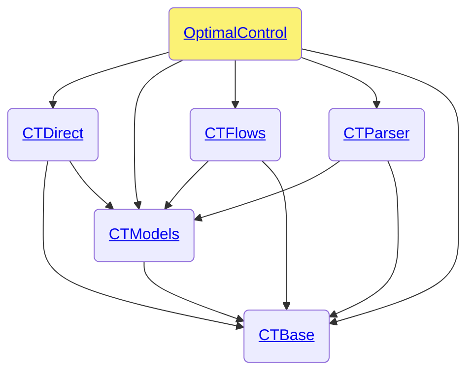

# OptimalControl.jl

```@meta
CollapsedDocStrings = false
```

The [OptimalControl.jl](https://control-toolbox.org/OptimalControl.jl) package is part of the [control-toolbox ecosystem](https://github.com/control-toolbox).



## Index

```@index
Pages   = ["dev-optimalcontrol.md"]
Modules = [OptimalControl]
Order   = [:module, :constant, :type, :function, :macro]
```

## Available methods

```@example
using OptimalControl
available_methods()
```

## Documentation

### Public

```@autodocs
Modules = [OptimalControl]
Order   = [:module, :constant, :type, :function, :macro]
Private = false
```

### Private

```@autodocs
Modules = [OptimalControl]
Order   = [:type, :module, :constant, :type, :function, :macro]
Public  = false
```
