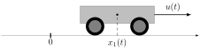

# [Double integrator: energy minimisation](@id example-double-integrator-energy)

```@meta
Draft = false
```

Let us consider a wagon moving along a rail, whose acceleration can be controlled by a force $u$.
We denote by $x = (q, v)$ the state of the wagon, where $q$ is the position and $v$ the velocity.

```@raw html

```

We assume that the mass is constant and equal to one, and that there is no friction. The dynamics are given by

```math
    \dot q(t) = v(t), \quad \dot v(t) = u(t),\quad u(t) \in \R,
```

which is simply the [double integrator](https://en.wikipedia.org/w/index.php?title=Double_integrator&oldid=1071399674) system. Let us consider a transfer starting at time $t_0 = 0$ and ending at time $t_f = 1$, for which we want to minimise the transfer energy

```math
    \frac{1}{2}\int_{0}^{1} u^2(t) \, \mathrm{d}t
```

starting from $x(0) = (-1, 0)$ and aiming to reach the target $x(1) = (0, 0)$.

First, we need to import the [OptimalControl.jl](https://control-toolbox.org/OptimalControl.jl) package to define the optimal control problem, [NLPModelsIpopt.jl](https://jso.dev/NLPModelsIpopt.jl) to solve it, and [Plots.jl](https://docs.juliaplots.org) to visualise the solution.

```@example main
using OptimalControl
using NLPModelsIpopt
using Plots
```

## Optimal control problem

Let us define the problem with the [`@def`](@ref) macro:

```@raw html
<div class="responsive-columns-left-priority">
<div>
```

```@example main
t0 = 0
tf = 1
x0 = [-1, 0]
xf = [0, 0]
ocp = @def begin
    t ∈ [t0, tf], time
    x = (q, v) ∈ R², state
    u ∈ R, control
    x(t0) == x0
    x(tf) == xf
    ∂(q)(t) == v(t)
    ∂(v)(t) == u(t)
    0.5∫( u(t)^2 ) → min
end
nothing # hide
```

```@raw html
</div>
<div>
```

### Mathematical formulation

```math
    \begin{aligned}
        & \text{Minimise} && \frac{1}{2}\int_0^1 u^2(t) \,\mathrm{d}t \\
        & \text{subject to} \\
        & && \dot{q}(t) = v(t), \\[0.5em]
        & && \dot{v}(t) = u(t), \\[1.0em]
        & && x(0) = (-1,0), \\[0.5em] 
        & && x(1) = (0,0).
    \end{aligned}
```

```@raw html
</div>
</div>
```

!!! note "Nota bene"

    For a comprehensive introduction to the syntax used above to define the optimal control problem, see [this abstract syntax tutorial](@ref manual-abstract-syntax). In particular, non-Unicode alternatives are available for derivatives, integrals, *etc.*

## [Solve and plot](@id example-double-integrator-energy-solve-plot)

### Direct method

We can [`solve`](@ref) it simply with:

```@example main
sol = solve(ocp)
nothing # hide
```

And [`plot`](@ref) the solution with:

```@example main
plot(sol)
```

!!! note "Nota bene"

    The `solve` function has options, see the [solve tutorial](@ref manual-solve). You can customise the plot, see the [plot tutorial](@ref manual-plot).

### Indirect method

The first solution was obtained using the so-called direct method.[^1] Another approach is to use an [indirect simple shooting](@extref tutorial-indirect-simple-shooting) method. We begin by importing the necessary packages.

```@example main
using OrdinaryDiffEq # Ordinary Differential Equations (ODE) solver
using NonlinearSolve # Nonlinear Equations (NLE) solver
```

To define the shooting function, we must provide the maximising control in feedback form:

```@example main
# maximising control, H(x, p, u) = p₁v + p₂u - u²/2
u(x, p) = p[2]

# Hamiltonian flow
f = Flow(ocp, u)

# state projection, p being the costate
π((x, p)) = x

# shooting function
S(p0) = π( f(t0, x0, p0, tf) ) - xf
nothing # hide
```

We are now ready to solve the shooting equations.

```@example main
# auxiliary in-place NLE function
nle!(s, p0, λ) = s[:] = S(p0)

# initial guess for the Newton solver
p0_guess = [1, 1]

# NLE problem with initial guess
prob = NonlinearProblem(nle!, p0_guess)

# resolution of S(p0) = 0
sol = solve(prob; show_trace=Val(true))
p0_sol = sol.u # costate solution

# print the costate solution and the shooting function evaluation
println("\ncostate: p0 = ", p0_sol)
println("shoot: S(p0) = ", S(p0_sol), "\n")
```

To plot the solution obtained by the indirect method, we need to build the solution of the optimal control problem. This is done using the costate solution and the flow function.

```@example main
sol = f((t0, tf), x0, p0_sol; saveat=range(t0, tf, 100))
plot(sol)
```

[^1]: J. T. Betts. Practical methods for optimal control using nonlinear programming. Society for Industrial and Applied Mathematics (SIAM), Philadelphia, PA, 2001.

!!! note

    - You can use [MINPACK.jl](@extref Tutorials Resolution-of-the-shooting-equation) instead of [NonlinearSolve.jl](https://docs.sciml.ai/NonlinearSolve).
    - For more details about the flow construction, visit the [Compute flows from optimal control problems](@ref manual-flow-ocp) page.
    - In this simple example, we have set an arbitrary initial guess. It can be helpful to use the solution of the direct method to initialise the shooting method. See the [Goddard tutorial](@extref Tutorials tutorial-goddard) for such a concrete application.

## State constraint

The following example illustrates both direct and indirect solution approaches for a constrained energy minimization problem. The workflow demonstrates a practical strategy: a direct method on a coarse grid first identifies the problem structure and provides an initial guess for the indirect method, which then computes a precise solution via shooting based on Pontryagin's Maximum Principle. The direct solution can also be refined using a finer discretization grid for higher accuracy.

### Direct method: constrained case

We add the path constraint

```math
    v(t) \le 1.2.
```

Let us model, solve and plot the optimal control problem with this constraint.

```@example main
# the upper bound for v
v_max = 1.2

# the optimal control problem
ocp = @def begin
    t ∈ [t0, tf], time
    x = (q, v) ∈ R², state
    u ∈ R, control
    v(t) ≤ v_max
    x(t0) == x0
    x(tf) == xf
    ∂(q)(t) == v(t)
    ∂(v)(t) == u(t)
    0.5∫( u(t)^2 ) → min
end

# solve with a direct method using default settings
sol = solve(ocp; grid_size=20)

# plot the solution
plt = plot(sol; label="Direct", size=(800, 600))
```

The solution has three phases (unconstrained-constrained-unconstrained arcs), requiring definition of Hamiltonian flows for each phase and a shooting function to enforce boundary and switching conditions.

### Indirect method: constrained case

Under the normal case, the pseudo-Hamiltonian reads:

```math
H(x, p, u, \mu) = p_1 v + p_2 u - \frac{u^2}{2} + \mu\, g(x),
```

where $g(x) = v_{\max} - v$. Along a boundary arc we have $g(x(t)) = 0$; differentiating gives:

```math
    \frac{\mathrm{d}}{\mathrm{d}t}g(x(t)) = -\dot{v}(t) = -u(t) = 0.
```

The zero control maximises the Hamiltonian, so $p_2(t) = 0$ along that arc. From the adjoint equation we then have

```math
    \dot{p}_2(t) = -p_1(t) + \mu(t) = 0 \quad \Rightarrow \mu(t) = p_1(t).
```

Because the adjoint vector is continuous at both the entry time $t_1$ and the exit time $t_2$, the unknowns are $p_0 \in \mathbb{R}^2$ together with $t_1$ and $t_2$. The target condition supplies two equations, $g(x(t_1)) = 0$ enforces the state constraint, and $p_2(t_1) = 0$ encodes the switching condition.

```@example main
# flow for unconstrained extremals
f_interior = Flow(ocp, (x, p) -> p[2])

ub = 0              # boundary control
g(x) = v_max - x[2] # constraint: g(x) ≥ 0
μ(p) = p[1]         # dual variable

# flow for boundary extremals
f_boundary = Flow(ocp, (x, p) -> ub, (x, u) -> g(x), (x, p) -> μ(p))

# shooting function
function shoot!(s, p0, t1, t2)
    x_t0, p_t0 = x0, p0
    x_t1, p_t1 = f_interior(t0, x_t0, p_t0, t1)
    x_t2, p_t2 = f_boundary(t1, x_t1, p_t1, t2)
    x_tf, p_tf = f_interior(t2, x_t2, p_t2, tf)
    s[1:2] = x_tf - xf
    s[3] = g(x_t1)
    s[4] = p_t1[2]
end
nothing # hide
```

We can derive an initial guess for the costate and the entry/exit times from the direct solution:

```@example main
t = time_grid(direct_sol) # the time grid as a vector
x = state(direct_sol)     # the state as a function of time
p = costate(direct_sol)   # the costate as a function of time

# initial costate
p0 = p(t0)

# times where constraint is active
t12 = t[ 0 .≤ (g ∘ x).(t) .≤ 1e-3 ]

# entry and exit times
t1 = minimum(t12) # entry time
t2 = maximum(t12) # exit time
```

We can now solve the shooting equations.

```@example main
# auxiliary in-place NLE function
nle!(s, ξ, λ) = shoot!(s, ξ[1:2], ξ[3], ξ[4])

# initial guess for the Newton solver
ξ_guess = [p0..., t1, t2]

# NLE problem with initial guess
prob = NonlinearProblem(nle!, ξ_guess)

# resolution of the shooting equations
sol = solve(prob; show_trace=Val(true))
p0, t1, t2 = sol.u[1:2], sol.u[3], sol.u[4]

# print the costate solution and the entry and exit times
println("\np0 = ", p0, "\nt1 = ", t1, "\nt2 = ", t2)
```

To reconstruct the constrained trajectory, concatenate the flows as follows: an unconstrained arc until $t_1$, a boundary arc from $t_1$ to $t_2$, and a final unconstrained arc from $t_2$ to $t_f$.  
This composition yields the full solution (state, costate, and control), which we then plot alongside the direct method for comparison.

```@example main
# concatenation of the flows
φ = f_interior * (t1, f_boundary) * (t2, f_interior)

# compute the solution: state, costate, control...
flow_sol = φ((t0, tf), x0, p0; saveat=range(t0, tf, 100))      

# plot the solution on the previous plot
plot!(plt, flow_sol; label="Indirect", color=2, linestyle=:dash)
```
