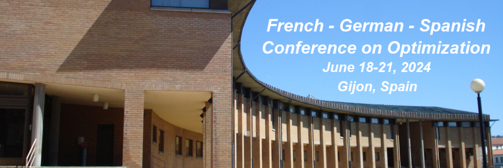

```@raw html

```

# control-toolbox: solving optimal control problems within Julia

### [Jean-Baptiste Caillau](http://caillau.perso.math.cnrs.fr), [Olivier Cots](https://ocots.github.io), [Joseph Gergaud](https://scholar.google.com/citations?user=pkH4An4AAAAJ&hl=fr), [Pierre Martinon](https://www.linkedin.com/in/pierre-martinon-b4603a17), [Sophia Sed](https://iww.inria.fr/sed-sophia)

```@raw html

```

# What it's about

- Nonlinear optimal control of ODEs:

```math
g(x(t_0),x(t_f)) + \int_{t_0}^{t_f} f^0(x(t), u(t))\, \mathrm{d}t \to \min
```

subject to

```math
\dot{x}(t) = f(x(t), u(t)),\quad t \in [t_0, t_f]
```

plus boundary, control and state constraints

- Our core interests: numerical & geometrical methods in control, applications

# Where it comes from

- [BOCOP: the optimal control solver](https://www.bocop.org)
- [HamPath: indirect and Hamiltonian pathfollowing](http://www.hampath.org)
- [Coupling direct and indirect solvers, examples](https://ct.gitlabpages.inria.fr/gallery//notebooks.html)

# OptimalControl.jl

- [Double integrator](https://control-toolbox.org/docs/optimalcontrol/dev/tutorial-double-integrator.html)
- [Batch processing](https://control-toolbox.org/docs/optimalcontrol/dev/tutorial-batch.html)
- [Goddard problem](https://control-toolbox.org/docs/optimalcontrol/dev/tutorial-goddard.html)

# Wrap up

- High level modelling of optimal control problems
- Efficient numerical resolution coupling direct and indirect methods
- Collection of examples

# Future

- Additional solvers: direct shooting, collocation for BVP, Hamiltonian pathfollowing...
- ... and open to contributions!
- [CTProblems.jl](https://control-toolbox.org/docs/ctproblems/stable/problems-list.html)

# control-toolbox.org

- Open toolbox
- Collection of Julia Packages rooted at [OptimalControl.jl](https://control-toolbox.org/docs/optimalcontrol)

```@raw html
<a href="https://control-toolbox.org"></a>
```

# Credits (not exhaustive!)

- [ADNLPModels.jl](https://jso.dev/ADNLPModels.jl)
- [DifferentiationInterface.jl](https://gdalle.github.io/DifferentiationInterface.jl/DifferentiationInterface/stable)
- [DifferentialEquations.jl](https://github.com/SciML/DifferentialEquations.jl)
- [MLStyle.jl](https://thautwarm.github.io/MLStyle.jl)