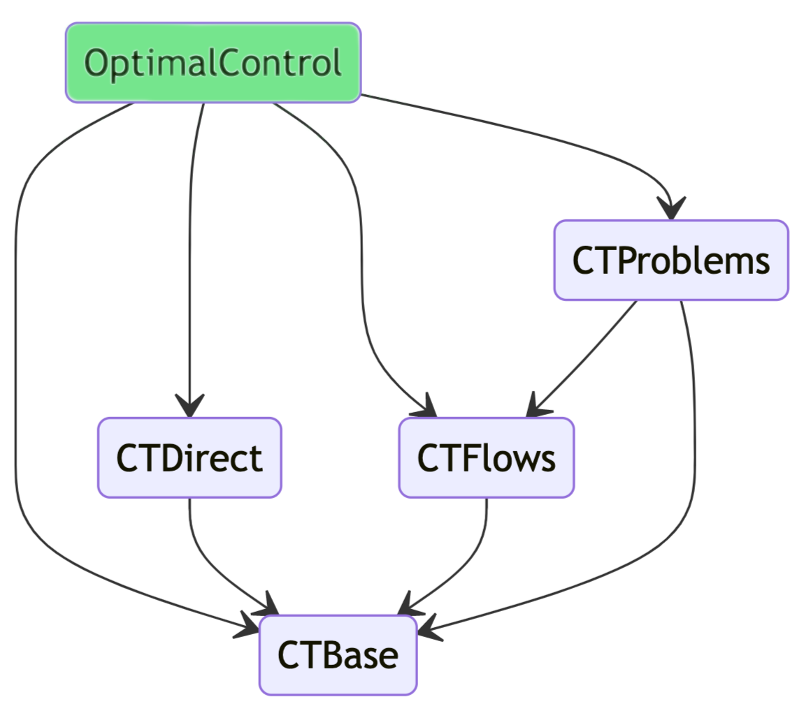

# OptimalControl.jl

```@meta
CurrentModule =  OptimalControl
```

The `OptimalControl.jl` package aims to provide tools to solve optimal control problems by direct and indirect methods.
It is part of the [control-toolbox ecosystem](https://github.com/control-toolbox):

```@raw html

```

!!! note "Install and documentation"

    To install a package from the control-toolbox ecosystem, 
    please visit the [installation page](https://github.com/control-toolbox#installation).
    The documentation is accessible from the main menu.

An optimal control problem with fixed initial and final times can be described as minimising the cost functional

```math
g(x(t_0), x(t_f)) + \int_{t_0}^{t_f} f^{0}(t, x(t), u(t))~\mathrm{d}t
```

where the state $x$ and the control $u$ are functions subject, for $t \in [t_0, t_f]$,
to the differential constraint

```math
   \dot{x}(t) = f(t, x(t), u(t))
```

and other constraints such as

```math
\begin{array}{llcll}
~\xi_l  &\le& \xi(t, u(t))        &\le& \xi_u, \\
\eta_l &\le& \eta(t, x(t))       &\le& \eta_u, \\
\psi_l &\le& \psi(t, x(t), u(t)) &\le& \psi_u, \\
\phi_l &\le& \phi(t_0, x(t_0), t_f, x(t_f)) &\le& \phi_u.
\end{array}
```

See our tutorials to get started solving optimal control problems:

- [Basic example](@ref): a simple smooth optimal control problem solved by the direct method.
- [Advanced example](@ref): the [Goddard problem](https://en.wikipedia.org/w/index.php?title=Goddard_problem&oldid=1091155283) solved by direct and indirect methods.
  