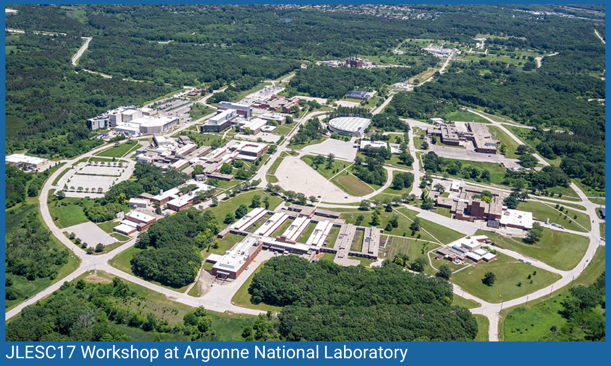

```@raw html

```

# Solving optimal control problems on GPU with Julia

### [Jean-Baptiste Caillau](http://caillau.perso.math.cnrs.fr), [Olivier Cots](https://ocots.github.io), [Joseph Gergaud](https://github.com/joseph-gergaud), [Pierre Martinon](https://github.com/PierreMartinon), [Sophia Sed](https://sed-sam-blog.gitlabpages.inria.fr)

```@raw html

```

## What it's about

- Nonlinear optimal control of ODEs:

$$ g(x(t_0),x(t_f)) + \int_{t_0}^{t_f} f^0(x(t), u(t))\, \mathrm{d}t \to \min $$

subject to

$$ \dot{x}(t) = f(x(t), u(t)),\quad t \in [t_0, t_f] $$

plus boundary, control and state constraints

- Our core interests: numerical & geometrical methods in control, applications
- Why Julia: fast (+ JIT), strongly typed, high-level (AD, macros), available fast optimisation and ODE solvers, rapidly growing community

```@raw html

```

## Discretise then solve strategy (*aka* direct methods)

- Discretising an OCP into an NLP: $h_i := t_{i+1}-t_i$,

$$ g(X_0,X_N) + \sum_{i=0}^{N} h_i f^0(X_i,U_i) \to \min $$

subject to 

$$ X_{i+1} - X_i - h_i f(X_i, U_i) = 0,\quad i = 0,\dots,N-1 $$

plus other constraints on $X := (X_i)_{i=0,N}$ and $U := (U_i)_{i=0,N}$ such as boundary and path (state and / or control) constraints :

$$ b(t_0, X_0, t_N, X_N) = 0 $$

$$ g(t_i, X_i, U_i) = 0,\quad i = 0,\dots,N $$

- SIMD parallelism ($f0$, $f$, $g$) + sparsity: Kernels for GPU ([KernelAbstraction.jl](XXXX)) and sparse linear algebra ([CUDSS.jl](https://github.com/exanauts/CUDSS.jl))
- Modelling and optimising for GPU: [ExaModels.jl](https://exanauts.github.io/ExaModels.jl/dev/guide)  + [MadNLP.jl](https://madnlp.github.io/MadNLP.jl), with **built-in AD**
- [Simple example, DSL](@ref tutorial-double-integrator-energy)
- Compile into an ExaModel (one pass compiler, [syntax + semantics](XXXX))
- Simple example, generated code
```julia
```
- **Remark.** Automated scalarisation of (linear) range constraints
```julia
```
- Solving (MadNLP + CUDSS)
```julia
```
- [Goddard problem](https://control-toolbox.org/Tutorials.jl/stable/tutorial-goddard/)
```julia
```

## Wrap up

- High level modelling of optimal control problems
- Solving on CPU and GPU

## Future

- New [applications](XXXX) (space mechanics, biology, quantum mechanics and more)
- Additional solvers: benchmarking on CPU / GPU for optimisation, Hamiltonian shooting and pathfollowing
- Improved AD: collab between Argonne and Inria, [JLESC Shared Infra AD](https://jlesc.github.io/projects/shared_infra_ad) project (XXXX team)...
- ... and open to contributions! If you like the package, please give us a star ⭐️

```@raw html
<a href="https://github.com/control-toolbox/OptimalControl.jl"></a>
```

## control-toolbox.org

- Open toolbox
- Collection of Julia Packages rooted at [OptimalControl.jl](https://control-toolbox.org/OptimalControl.jl)

```@raw html
<a href="https://control-toolbox.org"></a>
```

## Credits (not exhaustive!)

- [ADNLPModels.jl](https://jso.dev/ADNLPModels.jl)
- [DifferentiationInterface.jl](https://juliadiff.org/DifferentiationInterface.jl/DifferentiationInterface)
- [DifferentialEquations.jl](https://docs.sciml.ai/DiffEqDocs)
- [ExaModels.jl](https://exanauts.github.io/ExaModels.jl/dev/guide)
- [Ipopt.jl](https://github.com/jump-dev/Ipopt.jl)
- [MadNLP.jl](https://madnlp.github.io/MadNLP.jl)
- [MLStyle.jl](https://thautwarm.github.io/MLStyle.jl)

## Acknowledgements

Jean-Baptiste Caillau is partially funded by a **France 2030** support managed by the *Agence Nationale de la Recherche*, under the reference ANR-23-PEIA-0004 ([PDE-AI](https://pde-ai.math.cnrs.fr) project).

```@raw html

```

