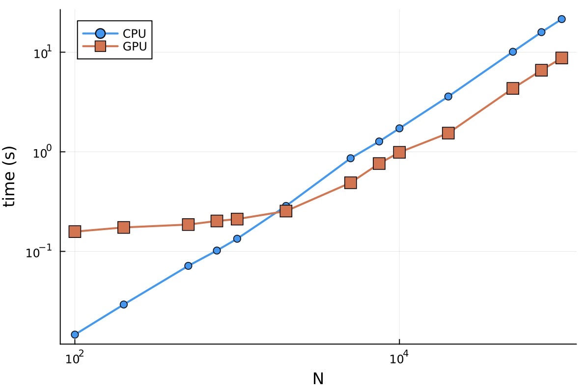
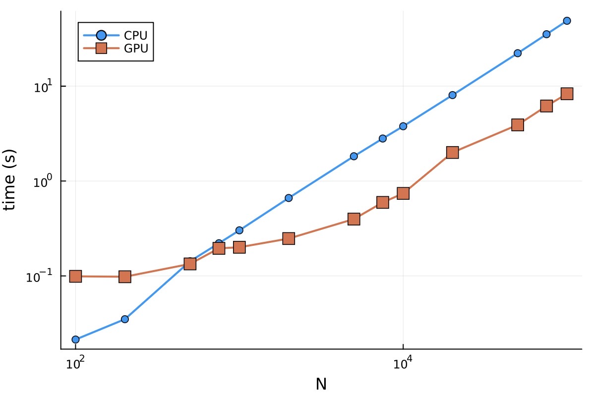
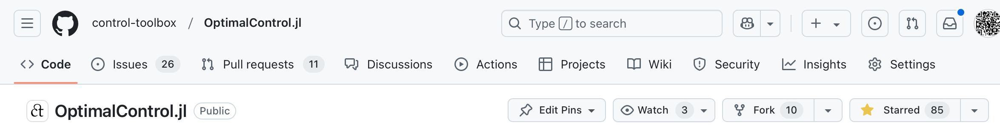

```@raw html

```

# Solving optimal control problems on GPU with Julia

### [Jean-Baptiste Caillau](http://caillau.perso.math.cnrs.fr), [Olivier Cots](https://ocots.github.io), [Joseph Gergaud](https://github.com/joseph-gergaud), [Pierre Martinon](https://github.com/PierreMartinon), [Sophia Sed](https://sed-sam-blog.gitlabpages.inria.fr)

```@raw html

```

## What it's about

- Nonlinear optimal control of ODEs:

```math
g(x(t_0),x(t_f)) + \int_{t_0}^{t_f} f^0(x(t), u(t))\, \mathrm{d}t \to \min
```

subject to

```math
\dot{x}(t) = f(x(t), u(t)),\quad t \in [t_0, t_f]
```

plus boundary, control and state constraints

- Our core interests: numerical & geometrical methods in control, applications
- Why Julia: fast (+ JIT), strongly typed, high-level (AD, macros), fast optimisation and ODE solvers available, rapidly growing community

## Discretise then solve strategy (*aka* direct methods)

- Discretising an OCP into an NLP: $h_i := t_{i+1}-t_i$,

```math
g(X_0,X_N) + \sum_{i=0}^{N} h_i f^0(X_i,U_i) \to \min
```

subject to 

```math
X_{i+1} - X_i - h_i f(X_i, U_i) = 0,\quad i = 0,\dots,N-1
```

plus other constraints on $X := (X_i)_{i=0,N}$ and $U := (U_i)_{i=0,N}$ such as boundary and path (state and / or control) constraints :

```math
b(t_0, X_0, t_N, X_N) = 0
```

```math
c(X_i, U_i) \leq 0,\quad i = 0,\dots,N
```

- SIMD parallelism ($f_0$, $f$, $g$) + sparsity: Kernels for GPU ([KernelAbstraction.jl](https://juliagpu.github.io/KernelAbstractions.jl/stable/)) and sparse linear algebra ([CUDSS.jl](https://github.com/exanauts/CUDSS.jl))
- Modelling and optimising for GPU: [ExaModels.jl](https://exanauts.github.io/ExaModels.jl/dev/guide)  + [MadNLP.jl](https://madnlp.github.io/MadNLP.jl), with **built-in AD**
- [Simple example, DSL](@ref example-double-integrator-energy)
- Compile into an ExaModel (one pass compiler, [syntax + semantics](https://github.com/control-toolbox/CTParser.jl/blob/20c6be5c953587fef10b054a95f9dc8c66b90577/src/onepass.jl#L145))


```@raw html
<details><summary>Simple example, generated code</summary>
```

```julia
begin
    #= /data/caillau/CTParser.jl/src/onepass.jl:1003 =#
    function (; scheme = :trapezoidal, grid_size = 200, backend = nothing, init = (0.1, 0.1, 0.1), base_type = Float64)
        #= /data/caillau/CTParser.jl/src/onepass.jl:1003 =#
        #= /data/caillau/CTParser.jl/src/onepass.jl:1004 =#
        LineNumberNode(0, "box constraints: variable")
        #= /data/caillau/CTParser.jl/src/onepass.jl:1005 =#
        begin
            LineNumberNode(0, "box constraints: state")
            begin
                var"##235" = -Inf * ones(3)
                #= /data/caillau/CTParser.jl/src/onepass.jl:461 =#
                var"##236" = Inf * ones(3)
            end
        end
        #= /data/caillau/CTParser.jl/src/onepass.jl:1006 =#
        begin
            LineNumberNode(0, "box constraints: control")
            begin
                var"##237" = -Inf * ones(1)
                #= /data/caillau/CTParser.jl/src/onepass.jl:512 =#
                var"##238" = Inf * ones(1)
            end
        end
        #= /data/caillau/CTParser.jl/src/onepass.jl:1007 =#
        var"##230" = ExaModels.ExaCore(base_type; backend = backend)
        #= /data/caillau/CTParser.jl/src/onepass.jl:1008 =#
        begin
            #= /data/caillau/CTParser.jl/test/test_onepass_exa.jl:23 =#
            var"##232" = begin
                    #= /data/caillau/CTParser.jl/src/onepass.jl:111 =#
                    local ex
                    #= /data/caillau/CTParser.jl/src/onepass.jl:112 =#
                    try
                        #= /data/caillau/CTParser.jl/src/onepass.jl:113 =#
                        (1 - 0) / grid_size
                    catch ex
                        #= /data/caillau/CTParser.jl/src/onepass.jl:115 =#
                        println("Line ", 1, ": ", "(t ∈ [0, 1], time)")
                        #= /data/caillau/CTParser.jl/src/onepass.jl:116 =#
                        throw(ex)
                    end
                end
            #= /data/caillau/CTParser.jl/test/test_onepass_exa.jl:24 =#
            x = begin
                    #= /data/caillau/CTParser.jl/src/onepass.jl:111 =#
                    local ex
                    #= /data/caillau/CTParser.jl/src/onepass.jl:112 =#
                    try
                        #= /data/caillau/CTParser.jl/src/onepass.jl:113 =#
                        ExaModels.variable(var"##230", 3, 0:grid_size; lvar = [var"##235"[i] for (i, j) = Base.product(1:3, 0:grid_size)], uvar = [var"##236"[i] for (i, j) = Base.product(1:3, 0:grid_size)], start = init[2])
                    catch ex
                        #= /data/caillau/CTParser.jl/src/onepass.jl:115 =#
                        println("Line ", 2, ": ", "(x ∈ R ^ 3, state)")
                        #= /data/caillau/CTParser.jl/src/onepass.jl:116 =#
                        throw(ex)
                    end
                end
            #= /data/caillau/CTParser.jl/test/test_onepass_exa.jl:25 =#
            var"u##239" = begin
                    #= /data/caillau/CTParser.jl/src/onepass.jl:111 =#
                    local ex
                    #= /data/caillau/CTParser.jl/src/onepass.jl:112 =#
                    try
                        #= /data/caillau/CTParser.jl/src/onepass.jl:113 =#
                        ExaModels.variable(var"##230", 1, 0:grid_size; lvar = [var"##237"[i] for (i, j) = Base.product(1:1, 0:grid_size)], uvar = [var"##238"[i] for (i, j) = Base.product(1:1, 0:grid_size)], start = init[3])
                    catch ex
                        #= /data/caillau/CTParser.jl/src/onepass.jl:115 =#
                        println("Line ", 3, ": ", "(u ∈ R, control)")
                        #= /data/caillau/CTParser.jl/src/onepass.jl:116 =#
                        throw(ex)
                    end
                end
            #= /data/caillau/CTParser.jl/test/test_onepass_exa.jl:26 =#
            begin
                #= /data/caillau/CTParser.jl/src/onepass.jl:111 =#
                local ex
                #= /data/caillau/CTParser.jl/src/onepass.jl:112 =#
                try
                    #= /data/caillau/CTParser.jl/src/onepass.jl:113 =#
                    ExaModels.constraint(var"##230", (x[i, 0] for i = 1:3); lcon = [-1, 0, 0], ucon = [-1, 0, 0])
                catch ex
                    #= /data/caillau/CTParser.jl/src/onepass.jl:115 =#
                    println("Line ", 4, ": ", "x(0) == [-1, 0, 0]")
                    #= /data/caillau/CTParser.jl/src/onepass.jl:116 =#
                    throw(ex)
                end
            end
            #= /data/caillau/CTParser.jl/test/test_onepass_exa.jl:27 =#
            begin
                #= /data/caillau/CTParser.jl/src/onepass.jl:111 =#
                local ex
                #= /data/caillau/CTParser.jl/src/onepass.jl:112 =#
                try
                    #= /data/caillau/CTParser.jl/src/onepass.jl:113 =#
                    ExaModels.constraint(var"##230", (x[i, grid_size] for i = 1:2); lcon = [0, 0], ucon = [0, 0])
                catch ex
                    #= /data/caillau/CTParser.jl/src/onepass.jl:115 =#
                    println("Line ", 5, ": ", "(x[1:2])(1) == [0, 0]")
                    #= /data/caillau/CTParser.jl/src/onepass.jl:116 =#
                    throw(ex)
                end
            end
            #= /data/caillau/CTParser.jl/test/test_onepass_exa.jl:28 =#
            begin
                #= /data/caillau/CTParser.jl/src/onepass.jl:111 =#
                local ex
                #= /data/caillau/CTParser.jl/src/onepass.jl:112 =#
                try
                    #= /data/caillau/CTParser.jl/src/onepass.jl:113 =#
                    begin
                        #= /data/caillau/CTParser.jl/src/onepass.jl:735 =#
                        if scheme == :trapezoidal
                            #= /data/caillau/CTParser.jl/src/onepass.jl:736 =#
                            ExaModels.constraint(var"##230", ((x[1, j + 1] - x[1, j]) - (var"##232" * (x[2, j] + x[2, j + 1])) / 2 for j = 0:grid_size - 1))
                        elseif #= /data/caillau/CTParser.jl/src/onepass.jl:737 =# scheme == :euler
                            #= /data/caillau/CTParser.jl/src/onepass.jl:738 =#
                            ExaModels.constraint(var"##230", ((x[1, j + 1] - x[1, j]) - var"##232" * x[2, j] for j = 0:grid_size - 1))
                        elseif #= /data/caillau/CTParser.jl/src/onepass.jl:739 =# scheme == :euler_b
                            #= /data/caillau/CTParser.jl/src/onepass.jl:740 =#
                            ExaModels.constraint(var"##230", ((x[1, j + 1] - x[1, j]) - var"##232" * x[2, j + 1] for j = 0:grid_size - 1))
                        else
                            #= /data/caillau/CTParser.jl/src/onepass.jl:742 =#
                            throw("unknown numerical scheme")
                        end
                    end
                catch ex
                    #= /data/caillau/CTParser.jl/src/onepass.jl:115 =#
                    println("Line ", 6, ": ", "(∂(x₁))(t) == x₂(t)")
                    #= /data/caillau/CTParser.jl/src/onepass.jl:116 =#
                    throw(ex)
                end
            end
            #= /data/caillau/CTParser.jl/test/test_onepass_exa.jl:29 =#
            begin
                #= /data/caillau/CTParser.jl/src/onepass.jl:111 =#
                local ex
                #= /data/caillau/CTParser.jl/src/onepass.jl:112 =#
                try
                    #= /data/caillau/CTParser.jl/src/onepass.jl:113 =#
                    begin
                        #= /data/caillau/CTParser.jl/src/onepass.jl:735 =#
                        if scheme == :trapezoidal
                            #= /data/caillau/CTParser.jl/src/onepass.jl:736 =#
                            ExaModels.constraint(var"##230", ((x[2, j + 1] - x[2, j]) - (var"##232" * (var"u##239"[1, j] + var"u##239"[1, j + 1])) / 2 for j = 0:grid_size - 1))
                        elseif #= /data/caillau/CTParser.jl/src/onepass.jl:737 =# scheme == :euler
                            #= /data/caillau/CTParser.jl/src/onepass.jl:738 =#
                            ExaModels.constraint(var"##230", ((x[2, j + 1] - x[2, j]) - var"##232" * var"u##239"[1, j] for j = 0:grid_size - 1))
                        elseif #= /data/caillau/CTParser.jl/src/onepass.jl:739 =# scheme == :euler_b
                            #= /data/caillau/CTParser.jl/src/onepass.jl:740 =#
                            ExaModels.constraint(var"##230", ((x[2, j + 1] - x[2, j]) - var"##232" * var"u##239"[1, j + 1] for j = 0:grid_size - 1))
                        else
                            #= /data/caillau/CTParser.jl/src/onepass.jl:742 =#
                            throw("unknown numerical scheme")
                        end
                    end
                catch ex
                    #= /data/caillau/CTParser.jl/src/onepass.jl:115 =#
                    println("Line ", 7, ": ", "(∂(x₂))(t) == u(t)")
                    #= /data/caillau/CTParser.jl/src/onepass.jl:116 =#
                    throw(ex)
                end
            end
            #= /data/caillau/CTParser.jl/test/test_onepass_exa.jl:30 =#
            begin
                #= /data/caillau/CTParser.jl/src/onepass.jl:111 =#
                local ex
                #= /data/caillau/CTParser.jl/src/onepass.jl:112 =#
                try
                    #= /data/caillau/CTParser.jl/src/onepass.jl:113 =#
                    begin
                        #= /data/caillau/CTParser.jl/src/onepass.jl:735 =#
                        if scheme == :trapezoidal
                            #= /data/caillau/CTParser.jl/src/onepass.jl:736 =#
                            ExaModels.constraint(var"##230", ((x[3, j + 1] - x[3, j]) - (var"##232" * (0.5 * var"u##239"[1, j] ^ 2 + 0.5 * var"u##239"[1, j + 1] ^ 2)) / 2 for j = 0:grid_size - 1))
                        elseif #= /data/caillau/CTParser.jl/src/onepass.jl:737 =# scheme == :euler
                            #= /data/caillau/CTParser.jl/src/onepass.jl:738 =#
                            ExaModels.constraint(var"##230", ((x[3, j + 1] - x[3, j]) - var"##232" * (0.5 * var"u##239"[1, j] ^ 2) for j = 0:grid_size - 1))
                        elseif #= /data/caillau/CTParser.jl/src/onepass.jl:739 =# scheme == :euler_b
                            #= /data/caillau/CTParser.jl/src/onepass.jl:740 =#
                            ExaModels.constraint(var"##230", ((x[3, j + 1] - x[3, j]) - var"##232" * (0.5 * var"u##239"[1, j + 1] ^ 2) for j = 0:grid_size - 1))
                        else
                            #= /data/caillau/CTParser.jl/src/onepass.jl:742 =#
                            throw("unknown numerical scheme")
                        end
                    end
                catch ex
                    #= /data/caillau/CTParser.jl/src/onepass.jl:115 =#
                    println("Line ", 8, ": ", "(∂(x₃))(t) == 0.5 * u(t) ^ 2")
                    #= /data/caillau/CTParser.jl/src/onepass.jl:116 =#
                    throw(ex)
                end
            end
            #= /data/caillau/CTParser.jl/test/test_onepass_exa.jl:31 =#
            begin
                #= /data/caillau/CTParser.jl/src/onepass.jl:111 =#
                local ex
                #= /data/caillau/CTParser.jl/src/onepass.jl:112 =#
                try
                    #= /data/caillau/CTParser.jl/src/onepass.jl:113 =#
                    ExaModels.objective(var"##230", x[3, grid_size])
                catch ex
                    #= /data/caillau/CTParser.jl/src/onepass.jl:115 =#
                    println("Line ", 9, ": ", "x₃(1) → min")
                    #= /data/caillau/CTParser.jl/src/onepass.jl:116 =#
                    throw(ex)
                end
            end
        end
        #= /data/caillau/CTParser.jl/src/onepass.jl:1009 =#
        begin
            #= /data/caillau/CTParser.jl/src/onepass.jl:994 =#
            !(isempty([1, 2, 3])) || throw(CTBase.ParsingError("dynamics not defined"))
            #= /data/caillau/CTParser.jl/src/onepass.jl:995 =#
            sort([1, 2, 3]) == 1:3 || throw(CTBase.ParsingError("some coordinates of dynamics undefined"))
        end
        #= /data/caillau/CTParser.jl/src/onepass.jl:1010 =#
        return ExaModels.ExaModel(var"##230")
    end
end
```

```@raw html
</details>
```
- Solving (MadNLP + CUDSS)
```julia
This is MadNLP version v0.8.7, running with cuDSS v0.4.0

Number of nonzeros in constraint Jacobian............:    12005
Number of nonzeros in Lagrangian Hessian.............:     9000

Total number of variables............................:     4004
                     variables with only lower bounds:        0
                variables with lower and upper bounds:        0
                     variables with only upper bounds:        0
Total number of equality constraints.................:     3005
Total number of inequality constraints...............:        0
        inequality constraints with only lower bounds:        0
   inequality constraints with lower and upper bounds:        0
        inequality constraints with only upper bounds:        0

iter    objective    inf_pr   inf_du lg(mu)  ||d||  lg(rg) alpha_du alpha_pr  ls
   0  1.0000000e-01 1.10e+00 1.00e+00  -1.0 0.00e+00    -  0.00e+00 0.00e+00   0
   1  1.0001760e-01 1.10e+00 3.84e-03  -1.0 6.88e+02  -4.0 1.00e+00 2.00e-07h  2
   2 -5.2365072e-03 1.89e-02 1.79e-07  -1.0 6.16e+00  -4.5 1.00e+00 1.00e+00h  1
   3  5.9939621e+00 2.28e-03 1.66e-04  -3.8 6.00e+00  -5.0 9.99e-01 1.00e+00h  1
   4  5.9996210e+00 2.94e-06 8.38e-07  -3.8 7.70e-02    -  1.00e+00 1.00e+00h  1

Number of Iterations....: 4

                                   (scaled)                 (unscaled)
Objective...............:   5.9996210189633494e+00    5.9996210189633494e+00
Dual infeasibility......:   8.3756005011360529e-07    8.3756005011360529e-07
Constraint violation....:   2.9426923277963834e-06    2.9426923277963834e-06
Complementarity.........:   2.0007459547789288e-06    2.0007459547789288e-06
Overall NLP error.......:   2.9426923277963834e-06    2.9426923277963834e-06

Number of objective function evaluations             = 6
Number of objective gradient evaluations             = 5
Number of constraint evaluations                     = 6
Number of constraint Jacobian evaluations            = 5
Number of Lagrangian Hessian evaluations             = 4
Total wall-clock secs in solver (w/o fun. eval./lin. alg.)  =  0.072
Total wall-clock secs in linear solver                      =  0.008
Total wall-clock secs in NLP function evaluations           =  0.003
Total wall-clock secs                                       =  0.083
```

## Mini-benchmark: [Goddard](https://control-toolbox.org/Tutorials.jl/stable/tutorial-goddard.html) and [Quadrotor](https://github.com/control-toolbox/CTParser.jl/blob/211042b061be17b3f7fdff41cb53701d30b128db/test/test_onepass_exa.jl#L926) problems

- Goddard, A100 run
```@raw html

```
- Goddard, H100 run             
```@raw html

```
- Quadrotor, A100 run    
```@raw html

```
- Quadrotor, H100 run             
```@raw html

```
               
## Wrap up

- High level modelling of optimal control problems
- Solving on CPU and GPU

## What's next

- New applications (space mechanics, biology, quantum mechanics and more) -> check David's talk
- Collection of problems: [OptimalControlProblems.jl](https://control-toolbox.org/OptimalControlProblems.jl)
- ... and open to contributions! Give it a [try](@ref manual-ai-llm), give it a star ⭐️

```@raw html
<a href="https://github.com/control-toolbox/OptimalControl.jl"></a>
```

## control-toolbox.org

- Open toolbox
- Collection of Julia Packages rooted at [OptimalControl.jl](https://control-toolbox.org/OptimalControl.jl)

```@raw html
<a href="https://control-toolbox.org"></a>
```

## Credits (not exhaustive!)

- [ADNLPModels.jl](https://jso.dev/ADNLPModels.jl)
- [DifferentiationInterface.jl](https://juliadiff.org/DifferentiationInterface.jl/DifferentiationInterface)
- [DifferentialEquations.jl](https://docs.sciml.ai/DiffEqDocs)
- [ExaModels.jl](https://exanauts.github.io/ExaModels.jl/dev/guide)
- [Ipopt.jl](https://github.com/jump-dev/Ipopt.jl)
- [MadNLP.jl](https://madnlp.github.io/MadNLP.jl)
- [MLStyle.jl](https://thautwarm.github.io/MLStyle.jl)

## Acknowledgements

Jean-Baptiste Caillau is partially funded by a **France 2030** support managed by the *Agence Nationale de la Recherche*, under the reference ANR-23-PEIA-0004 ([PDE-AI](https://pde-ai.math.cnrs.fr) project).

```@raw html

```
