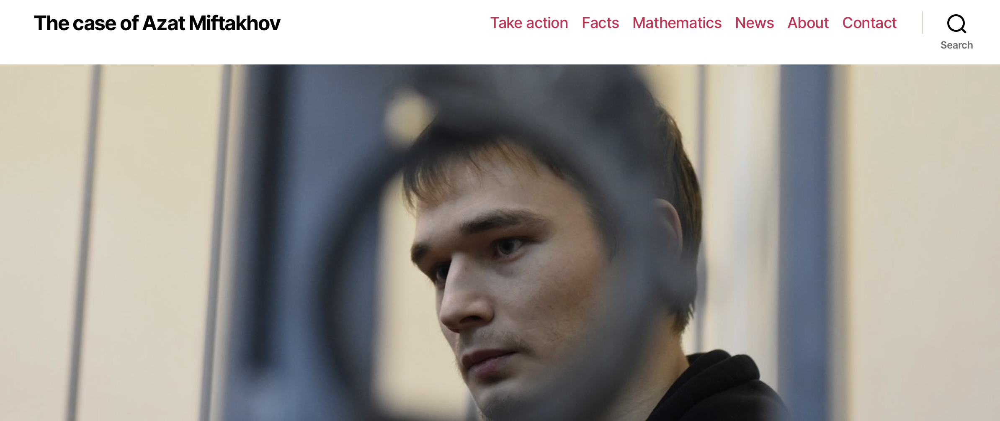

# Solving optimal control problems with Julia
### Jean-Baptiste Caillau, Olivier Cots, Joseph Gergaud, Pierre Martinon, Sophia Sed


# What it's about
- Nonlinear optimal control of ODEs:
```math
g(x(t_0),x(t_f)) + \int_{t_0}^{t_f} f^0(x(t), u(t)) \to \min
```
subject to
```math
\dot{x}(t) = f(x(t), u(t)),\quad t \in [0, t_f]
```
plus boundary, control and state constraints
- Our core interests: numerical & geometrical methods in control, applications

# Where it comes from
- [BOCOP: the optimal control solver](https://www.bocop.org)
- [HamPath: indirect and Hamiltonian pathfollowing](http://www.hampath.org)
- [Coupling direct and indirect solvers, examples](https://ct.gitlabpages.inria.fr/gallery//notebooks.html)

# OptimalControl.jl
- [Basic example: double integrator](https://control-toolbox.org/OptimalControl.jl/dev/tutorial-basic-example.html)
- [Basic example: double integrator (cont'ed)](https://control-toolbox.org/OptimalControl.jl/dev/tutorial-basic-example-f.html)
- [Advanced example: Goddard problem](https://control-toolbox.org/OptimalControl.jl/dev/tutorial-goddard.html)

# Wrap up
- [X] High level modelling of optimal control problems
- [X] Efficient numerical resolution coupling direct and indirect methods
- [X] Collection of examples 

# Future
- [ct_repl](./assets/repl.mp4)
- Additional solvers: direct shooting, collocation for BVP, Hamiltonian pathfollowing...
- ... and open to contributions!
- [CTProblems.jl](https://control-toolbox.org/CTProblems.jl/stable/problems-list.html)

# control-toolbox.org
- Open toolbox
- Collection of Julia Packages rooted at [OptimalControl.jl](https://control-toolbox.org/OptimalControl.jl)

<a href="https://control-toolbox.org"></a>

# Credits (not exhaustive!)
- [DifferentialEquations.jl](https://github.com/SciML/DifferentialEquations.jl)
- [JuliaSmoothOptimizers](https://github.com/JuliaSmoothOptimizers)
  ([JuMP](https://jump.dev/JuMP.jl),
  [InfiniteOpt.jl](https://docs.juliahub.com/InfiniteOpt/p3GvY/0.4.1),
  [ADNLPModels.jl](https://jso.dev/ADNLPModels.jl))
- [Ipopt](https://github.com/coin-or/ipopt)
- [JuliaDiff](https://juliadiff.org)
  ([FowardDiff.jl](https://juliadiff.org/ForwardDiff.jl),
  [Zygote.jl](https://fluxml.ai/Zygote.jl))
- [MLStyle.jl](https://thautwarm.github.io/MLStyle.jl)
- [REPLMaker.jl](https://docs.juliahub.com/ReplMaker)
<br/>
<br/>
<br/>
<br/>
<br/>
<br/>
<br/>
<br/>
<br/>
<br/>
<br/>
<br/>
<br/>
<br/>
<br/>
<br/>
<br/>
<br/>
<br/>
<br/>
<br/>
<br/>
<br/>
<br/>
<br/>
<br/>
<br/>
<br/>
<br/>
<br/>
<br/>
<br/>
<br/>
<br/>
<br/>
<br/>

# [caseazatmiftakhov.org](https://caseazatmiftakhov.org) (2019-)
<a href="https://caseazatmiftakhov.org"></a>
