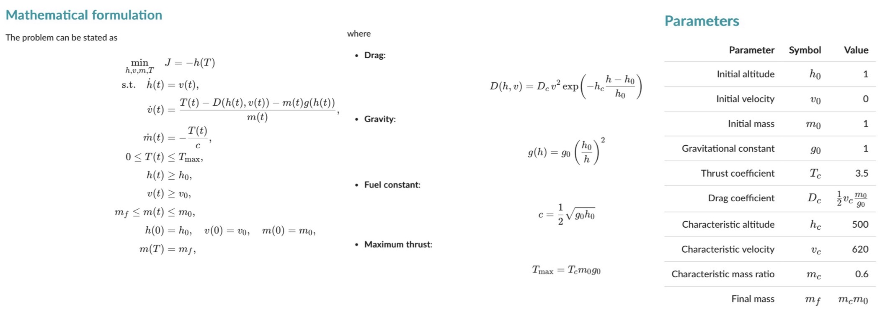

# [Use AI](@id manual-ai-llm)

Using now common models from AI, it is an elementary task to have such an agent learn the syntax of OptimalControl.jl DSL, then use the agent to translate standard math into this DSL. Here is a typical prompt, pointing to the [DSL syntax](@ref manual-abstract-syntax):

```text
Learn the syntax of OptimalControl.jl DSL described at the link below 
to translate math into this DSL (Julia language): 
https://control-toolbox.org/OptimalControl.jl/stable/manual-abstract.html.
```

```@raw html
<div style="display:flex; align-items:center; gap:8px; margin:16px 0;">
  <span style="font-weight:600; color:#666;">Try with:</span>
  <!-- ChatGPT -->
  <a href="https://chat.openai.com/?q=Learn+the+syntax+of+OptimalControl.jl+DSL+described+at+the+link+below+to+translate+math+into+this+DSL+(Julia+language):+https://control-toolbox.org/OptimalControl.jl/stable/manual-abstract.html" target="_blank" rel="nofollow noreferrer noopener" style="padding:4px 10px; background-color:#10A37F; color:#fff; border-radius:20px; font-size:13px; font-weight:600; text-decoration:none; transition:opacity 0.3s;">
    ChatGPT
  </a>

  <!-- Claude -->
  <a href="https://claude.ai/new?q=Learn+the+syntax+of+OptimalControl.jl+DSL+described+at+the+link+below+to+translate+math+into+this+DSL+(Julia+language):+https://control-toolbox.org/OptimalControl.jl/stable/manual-abstract.html" target="_blank" rel="nofollow noreferrer noopener" style="padding:4px 10px; background-color:#CC9B7A; color:#fff; border-radius:20px; font-size:13px; font-weight:600; text-decoration:none; transition:opacity 0.3s;">
    Claude
  </a>

  <!-- Perplexity -->
  <a href="https://www.perplexity.ai/search/new?q=Learn+the+syntax+of+OptimalControl.jl+DSL+described+at+the+link+below+to+translate+math+into+this+DSL+(Julia+language):+https://control-toolbox.org/OptimalControl.jl/stable/manual-abstract.html" target="_blank" rel="nofollow noreferrer noopener" style="padding:4px 10px; background-color:#9C4DE2; color:#fff; border-radius:20px; font-size:13px; font-weight:600; text-decoration:none; transition:opacity 0.3s;">
    Perplexity
  </a>

  <!-- Mistral AI -->
  <a href="https://chat.mistral.ai/chat?q=Learn+the+syntax+of+OptimalControl.jl+DSL+described+at+the+link+below+to+translate+math+into+this+DSL+(Julia+language):+https://control-toolbox.org/OptimalControl.jl/stable/manual-abstract.html" target="_blank" rel="nofollow noreferrer noopener" style="padding:4px 10px; background-color:#FF7000; color:#fff; border-radius:20px; font-size:13px; font-weight:600; text-decoration:none; transition:opacity 0.3s;">
    Mistral
  </a>
</div>
```

Now, here is an extract of, *e.g.*, [claude.ai](https://claude.ai) answer (Sonnet 4 model) to the request below:

```text
Translate the problem below into this DSL:

    minimise the final time tf 
    under the constraint q''(t) = u(t) 
    with -1 <= u(t) <= 1, 
    q(0) = 1, q'(0) = -2, q(tf) = 3, q'(tf) = 1, and q'(t) <= 1.
```

```julia
@def begin
    tf ∈ R, variable
    t ∈ [0, tf], time
    x = (q, v) ∈ R², state
    u ∈ R, control
    
    # Variable constraint
    tf ≥ 0
    
    # Control constraint
    -1 ≤ u(t) ≤ 1
    
    # Initial conditions
    q(0) == 1
    v(0) == -2
    
    # Final conditions  
    q(tf) == 3
    v(tf) == 1
    
    # Path constraint
    v(t) ≤ 1
    
    # Dynamics (q'' = u becomes first-order system)
    ẋ(t) == [v(t), u(t)]
    
    # Objective: minimize final time
    tf → min
end
```

The answer is syntactically correct and can be updated, for instance according to the new request below:

```text
Use a form compatible with examodels.
```

```julia
@def begin
    tf ∈ R, variable
    t ∈ [0, tf], time
    x = (q, v) ∈ R², state
    u ∈ R, control
    
    # Variable constraint
    tf ≥ 0
    
    # Control constraint
    -1 ≤ u(t) ≤ 1
    
    # Initial conditions
    q(0) == 1
    v(0) == -2
    
    # Final conditions  
    q(tf) == 3
    v(tf) == 1
    
    # Path constraint
    v(t) ≤ 1
    
    # Dynamics (coordinate-wise for ExaModels)
    ∂(q)(t) == v(t)
    ∂(v)(t) == u(t)
    
    # Objective: minimize final time
    tf → min
end
```

It is also possible to feed the model directly with math definitions (here from a snapshot), as in the [example](https://control-toolbox.org/OptimalControlProblems.jl/stable/problems/rocket.html) below:

```text
translate the problem below into OptimalControl.jl DSL:
```

```@raw html

```

This prompt generates the syntactically correct code:

```julia
# Parameters
h₀ = 1
v₀ = 0
m₀ = 1
g₀ = 1
Tc = 3.5
hc = 500
vc = 620
mc = 0.6

# Derived constants
Dc = 0.5 * vc * m₀ / g₀
mf = mc * m₀
c = 0.5 * sqrt(g₀ * h₀)
Tmax = Tc * m₀ * g₀

# Auxiliary functions
D(h, v) = Dc * v^2 * exp(-hc * (h - h₀) / h₀)
g(h) = g₀ * (h₀ / h)^2

rocket = @def begin
    # Variable (free final time)
    tf ∈ R, variable
    
    # Time
    t ∈ [0, tf], time
    
    # State: (altitude, velocity, mass)
    x = (h, v, m) ∈ R³, state
    
    # Control: thrust
    T ∈ R, control
    
    # Dynamics
    ∂(h)(t) == v(t)
    ∂(v)(t) == (T(t) - D(h(t), v(t)) - m(t) * g(h(t))) / m(t)
    ∂(m)(t) == -T(t) / c
    
    # Initial conditions
    h(0) == h₀
    v(0) == v₀
    m(0) == m₀
    
    # Final condition
    m(tf) == mf
    
    # State constraints
    h(t) ≥ h₀
    v(t) ≥ v₀
    mf ≤ m(t) ≤ m₀
    
    # Control constraint
    0 ≤ T(t) ≤ Tmax
    
    # Variable constraint
    tf ≥ 0
    
    # Objective: maximize final altitude h(tf)
    -h(tf) → min
end
```