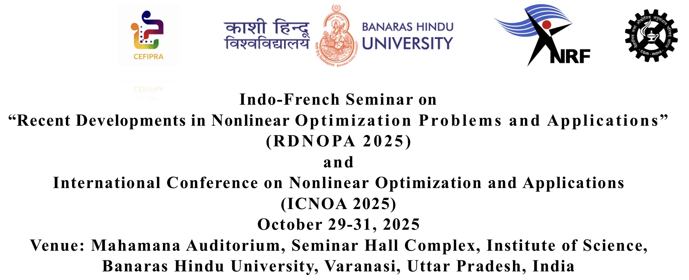
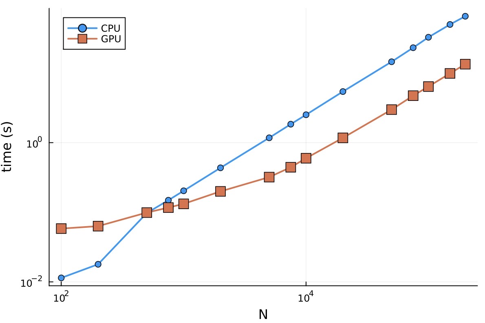

```@raw html

```

# Numerical developments to solve optimal control problems in Julia

### [Jean-Baptiste Caillau](http://caillau.perso.math.cnrs.fr), [Olivier Cots](https://ocots.github.io), [Joseph Gergaud](https://github.com/joseph-gergaud), [Pierre Martinon](https://github.com/PierreMartinon), [Sophia Sed](https://sed-sam-blog.gitlabpages.inria.fr)

```@raw html

```

## What it's about

- Nonlinear optimal control of ODEs:

```math
g(x(t_0),x(t_f)) + \int_{t_0}^{t_f} f^0(x(t), u(t))\, \mathrm{d}t \to \min
```

subject to

```math
\dot{x}(t) = f(x(t), u(t)),\quad t \in [t_0, t_f]
```

plus boundary, control and state constraints

- Our core interests: numerical & geometrical methods in control, applications
- Why Julia: fast (+ JIT), strongly typed, high-level (AD, macros), fast optimisation and ODE solvers available, rapidly growing community

**What is important to solve such a problem numerically?**

## Syntax matters

- [Simple example](@ref example-double-integrator-time)
- [Use LLM](@ref manual-ai-llm)

```@raw html
<details><summary>Do more...</summary>
```

```text
rewrite in OptimalControl.jl DSL the free time problem below as a problem with fixed final time using:
- a change time from t to s = t / tf
- tf as an additional state variable subject to dtf / ds = 0
ocp = @def begin
    tf ∈ R,          variable
    t ∈ [0, tf],     time
    x = (q, v) ∈ R², state
    u ∈ R,           control
    -1 ≤ u(t) ≤ 1
    q(0)  == -1
    v(0)  == 0
    q(tf) == 0
    v(tf) == 0
    ẋ(t) == [v(t), u(t)]
    tf → min
end
```

```julia
ocp_fixed = @def begin
    # Fixed time domain
    s ∈ [0, 1], time
    
    # Augmented state: (position, velocity, final_time)
    y = (q, v, tf) ∈ R³, state
    
    # Control
    u ∈ R, control
    
    # Transformed dynamics (multiply by tf due to ds = dt/tf)
    ∂(q)(s)  == tf(s) * v(s)
    ∂(v)(s)  == tf(s) * u(s)
    ∂(tf)(s) == 0
    
    # Initial conditions
    q(0)  == -1
    v(0)  == 0
    # tf(0) is free (no initial condition needed)
    
    # Final conditions
    q(1)  == 0
    v(1)  == 0
    # tf(1) is what we minimize
    
    # Control constraints
    -1 ≤ u(s) ≤ 1
    
    # Cost: minimize final time
    tf(1) → min
end
```

```@raw html
</details>
```

## Performance matters

- Discretising an OCP into an NLP: $h_i := t_{i+1}-t_i$,

```math
g(X_0,X_N) + \sum_{i=0}^{N} h_i f^0(X_i,U_i) \to \min
```

subject to 

```math
X_{i+1} - X_i - h_i f(X_i, U_i) = 0,\quad i = 0,\dots,N-1
```

plus other constraints on $X := (X_i)_{i=0,N}$ and $U := (U_i)_{i=0,N}$ such as boundary and path (state and / or control) constraints :

```math
b(t_0, X_0, t_N, X_N) = 0
```

```math
c(X_i, U_i) \leq 0,\quad i = 0,\dots,N
```

- SIMD parallelism ($f_0$, $f$, $g$) + sparsity: Kernels for GPU ([KernelAbstraction.jl](https://juliagpu.github.io/KernelAbstractions.jl/stable/)) and sparse linear algebra ([CUDSS.jl](https://github.com/exanauts/CUDSS.jl))
- Modelling and optimising for GPU: [ExaModels.jl](https://exanauts.github.io/ExaModels.jl/dev/guide)  + [MadNLP.jl](https://madnlp.github.io/MadNLP.jl), with **built-in AD**
- Compile into an ExaModel (one pass compiler, [syntax + semantics](https://github.com/control-toolbox/CTParser.jl/blob/20c6be5c953587fef10b054a95f9dc8c66b90577/src/onepass.jl#L145))


```@raw html
<details><summary>Solving (MadNLP + CUDSS)</summary>
```

```julia
This is MadNLP version v0.8.7, running with cuDSS v0.4.0

Number of nonzeros in constraint Jacobian............:    12005
Number of nonzeros in Lagrangian Hessian.............:     9000

Total number of variables............................:     4004
                     variables with only lower bounds:        0
                variables with lower and upper bounds:        0
                     variables with only upper bounds:        0
Total number of equality constraints.................:     3005
Total number of inequality constraints...............:        0
        inequality constraints with only lower bounds:        0
   inequality constraints with lower and upper bounds:        0
        inequality constraints with only upper bounds:        0

iter    objective    inf_pr   inf_du lg(mu)  ||d||  lg(rg) alpha_du alpha_pr  ls
   0  1.0000000e-01 1.10e+00 1.00e+00  -1.0 0.00e+00    -  0.00e+00 0.00e+00   0
   1  1.0001760e-01 1.10e+00 3.84e-03  -1.0 6.88e+02  -4.0 1.00e+00 2.00e-07h  2
   2 -5.2365072e-03 1.89e-02 1.79e-07  -1.0 6.16e+00  -4.5 1.00e+00 1.00e+00h  1
   3  5.9939621e+00 2.28e-03 1.66e-04  -3.8 6.00e+00  -5.0 9.99e-01 1.00e+00h  1
   4  5.9996210e+00 2.94e-06 8.38e-07  -3.8 7.70e-02    -  1.00e+00 1.00e+00h  1

Number of Iterations....: 4

                                   (scaled)                 (unscaled)
Objective...............:   5.9996210189633494e+00    5.9996210189633494e+00
Dual infeasibility......:   8.3756005011360529e-07    8.3756005011360529e-07
Constraint violation....:   2.9426923277963834e-06    2.9426923277963834e-06
Complementarity.........:   2.0007459547789288e-06    2.0007459547789288e-06
Overall NLP error.......:   2.9426923277963834e-06    2.9426923277963834e-06

Number of objective function evaluations             = 6
Number of objective gradient evaluations             = 5
Number of constraint evaluations                     = 6
Number of constraint Jacobian evaluations            = 5
Number of Lagrangian Hessian evaluations             = 4
Total wall-clock secs in solver (w/o fun. eval./lin. alg.)  =  0.072
Total wall-clock secs in linear solver                      =  0.008
Total wall-clock secs in NLP function evaluations           =  0.003
Total wall-clock secs                                       =  0.083
```

- Mini-benchmark: [Goddard](https://control-toolbox.org/Tutorials.jl/stable/tutorial-goddard.html) and [Quadrotor](https://github.com/control-toolbox/CTParser.jl/blob/211042b061be17b3f7fdff41cb53701d30b128db/test/test_onepass_exa.jl#L926) problems
- Goddard, H100 run             
```@raw html

```
- Quadrotor, H100 run             
```@raw html

```

```@raw html
</details>
```
 
## Maths matters

- Coupling direct *and* indirect (*aka* shooting methods)
- Easy access to differential-geometric tools with AD
- [Goddard tutorial](https://control-toolbox.org/Tutorials.jl/stable/tutorial-goddard.html)

## Applications matter

- Use case approach: aerospace engineering, quantum mechanics, biology, environment...
- [Magnetic Resonance Imaging](https://control-toolbox.org/MagneticResonanceImaging.jl/stable/saturation.html)

## Wrap up

- High level modelling of optimal control problems
- High performance solving both on CPU and GPU
- Driven by applications

## control-toolbox.org

- Collection of Julia Packages rooted at [OptimalControl.jl](https://control-toolbox.org/OptimalControl.jl)
```@raw html
<a href="https://control-toolbox.org"></a>
```
- Open to contributions! Give it a [try](@ref manual-ai-llm), give it a star ⭐️
- Collection of problems: [OptimalControlProblems.jl](https://control-toolbox.org/OptimalControlProblems.jl/stable/problems_browser.html)

## Credits (not exhaustive!)

- [ADNLPModels.jl](https://jso.dev/ADNLPModels.jl)
- [DifferentiationInterface.jl](https://juliadiff.org/DifferentiationInterface.jl/DifferentiationInterface)
- [DifferentialEquations.jl](https://docs.sciml.ai/DiffEqDocs)
- [ExaModels.jl](https://exanauts.github.io/ExaModels.jl/dev/guide)
- [Ipopt.jl](https://github.com/jump-dev/Ipopt.jl)
- [MadNLP.jl](https://madnlp.github.io/MadNLP.jl)
- [MLStyle.jl](https://thautwarm.github.io/MLStyle.jl)

## Acknowledgements

Jean-Baptiste Caillau is partially funded by a **France 2030** support managed by the *Agence Nationale de la Recherche*, under the reference ANR-23-PEIA-0004 ([PDE-AI](https://pde-ai.math.cnrs.fr) project).

```@raw html

```