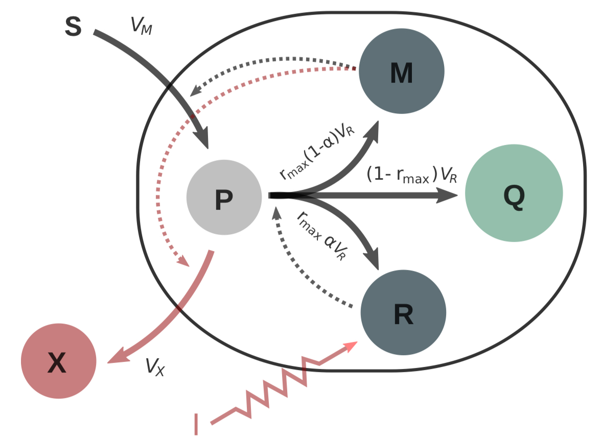

# [Batch processing](@id batch)

## Introduction

Let us consider a *self-replicator* model [^1] describing the
dynamics of a microbial population growing inside a closed bioreactor. The bacterial
culture has a constant volume. At the beginning of the experience,
there is an initial mass of substrate $S$ inside the bioreactor, that is gradually consumed
by the bacterial population, and transformed into precursor metabolites $P$. These
precursors are intermediate metabolites used to produce proteins—such as ribosomes
and enzymes—responsible for specific cellular functions; and metabolites of interest
$X$ which are excreted from the cell. The proteins forming bacterial cells are divided
into three classes $M$, $R$ and $Q$, associated with the following cellular functions:
- class $M$ proteins of the metabolic machinery, responsible for the uptake of nutrients,
- class $S$ from the medium (substrate),
- the production of precursor metabolites $P$,
- and the synthesis of metabolites of interest $X$.

Class $R$ proteins of the gene expression machinery (such as ribosomes) actively involved in protein biosynthesis (*i.e.* in the production of proteins of classes $M$,
$Q$ and $R$). Class $Q$ Growth are rate-independent proteins, such as housekeeping proteins responsible for cell maintenance, and ribosomes not involved in protein synthesis. There is an *internal* control, $\alpha$, accounting for the behaviour of each individual cell that has to decide between two pathways (transforming precursors $P$ into metabolites $M$ or into ribosomes $R$), and one *external* control leveraging the production of the product $X$ (for instance using a light induced control of bioengineered cells).

```@raw html

```

After some normalisations, a simplified version of the system (not describing the production of metabolite as we will focus on volume maximisation on this example) can be written in terms of the concentrations of the substrate $s$, precursors $p$, ribosomes $r$, and the of the volume $V$ of the bacterial population.[^2] Accordingly, the state $\varphi=(s,p,r,V)$ is four-dimensional, and there is only one control, $\alpha$:

```math
\begin{align*}
  \dot{s} &= -w_M(s)(1-r)V,\\
  \dot{p} &= w_M(s)(1-r) - w_R(p)r(p+1),\\
  \dot{r} &= (\alpha-r)w_R(p)r,\\
  \dot{V} &= w_R(p)rV,
\end{align*}
```

where velocities are taken linear in the concentrations, and where Michaelis-Menten kinetics are assumed:

```math
v_R := V_R/V = w_R(p) r,\quad v_M := V_M/V = w_M(s) m,
```

with

```math
w_R(p) = \frac{k_R\,p}{K_r + p}\,, \quad w_M(s) = \frac{k_m s}{K_m + s}\cdot
```

## Biomass maximisation

We are interested in maximising the biomass production [^3] (final volume of the bacterial population) over a finite time horizon $[0,t_f]$. To solve the problem, we first set up the boundary values,

```@example main
using OptimalControl

t0 = 0      
tf = 90     
s0 = 0.1
p0 = 0.001
r0 = 0.1
V0 = 0.003
nothing # hide
```

together with parameters and auxiliary functions definnig the synthesis rates:

```@example main
kᵣ = 1.1
kₘ = 1.2
Kᵣ = 1.3
Kₘ = 1.4

wᵣ(p) = kᵣ * p / (Kᵣ + p)
wₘ(s) = kₘ * s / (Kₘ + s)
nothing # hide
```

Then we define the optimal control problem setting time, state, control, boundary conditions, state and control constraints, dynamics and Mayer cost:

```@example main
@def batch begin

    t ∈ [ t0, tf ], time
    φ = (s, p, r, V) ∈ R⁴, state 
    α ∈ R, control

    s(t0) == s0
    p(t0) == p0
    r(t0) == r0
    V(t0) == V0
    
    s(t) ≥ 0
    p(t) ≥ 0
    0 ≤ r(t) ≤ 1
    V(t) ≥ 0
    0 ≤ α(t) ≤ 1

    φ̇(t) == F0(s(t), p(t), r(t), V(t)) + α(t) * F1(s(t), p(t), r(t), V(t))

    V(tf) → max

end
nothing # hide
```

The dynamics is indeed affine in the control, $\dot{\varphi} = F_0(\varphi) + \alpha F_1(\varphi)$, with vector fields

```@example main
F0(s, p, r, V) =
    [ -wₘ(s) * (1 - r) * V
       wₘ(s) * (1 - r) - wᵣ(p) * r * (p + 1)
      -wᵣ(p) * r^2
       wᵣ(p) * r * V ]

F1(s, p, r, V) = [ 0, 0, wᵣ(p) * r, 0 ]
nothing # hide
```

## Direct solve

Since the following result holds,[^4]

**Proposition.** *The Lie bracket $F_{101}$ belongs to the span of $F_1$ and $F_{01}$, so singular controls are at least of local order two.*

one expects singular arcs connected with bang arcs through Fuller phenomenon (accumulation of switching times).

We first solve the problem using a uniform discretisation:

```@example main
sol0  = solve(batch, grid_size=1000, print_level=0)
println("Objective ", sol0.objective, " after ", sol0.iterations, " iterations")
```

Although convergence is obtained, it is actually more efficient to first solve on a raw grid, then use a *warm start* to solve again on a finer (still uniform) grid:

```@example main
sol1 = solve(batch, grid_size=20, print_level=0)
println("Objective ", sol1.objective, " after ", sol1.iterations, " iterations")
```

```@example main
sol2 = solve(batch, grid_size=1000, print_level=0, init=sol1)
println("Objective ", sol2.objective, " after ", sol2.iterations, " iterations")
```

## Plotting

We eventually plot the solutions (raw grid + finer grid) and observe that the control exhibits the expected structure with a Fuller-in arc followed by a singular one, then a Fuller-out arc:

```@example main
plot(sol1, size=(800, 800))
plot!(sol2)
```

## References

[^1]:  Giordano, N.; Mairet, F.; Gouzé, J.-L.; Geiselmann, J.; De Jong, H. Dynamical allocation of cellular resources as an optimal control problem: novel insights into microbial growth strategies. *PLoS comp. biol.* **12** (2016), e1004802. 

[^2]: Yabo, A. G.; Caillau, J.-B.; Gouzé, J.-L.; de Jong, H.; Mairet, F. Dynamical analysis and optimization of a generalized resource allocation model of microbial growth. *SIAM J. Appl. Dyn. Syst.* **21** (2022), no. 1, 137-165.

[^3]: Yabo, A. G.; Caillau, J.-B.; Gouzé, J.-L. Optimal bacterial resource allocation strategies in batch processing. *SIAM J. Appl. Dyn. Syst.*, to appear.

[^4]: Astruc, L.; Edery, N. Optimal allocation of bacterial resources in a bioreactor. Project report, Polytech Nice Sophia, Université Côte d'Azur (2023).