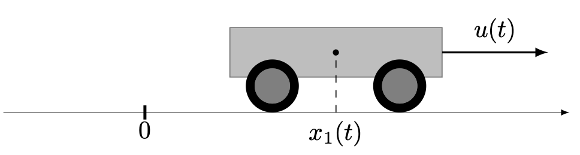

# [Batch](@id batch)

Let us consider...

```@raw html

```

To solve the problem, we first set up the boundary values,

```@example main
using OptimalControl

t0 = 0      
tf = 90     
s0 = 0.1
p0 = 0.001
r0 = 0.1
V0 = 0.003
nothing # hide
```

together with parameters and auxiliary functions definnig the synthesis rates (Michaelis-Menten kinetics, here)

```@example main
kᵣ = 1.1
kₘ = 1.2
Kᵣ = 1.3
Kₘ = 1.4

wᵣ(p) = kᵣ * p / (Kᵣ + p)
wₘ(s) = kₘ * s / (Kₘ + s)
nothing # hide
```

assuming that velocities are linear in the concentrations:

```math
v_R := V_R/V = w_R(p) r,\quad v_M := V_M/V = w_M(s) m.
```

Then we define the optimal control problem setting time, state, control, boundary conditions, state and control constraints, affine in the control dynamics and Mayer cost:

```@example main
@def batch begin

    t ∈ [ t0, tf ], time
    φ = (s, p, r, V) ∈ R⁴, state 
    α ∈ R, control

    s(t0) == s0
    p(t0) == p0
    r(t0) == r0
    V(t0) == V0
    
    s(t) ≥ 0
    p(t) ≥ 0
    0 ≤ r(t) ≤ 1
    V(t) ≥ 0
    0 ≤ α(t) ≤ 1

    φ̇(t) == F0(φ(t)) + α(t) * F1(φ(t))

    V(tf) → max

end
nothing # hide
```

Herebefore, the two vector fields are

```@example main
F0(φ) = begin
    s, p, r, V = φ
    res = [ -wₘ(s) * (1 - r) * V
             wₘ(s) * (1 - r) - wᵣ(p) * r * (p + 1)
            -wᵣ(p) * r^2
             wᵣ(p) * r * V ]
    return res
end

F1(φ) = begin
    s, p, r, V = φ
    res = [ 0, 0, wᵣ(p) * r, 0 ]
    return res
end
nothing # hide
```

We first solve the problem using a uniform discretisation:

```@example main
sol0  = solve(batch, grid_size=1000, print_level=0)
println("Objective ", sol0.objective, " after ", sol0.iterations, " iterations")
```

Although convergence is obtained, it is actually more efficient to first solve on a raw grid, then use a *warm start* to solve again on a finer (still uniform) grid:

```@example main
sol1 = solve(batch, grid_size=20, print_level=0)
println("Objective ", sol1.objective, " after ", sol1.iterations, " iterations")
```

```@example main
sol2 = solve(batch, grid_size=1000, print_level=0, init=sol1)
println("Objective ", sol2.objective, " after ", sol2.iterations, " iterations")
```

We eventually plot the solutions (raw grid + finer grid) and observe that the control exhibits the expected structure with a Fuller-in arc followed by a singular one, then a Fuller-out arc:

```@example main
plot(sol1, size=(600, 600))
plot!(sol2)
```