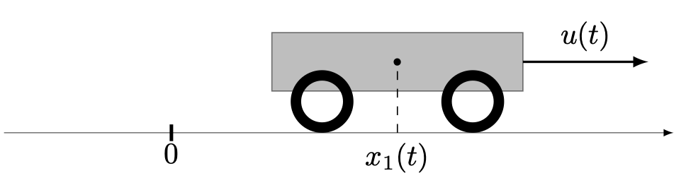

# [Double integrator: time minimisation](@id double-int)

The problem consists in minimising the final time $t_f$ for the double integrator system

```math
    \dot x_1(t) = x_2(t), \quad \dot x_2(t) = u(t), \quad u(t) \in [-1,1],
```

and the limit conditions

```math
    x(0) = (1,2), \quad x(t_f) = (0,0)
```

This problem can be interpretated as a simple model for a wagon with constant mass moving along
a line without fricton.

```@raw html

```

First, we need to import the `OptimalControl.jl` package:

```@example main
using OptimalControl
```

Then, we can define the problem

```@example main
@def ocp begin
    tf ∈ R, variable
    t ∈ [ 0, tf ], time
    x ∈ R², state
    u ∈ R, control
    tf ≥ 0
    -1 ≤ u(t) ≤ 1
    q = x₁
    v = x₂
    q(0) == 1
    v(0) == 2
    q(tf) == 0
    v(tf) == 0
    0 ≤ q(t) ≤ 5,       (1)
    -2 ≤ v(t) ≤ 3,      (2)
    ẋ(t) == [ v(t), u(t) ]
    tf → min
end
nothing # hide
```
!!! note "Nota bene"

    In order to ensure convergence of the direct solver, we have added the state constraints labelled (1) and (2):

```math
0 \leq q(t) \leq 5,\quad -2 \leq v(t) \leq 3,\quad t \in [ 0, tf ].
```

Solve it

```@example main
sol = solve(ocp)
nothing # hide
```

and plot the solution

```@example main
plot(sol, size=(600, 450))
```
